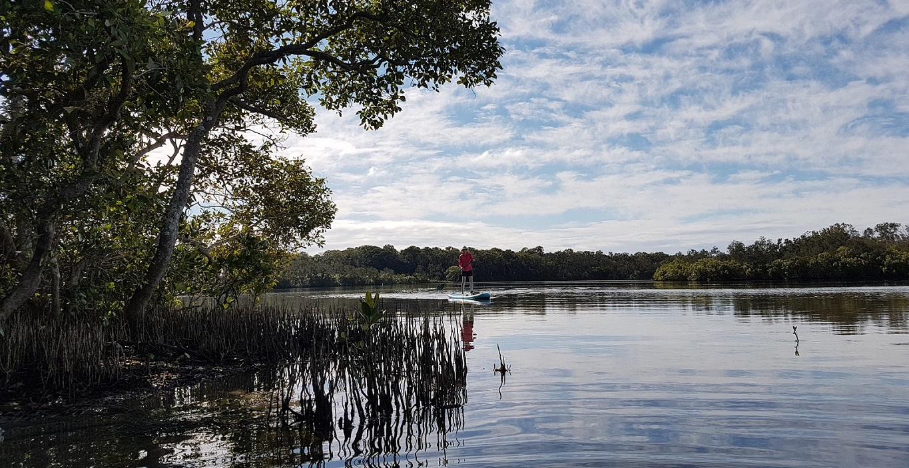

  
  

    <h1>Seascape models lab</h1>
    
Marine ecosystems, conservation, fisheries and modelling

  

<a href="/research.html" class="card-link">
    

      <h2>Research Focus</h2>
      
We need to find balance between human needs and ocean conservation.
We are a team of ecologists, data scientists and social scientists. 
We provide the evidence needed for sustainable ocean management. We work to bring ecological complexity to the  modelling tools that are used to inform decision-making.  

    

  </a>

<h2 class="text-center mb-2">Featured Projects</h2>

  <a href="/research.html#marine-conservation" class="card-link">
    

      <h3>Marine Conservation</h3>
      
Developing strategies for protecting marine ecosystems and biodiversity.

    

  </a>
  
  <a href="/research.html#data-science" class="card-link">
    

      <h3>Data Science</h3>
      
Using R and other tools to analyze ecological data and inform conservation decisions.

    

  </a>
  
  <a href="/research.html#ecosystem-modeling" class="card-link">
    

      <h3>Ecosystem Modeling</h3>
      
Creating models to understand and predict changes in marine environments.

    

  </a>

  <h2>Recent Blog Posts</h2>
  

    
    <a href="{{ post.url }}" class="card-link">
      

        <h3>{{ post.title }}</h3>
        
{{ post.date | date: "%B %d, %Y" }}

      

    </a>
    
  

