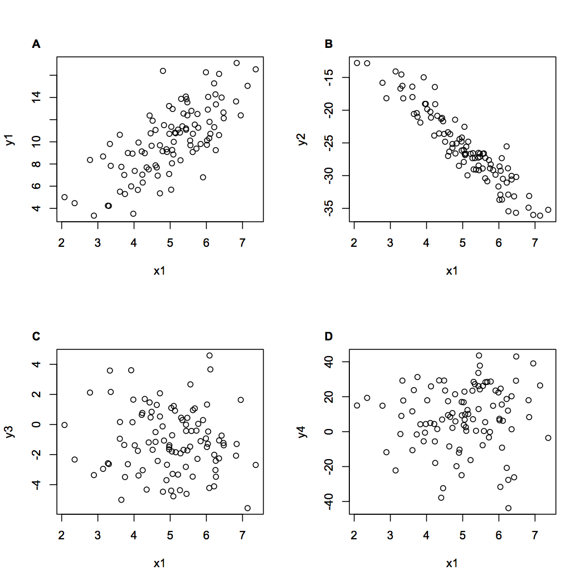

## How automate labels on figures in R  

The other day I was resubmitting a paper to a new journal for the fourth time and I decided I had had enough with reformatting of figure labels each time I resubmitted to a new journal. So I wrote this handy function which automatically places labels on figures in a given format.  

I thought writing such a function is a good lesson in R objects, so here we go. If you just want to get to the function, without my lecturing, then skip to the bottom.  

First up we need to create some data, for testing here we go:

	n <- 100
	x1 <- rnorm(n, mean = 5, sd = 1)
	y1 <- 2*x1 + rnorm(n, mean = 0, sd = 2)
	y2 <- -5*x1 + rnorm(n, mean = 0, sd = 2)
	y3 <- rnorm(n, mean = -1, sd = 2)
	y4 <- 9*rnorm(n, mean = 0, sd = 2) + 5

We just created an x-variable and four y-variables that depend on that x-variable, with normal errors.

Let's start a plot, with 2*2 window:  

	par(mfrow = c(2,2))
	plot(x1, y1)

Now we need to identify the boundaries of the axis on each sub-plot as it is created. We can do that using the `par()` command:  

	axbounds <- par('usr')

Which gives us the bounds on the x and y axes for whatever plot is open right now.

We can then get the range of each axis like this:  

	axrange <- c(axbounds[2]-axbounds[1], axbounds[4] - axbounds[3])

Next, define our labels. We have four plots and we can use `letters` or `LETTERS` to obtain letters of the alphabet. ie:

	labels <- LETTERS[1:4]

Gives us the labels a, b, c, d. Or we could also do:

	labels <- paste0('(',letters[1:4],')')

Which gives us (a), (b), (c), (d)

Now we need to position the labels, relative to each axes range. We can do this by taking the x-axis minimum value and y-axis maximum value and then adding an offset to the axis range. Adding the offset in this way means the labels will always be placed in the same place, even if the axis scale varies. We can place the label using the `text` command.

	text(axbounds[1] -
		(axrange[1]*xoffset), axbounds[4] +(axrange[2]* yoffset),
		label[1], xpd=NA,...)

The argument `xpd=NA` is neccesary, because without it new additions to the plot outside of the plot window are invisible.

So those are the elements we need. To get it all finished, we can stitch these all together in a new function:  

### Here is the finished function for adding labels

	figlabel <- function(label ='A', xoffset = 0.1, yoffset = 0.08,...){
		axbounds <- par('usr')
		axrange <- c(axbounds[2]-axbounds[1], axbounds[4] - axbounds[3])
		text(axbounds[1] -
			(axrange[1]*xoffset), axbounds[4] +(axrange[2]* yoffset),
			label, xpd=NA,...)
		}

We use it like this:  

		par(mfrow = c(2,2))
		plot(x1, y1)
		figlabel(labels[1], font = 2)
		plot(x1, y2)
		figlabel(labels[2], font = 2)
		plot(x1, y3)
		figlabel(labels[3], font = 2)
		plot(x1, y4)
		figlabel(labels[4], font = 2)

The result is this:  

  
