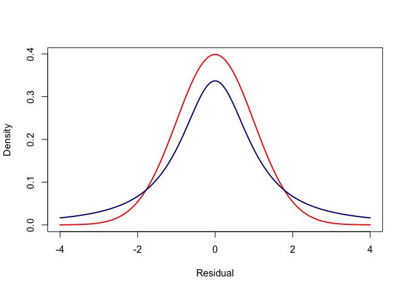
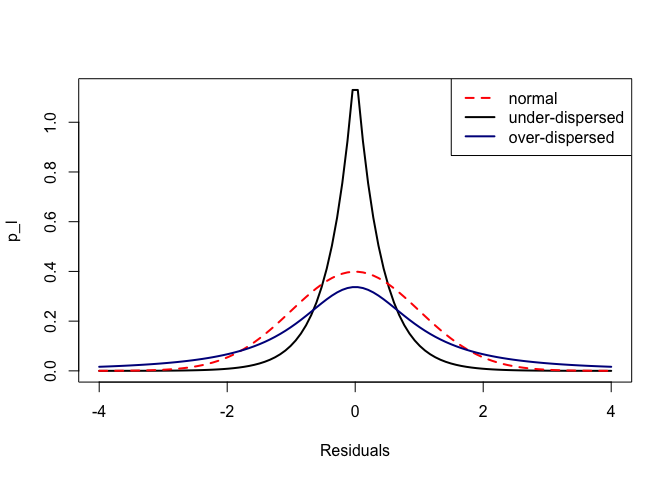
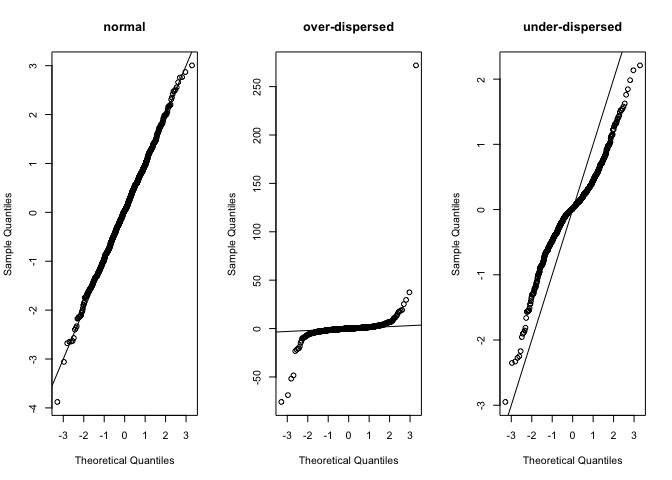

What does under or over-dispersion look like?
---------------------------------------------

One issue that often comes up in analysis with linear models is under or
over dispersion.

For instance, if you are fitting a linear regression model, you are
assuming the residuals (difference between the line of best fit and the
data-points) are normally distributed. Residuals are said to be
overdispersed if they are 'fatter' in the tails than a normal bell
curve. Whereas, if the residuals are too peaked in the middle, they are
said to be under-dispersed.

Under or over dispersion is an issue because it can bias the calculation
of p-values. Over-dispersion is often of particular concern because it
may cause p-values that are biased too low. If you are taking 0.05 as
significant, over-dispersion will mean you would reject the null
hypothesis more than 5% of the time. Thus, you may be more likely to
falsely reject the null hypothesis.

If there is under-dispersion the opposite is true, your p-values may be
too high. P-values that are biased high can be a problem, because they
will give you low power to detect real effects.

So, let's take a look at under and overdispersion. First, up here is a
normal bell curve:

    x <- seq(-4, 4, length.out = 100)
    p <- dnorm(x, mean = 0, sd = 1)
    plot(x, p, type = 'l', lwd = 2, col = "red",
        xlab = "Residual", ylab = "Density")

Now, we can add an over-dispersed curve to that. Here is one, calculated
using the Student t distribution:

    p_t <- dt(x, df = 1.4, ncp = 0)

    plot(x, p, type = 'l', lwd = 2, col = "red",
        xlab = "Residual", ylab = "Density")
    lines(x, p_t, col = "darkblue", lwd = 2)

It wouldn't matter how large we made the standard devation of the normal
curve, we would never get it to match the Student-t.

Finally, let's draw an under-dispersed distribution, using the Laplace
distribution

    library(rmutil)
    p_l <- dlaplace(x, m = 0, s = 0.4)

Now plot them all together:

    plot(x, p_l, xlim = c(-4, 4), lwd = 2, xlab = "Residuals", main = "", type = "l")
    lines(x, p, col = "red", lwd = 2, lty = 2)
    lines(x, p_t, col = "darkblue", lwd = 2)
    legend("topright", legend = c("normal", "under-dispersed", "over-dispersed"),
          lty = c(2,1,1), col = c("red", "black", "darkblue"), lwd = 2)

Here's what they look like if we sample measures from each distribution
and plot them on a normal QQ plot, which you may be familiar with. It is
one of the standard checks of model residuals:

    set.seed(1997)
    par(mfrow = c(1,3))
    qqnorm(rnorm(1000, mean = 0, sd = 1), main = "normal")
    abline(0,1)
    qqnorm(rt(1000, df = 1.4, ncp = 0), main = "over-dispersed")
    abline(0,1)
    qqnorm(rlaplace(1000, m = 0, s = 0.4), main = "under-dispersed")
    abline(0,1)

Playing around with the parameters for each distribution should help
your understanding. For instnace, if you set the scale for the Laplace
distribution to a larger number it will become over-dispersed, because
it gets fatter tails than the normal (despite being more peaked at its
mode).

Under-dispersion is more common than you might think. It can occur when
you have a censoring process. For instance, perhaps you machine can only
measure length's to a certain precision and any distance that is to
small gets rounded down to zero.
