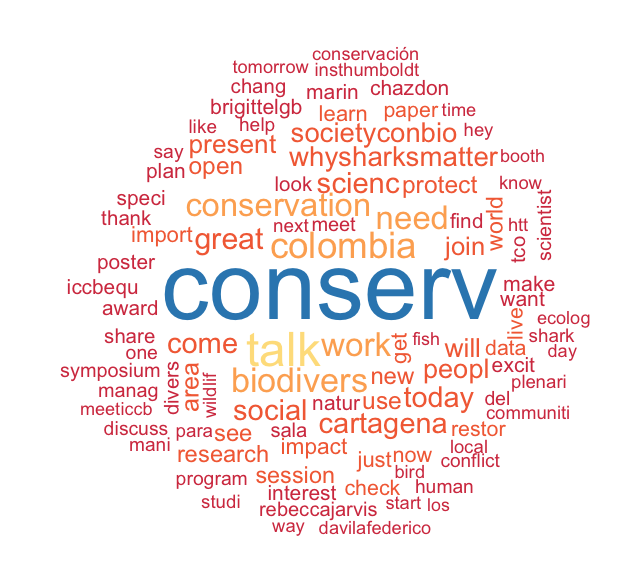
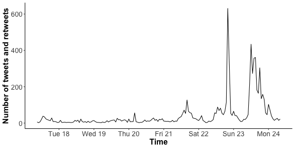

## What are people saying about International Congress for Conservation Biology 2017 on Twitter?

Here's a brief analysis of tweets from the [International Congress for Conservation Biology](http://conbio.org/mini-sites/iccb-2017) to date. The conference started on the starting 23rd July I was curious to see what people are talking about there and who is doing the talking on twitter.

I have updated this on 27th July (first post on 25th July. )

As of 27th July I could access 13396 tweets and retweets from the conference, starting on 2017-07-18.

If you are wondering how these stats compare to other conferences, check out my [post from ICRS](http://www.seascapemodels.org/research%20rstats/2016/06/27/ICRS-tweets.html) last year.

### What people are saying

Textual analysis is a bit of a dark art, but here is a word cloud of terms, word size is scaled by number of mentions. Words are stemmed so or instance 'biodiverse' and 'biodiversity' both appear below as 'biodivers'

At this stage the location are still an imporant talking point with words like Colombia and Cartagena. Also predictably 'conservation' and 'biodiversity' are up there.

It is interesting that 'need' features in a lot of tweets. Perhaps many people making calls for action?

I think that words like "open", "join", "world", "come" hint at the inclusiveness of conservation conferences.

There were a few more interesting words that have more than 100 mentions:
"[taotaotasi](https://twitter.com/taotaotasi)" - the handle of Angelo Villagomez who recieved a distinguished service award from the Society for Conservation Biology.
"shark" still is the most popular plant or animal group mentioned so far, likely due to the two top 5 tweets mentioned above.  But 'forest', 'bird' and 'fish' are also working their way up the list.

Finally the stems for happy ("happi") and peace ("peac") and the word "love" were also very popular. Perhaps conservation scientist is getting back to its 1960s origins?

### Who is talking

You might see twitter stats reported after conferences that look phenomenal, like 'millions saw our posts', but it is worth digging down to see how many people had substantial interaction with the conference's feed.

If we count the number of twitter users that have tweeted or RTed (re-tweet) #ICCB2017 posts, then there are 2337. Of those about 1/3 (690) have written an original tweet. If we only consider tweeters that have made >5 tweets, then we have only 222 people and organisations.

Clearly, the people talking on twitter are a biased selection of people at ICCB2017 and may also include people not there (like me). As usual, a lot people only tweet once or twice.

The users doing the most tweeting are (in order of most to least with number of tweets):

Handle|# of tweets
------|-----------
IbuAnggrek|654
ICCB2017|509
AzurigenMCS|466
rebecca_jarvis|413
WhySharksMatter|299
CarlaWildlife|218
ultimatemegs|186
FancyScientist|156
MattTietbs47|155
Society4ConBio|137

### Most popular tweets

Here is a table of the most popular tweets, by their RT count:

Handle|Tweet|# retweets
------|-----|----------
WhySharksMatter|Angler gives up chance at world record, releases huge blacktip shark alive. #ICCB2017 #SharkWeek (from 2014) https://t.co/dwmiAeSXQW https://t.co/74SyQ6Uhfk|96
eguerreroforero|@Brigittelgb en #ICCB2017: A los países megadiversos nos llaman 'megadispersos' porq no hemos logrado posicionar políticamente biodiversidad https://t.co/u43dVvcjHO|93
HugePossum|Australia's proposed marine parks have never been science based - bad planning for nature and people #ICCB2017 https://t.co/rZXAueuod6|70
ICCB2017|#ICCB2017 attendees - there are sloths in El Parque Centenario near the convention center! #UrbanWildlife https://t.co/81YktjU4Mu|60
NathanJBennett|How can the conservation social sciences improve conservation? Today at 11:30am in Sala 304 at #ICCB2017 Paper here https://t.co/WAYzpvoXQv https://t.co/WVLS4y2Wj7|52
cyclonewatson|A slight messaging problem- release of iPhone is hundreds of times more read about than global loss of coral reefs! #iccb2017 https://t.co/6hbfrCPNu1|42
NathanJBennett|There are still significant barriers to mainstreaming the social sciences in conservation-&gt;Today at #ICCB2017 Paper: https://t.co/nnyhYxb3gk https://t.co/2dGeEPt46y|41
Seasaver|UN Patron of Oceans calls for ban on tournaments which kill threatened sharks https://t.co/P5KmUxBte3 #ICCB2017 @TheIGFA #sportfishing|41
rebecca_jarvis|Are we really including everybody's voices and needs in our conservation decisions and actions? #ICCB2017 #ICCB2017equity https://t.co/BmV7tzgzjV|37
action4ifaw|IFAW looks forward to joining youth conservation partners at the Millennials in Conservation workshop this Tuesday at #ICCB2017! https://t.co/cZZ5XVIFhF|35

I like that sloths in the park are right up there. Marine science topics are also pretty popular. Tweets by well known people (e.g. Chief Scientist of The Nature Conservancy, Hugh Possigham) and organisations (e.g. ICCB) are more likely to become more popular. Also, those that link to topical news items (e.g. marine park policy in Australia and fishing of sharks) are also more likely to reach an audience much broader than the ICCB2017 attendees.

I like the tweet written in Spanish, which comes via a Colombian. I think it translates to (thanks google translate and a friend): "Megadiverse countries call us mega-scattered because we have failed to politically position biodiversity". [Tweet me](https://twitter.com/bluecology) if I have this wrong.

Finally, there are a fair few tweets about communicating the urgency of conservation issues to the public and failure to do so in the past. I think this is telling, it is an issue that is at the forefront of many attendees minds.

### Time of tweets

Finally, it can be illustrative to look at the timing of tweets. This graph is made with times for the time zone local to Cartagena.

