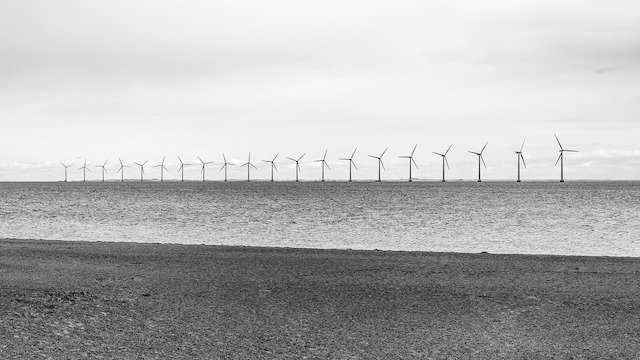

I'm over here in Scotland at their National marine science and technology conference (['MASTS'](https://theconversation.com/why-are-we-still-pursuing-the-adani-carmichael-mine-85100)). There are a lot of talks about the ecological issues associated with green energy derived from wind, waves and tides.

Seeing these environmental issues crop with green energy made me think how lucky the Australian environment is that we are focussing our efforts on deriving and exporting energy created with good old carbon.

Queensland is leading the way in keeping the coal tradition going, with new coal mines that have [recently been criticised](https://theconversation.com/why-are-we-still-pursuing-the-adani-carmichael-mine-85100) by the less enlightened.

Queenslanders should call our state **"The Coal State"** not "The Sunshine State" like we currently do. What's sunshine ever done for us? You can't [run much more than a few web  servers with it](http://www.bbc.com/future/story/20161013-why-apple-and-google-are-going-solar), and its proven to give you cancer.

Coal [rarely makes people ill](https://www.atse.org.au/Documents/Publications/Reports/Energy/ATSE%20Hidden%20Costs%20Electricity%202009.pdf), a single power plant causing only about [18 deaths a year in Victoria](https://theconversation.com/why-coal-fired-power-stations-need-to-shut-on-health-grounds-68809). Coal also provides stacks of cheap energy.

A rogue group of scientists believe that climate change is caused by greenhouse gas emissions, such as all the CO2 that comes from burning coal. This extremist group (something like [97% of scientists](https://www.skepticalscience.com/global-warming-scientific-consensus-intermediate.htm))) will probably also tell you that climate change has [dire consequences for humanity and life on earth](https://www.ipcc.ch/report/ar5/syr/).

Well, even if that is true, the global emissions of carbon are now so huge that Aussie coal mining doesn't really matter. One mine in Queensland will only contribute [about half a percent of the global emissions](http://www.abc.net.au/news/2016-11-02/fast-tracking-adani-carmichael-coal-mine-a-bad-idea/7988116) we have left before the Earth global warming will exceed 2 degrees. 0.5% from just one mine is pretty minor when you consider Australia's human population is only about 0.33% of the global population.

We are also planting heaps of trees in Australia. If you didn't know it, trees actually suck carbon out of the atmosphere. So the trees we plant are helping to [offsett emissions we create from doing things like clearing native forests for farming and burning coal](https://theconversation.com/stopping-land-clearing-and-replanting-trees-could-help-keep-australia-cool-in-a-warmer-future-63654).

Anyway, the heroin we produce gets sold overseas to countries like India who use it, so it [is really their problem](http://www.theaustralian.com.au/national-affairs/geoff-cousins-accuses-matthew-canavan-of-drug-dealers-defence-on-adani/news-story/5b9d18577faed2dce79d39f39c1f30c3). Sorry did I say heroin? I meant coal.

Those [impoverished people in India really need our coal](https://theconversation.com/why-are-we-still-pursuing-the-adani-carmichael-mine-85100). Having power will raise their standards of living and maybe even their life expectancies. The dirty coal we sell is so cheap everyone can afford it, and the health affects of living near power plants that burn the stuff are [pretty unsubstantiated anyway](https://theconversation.com/why-coal-fired-power-stations-need-to-shut-on-health-grounds-68809).

What we are doing is putting national interests aside to help humanity at a global scale. We are trading in the [land rights of indigenous Australian's](https://theconversation.com/australias-climate-bomb-the-senselessness-of-adanis-carmichael-coal-mine-76155) so we can dig up more coal and to give people overseas the chance of cheap power. If that doesn't balance out historical inequities created by colonialism I don't know what will.

Conservationists and some scientists will tell you that mining and transporting coal has impacts on local ecosystems too.

You can be rest assured that our governments in Australia are very concerned about the environmental impacts of coal mining. Queensland is a state known for its [excessive levels of 'green tape'](http://statements.qld.gov.au/Statement/Id/79374), which make it difficult for everyday ~~Aussie~~ overseas companys to make an honest profit out of mining.

The government's level of concern is evidenced by the hefty fines they hand out for breaches of environmental protocols. The coal company Adani [recently got wacked with a $12,000 fine](http://www.abc.net.au/news/2017-08-11/adani-avoids-multi-million-dollar-fine-over-sediment-water/8796178) for letting toxic stormwater spill out into the waters adjacent to the Great Barrier Reef.

Anyway, people matter too. What you can't dispute is that coal mining provide significant numbers of jobs to honest hard working Australian's.

The creation of a new coal mine may create [**up to 1500**](http://www.theaustralian.com.au/business/business-spectator/fact-check-will-adanis-coal-mine-really-boost-employment-by-10000-jobs/news-story/903c1932738b1d1a1763c74e45f4d7c7) new jobs over the life of the project.

Everyone knows the [10s of thousands of ongoing jobs in tourism](http://www.telegraph.co.uk/news/2017/06/26/great-barrier-reef-now-worth-56bn-australias-economy/) are not really related to the Great Barrier Reef. All those people are coming for another great Aussie industry - Casinos. But that's another story.

So get behind Australia's coal mines. Our environment needs coal power as much as our economy does.
