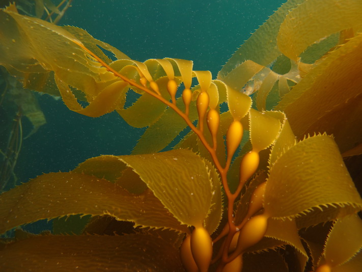
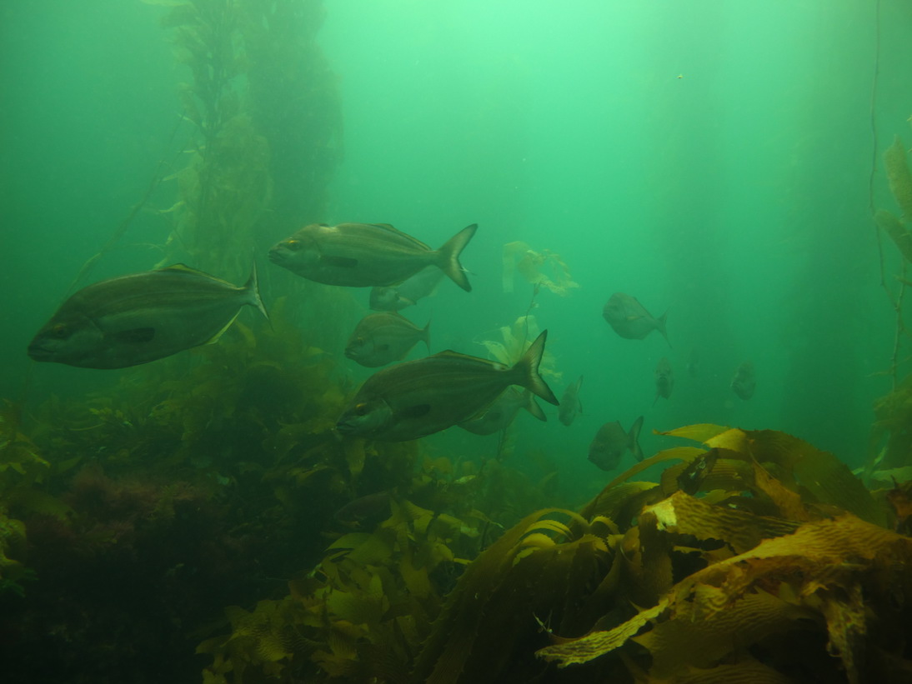
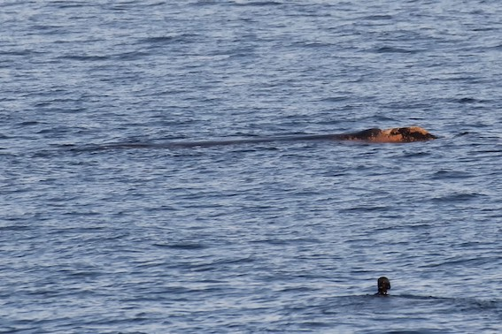

Sitting on narrow rock ledge, the cold Tasmanian ocean at my feet, I wondered if ten years of living in the sub-tropics was going to ruin my attempt to dive back into the underwater forests of my youth.

I was visiting colleagues in my childhood state of Tasmania when someone mentioned a dense kelp forest, crawling with large rock lobster, which had regrown inside one of Tasmania's marine reserves.

It sounded like the mythical ecosystems described in the accounts of early European explorers. That is, in the days before climate change and industrial fishing took their toll on ocean ecosystems across the globe, including in Tasmania.

A *Macrocystis* forest. Photo: Megan Saunders

I had only one weekend left in Tasmania, but I made it a priority to dive this kelp forest. I borrowed a mask from a friend, dug up my stiff old wetsuit from my parent's basement and fixed ageing fins with cable ties.

When growing up near Hobart I often sought out opportunities for diving in kelp forests, specifically the Giant Kelp *Macrocystis*. Giant kelp is remarkable because its fast growth (up to 35cm a day) can lead to dense forests that grow from ocean floor to surface and shade out sunlight. If you dive in a kelp forest on a bright day you will be bathed in the golden rays of the sun reflecting off the kelp's fronds.

There is another world to explore in a kelp forest. If you free dive, as I typically did as a teen (scuba was too expensive) on every dive you swim down through a multitude of micro-ecosystems, from canopy to holdfast. Caprellid amphipods, which resemble a praying mantis, graze in the fronds near the surface. Mid-water you might encounter schools of Bastard Trumpeter or spiny boarfish. On the bottom, the kelp's holdfast, a tangled mass of root like structures, hosts an array of zany looking invertebrates.

Bastard Trumpeter *Latridopsis forsteri*, cruise a kelp forest. Photo: Megan Saunders

Kelp forests were so important to my upbringing that they were the topic of the first conversation I had with my now wife (she is also a diver from another other great bastion of kelp forests - the west coast of North America).

Kelp forests became a fast disappearing ecosystem as I grew up and were increasingly difficult to find.

It's estimated that Giant Kelp occupies <1% of its former range in Tasmania's waters.

Giant Kelp likes cold nutrient rich water. Warming oceans and the strengthening East Australia Current have brought warm nutrient-poor waters to Tasmania's coast over the past several decades, all but wiping out the Giant Kelp.

The warm waters also carried the larvae of the Purple Sea Urchin (*Centrostephanus rodgersii*) to Tasmania, where it did not previously occur. It is a voracious consumer of kelp, and rapidly transforms massive forests into rocky barrens. It is so effective that just a few individuals, who can live as long as 30 years, can prevent any [kelp re-establishing in an area](http://www.pnas.org/content/106/52/22341.short).

I was under no illusions that the ecosystems I knew as a teen would be somehow preserved for all time, as some people see the places of their teen adventures. I even participated in a kelp forest restoration project at one stage.

Though they were few and far between, there were always the good sites with dense kelp forests. These became important fixed points in my experience. Places I could go back to and remember a younger life, like when you catch up with old school friends to talk gossip from 20 years ago.

Years later in 2016, as an adult, I visited one of the most reliable sites. Somewhat ironically, it had always been good because pollution from a sewage outflow saw that there were always plenty of nutrients in the water. In 2016 all that remained were a few scraggy strands of kelp.

A casual observers wouldn't know the loss I felt. To them it would just be another part of the ocean, filled with empty blue water. To me, however, swimming through the empty water was like walking over the ashes of a razed forest.

2016 was also the first year of what turned into two consecutive years of mass coral bleaching on the Great Barrier Reef, in my now home state of Queensland. While the world watched in horror at the devastation that climate change wrought on the reef, the forests of my childhood quietly faded away.

So I found myself this past weekend on my own navigating down a gravel track, on the side of a steep cliff, with a weightbelt slung over my shoulder. I squeezed into my old wetsuit (it still fits remarkably) and slid down into the cold ocean.

As I swam out to the kelp forest, I hoped I would recall the techniques of relaxing into a free dive, so I could hold my breath for long enough to descend into the forest. Free diving is the sport of holding one's breath so that you can swim to depth, unhindered by scuba gear.

While this serene sport may seem innocuous, mistakes can be deadly. Relax for too long and go too deep and you may not make it back to the top. It is best to dive with a partner for safety, though today I was on my own. The day before my dive I had visited the seaside memorial of a school friend who had died, on his own, during a free dive. I felt his absence today, he was once a free diver and prodigiuos hunter of lobster, and would certainly have joined me on this trip.

I reached the kelp forest, but my first dives were frantic and I quickly bounced back to the surface for air. But then I found my old skills and was able to relax into dives.

It was fitting perhaps for that the day was grey and the visibility underwater poor, so like my memories of childhood dives, the kelp forest was hazy. But the feeling of gliding down from canopy to holdfast was the same, and I still wondered at strange animals that lived there.

I searched for lobster for a while, but found none. The forest is in a reserve, so there should be no fishing, but I wondered if poachers had been there before me.

The ongoing presence of lobsters may be crucial to the kelp's survival. Large lobsters eat purple sea urchins and can push them back before they get a chance to establish and devour the forest.

It is indicative that the kelp holds on in a place where lobster fishing is banned.

That the kelp still holds on in a few places is a sign of hope that Tasmania's ecosystems can withstand climate change.

As I made my way back up the cliff track after the dive, I thought about the cliche of arguing we do more to save nature, like creating more marine reserves, so our children can visit these places we were fortunate to experience. But our children will develop their own fixed points of experience as they grow and as the baseline for what is natural shifts from generation to generation the old baselines of their forbearers may not give them much concern.

I hope my children don't have the same childhood experience of nature as I had. I hope they can expect things to get better and that their shifting baseline is one of degraded ecosystems that are recovering.

There are signs of hope. The talk of Hobart that week had been the sighting of a southern right whale just a hundred metres from shore in the Derwent estuary. Right whales were almost driven to extinction by whale hunting, but now they are protected they are making a [slow recovery](http://onlinelibrary.wiley.com/doi/10.1111/faf.12241/full).

*A snorkeller watches a southern right whale that visited the Derwent estuary. Photo: Mick Brown*

Controversy surrounded this particular whale, which made the front page of the local news paper. Many onlookers reported it seemed distressed as it was mobbed by swimmers, boats and jetskis.

I see this debate as a good sign. We need more conversations about what helps and what hinders nature's recovery. The more people start to notice the empty spaces in our ocean, the more hope there is that society will notice its loss and take action to restore nature.
