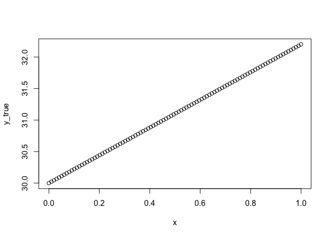
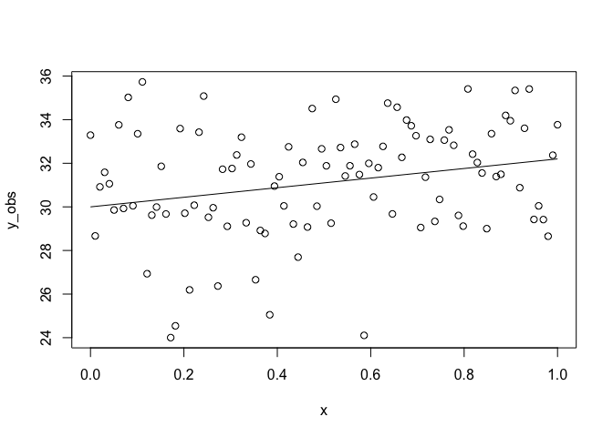
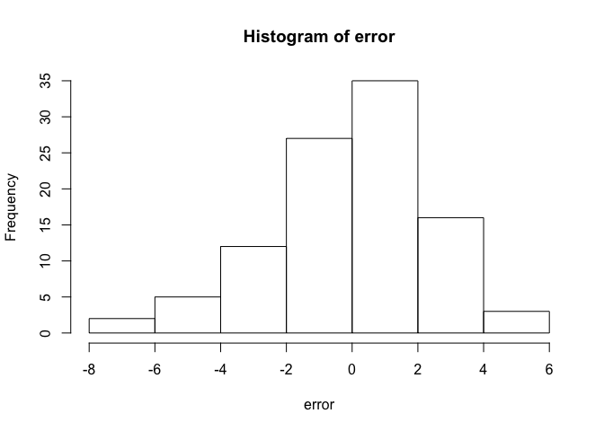
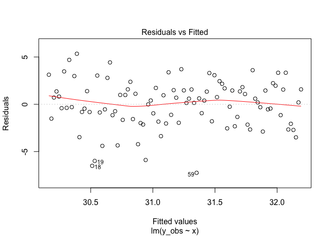
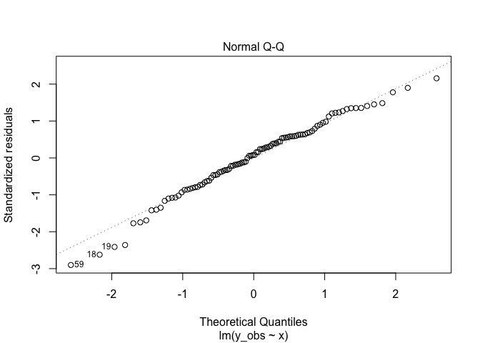

General Linear Models: The Basics
=================================

General linear models are one of the most widely used statistical tool
in the biological sciences. This may be because they are so flexible and
they can address many different problems, that they provide useful
outputs about statistical significance AND effect sizes, or just that
they are easy to run in many common statistical packages.

The maths underlying General Linear Models (and Generalized linear
models, which are a related but different class of model) may seem
mysterious to many, but are actually pretty accessible. You would have
learned the basics in high school maths.

We will cover some of those basics here. You might like to read my blog
on [Genealized linear model link functions](/rstats/2018/10/16/understanding-the-glm-link.html) after this one. 

Linear equations
----------------

As the name suggests General Linear Models rely on a linear equation,
which in its basic form is simply:

*y**i* = *α* + *β*x*i + *ϵ*i

 The equation for a straight line, with some error added on.

If you aren't that familiar with mathematical notation, notice a few
things about this equation (I have followed standard conventions here).
I used normal characters for variables (i.e. things you measure) and
Greek letters for parameters, which are estimated when you fit the model
to the data.

*y**i* are your response data, I indexed the *y* with *i* to
indicate that there are multiple observations. *x**i* is
variously known as a covariate, predictor variable or explanatory
variable. *α* is an intercept that will be estimated. *α* has the same
units as y. (e.g. if y is number of animals, then *α* is expected the
number of animals when x = 0).

*β* is a slope parameter that will also be estimated. *β* is also termed
the effect size because it measures the effect of x on y. *β* has units
of 'y per x'. For instance, if x is temperature, then *β* has units of
number of animals per degree C. *β* thus measures how much we expect y
to change if x were to increase by 1.

Finally, don't forget *ϵ**i*, which is the error.
*ϵ**i* will measure the distance between each prediction of
*y**i* made by the model and the observed value of
*y**i*.

These predictions will simply be calculated as:

*y**i* = *α* + *β*x**i*

(notice I just removed the *ϵ**i* from the end). You can
think of the linear predictions as: the mean or 'expected' value a new
observation *y**i* would take if we only knew
*x**i* and also as the 'line of best fit'.

Simulating ideal data for a general linear model
------------------------------------------------

Now we know the model, we can generate some idealized data. Hopefully
this will then give you a feel for how we can fit a model to data. Open
up R and we will create these parameters:

    n <- 100
    beta <- 2.2
    alpha <- 30

Where `n` is the sample size and `alpha` and `beta` are as above.

We also need some covariate data, we will just generate a sequence of
`n` numbers from 0 to 1:

    x <- seq(0, 1, length.out = n)

The model's expectation is thus this straight line:

    y_true <- beta * x + alpha
    plot(x, y_true)

Because we made the model up, we can say this is the true underlying
relationship. Now we will add error to it and see if we can recover that
relationship with a general linear model.

Let's generate some error:

    sigma <- 2.4
    set.seed(42)
    error <- rnorm(n, sd = sigma)
    y_obs <- y_true + error
    plot(x, y_obs)
    lines(x, y_true)

Here `sigma` is our standard deviation, which measures how much the
observations y vary around the true relationship. We then used `rnorm`
to generate `n` random normal numbers, that we just add to our predicted
line `y_true` to simulate observing this relationship.

Congratulations, you just created a (modelled) reality a simulated an
ecologist going out and measuring that reality.

Note the `set.seed()` command. This just ensures the random number
generator produces the same set of numbers every time it is run in R and
it is good practice to use it (so your code is repeatable). Here is a
great explanation of seed setting and [why 42 is so
popular](http://www.masalmon.eu/2017/04/12/seeds/).

Also, check out the errors:

    hist(error)

Looks like a normal distribution hey? That's because we generated them
from a normal distribution. That was a handy trick, because the basic
linear model assumes the errors are normally distributed (but not
necessarily the raw data).

Also note that `sigma` is constant (e.g. it doesn't get larger as x gets
larger). That is another assumption of basic linear models called
'homogeneity of variance'.

Fitting a model
---------------

To fit a basic linear model in R we can use the `lm()` function:

    m1 <- lm(y_obs ~ x)

It takes a formula argument, which simply says here that `y_obs` depends
on (the tilde `~`) `x`. R will do all the number crunching to estimate
the parameters now.

To see what it came up with try:

    coef(m1)

    ## (Intercept)           x
    ##   30.163713    2.028646

This command tells us the estimate of the intercept (`(Intercept)`) and
the slope on x under `x`. Notice they are close to, but not exactly the
same as `alpha` and `beta`. So the model has done a pretty decent job of
recovering our original process. The reason the values are not identical
is that we simulated someone going and measuring the real process with
error (that was when we added the normal random numbers).

We can get slightly more details about the model fit like this:

    summary(m1)

    ##
    ## Call:
    ## lm(formula = y_obs ~ x)
    ##
    ## Residuals:
    ##     Min      1Q  Median      3Q     Max
    ## -7.2467 -1.5884  0.1942  1.5665  5.3433
    ##
    ## Coefficients:
    ##             Estimate Std. Error t value Pr(>|t|)
    ## (Intercept)  30.1637     0.4985  60.503   <2e-16 ***
    ## x             2.0286     0.8613   2.355   0.0205 *
    ## ---
    ## Signif. codes:  0 '***' 0.001 '**' 0.01 '*' 0.05 '.' 0.1 ' ' 1
    ##
    ## Residual standard error: 2.511 on 98 degrees of freedom
    ## Multiple R-squared:  0.05357,    Adjusted R-squared:  0.04391
    ## F-statistic: 5.547 on 1 and 98 DF,  p-value: 0.0205

I'm not going to go overboard with explaining this output now, but
notice a few key things. With the summary, we get standard errors for
the parameter estimates (which is a measure of how much they might
vary). Also notice the R-squared, which can be handy. Finally, notice
that the `Residual standard error` is close to the value we used for
`sigma`, which is because it is an estimate of `sigma` from our
simulated data.

Your homework is play around with the model and sampling process. Try
change `alpha`, `beta`, `n` and `sigma`, then refit the model and see
what happens.

Final few points
----------------

So did you do the homework? If you did, well done, you just performed a
simple power analysis (in the broad sense).

In a more formal power analysis (which is what you might have come
across previously) could systematically vary `n` or `beta` and for 1000
randomised data sets and then calculate the proportion out of 1000
data-sets that your p-value was 'significant' (e.g. less than a critical
threshold like the ever-popular 0.05). This number tells you how good
you are at detecting 'real' effects.

Here's a great intro to power analysis in the broad sense: [Bolker,
Ecological Models and Data in
R](https://press.princeton.edu/titles/8709.html)

One more point. Remember we said above about some 'assumptions'. Well we
can check those in R quite easily:

    plot(m1, 1)

This shows a plot of the residuals (A.K.A. errors) versus the predicted
values. We are looking for 'heteroskedasticity' which is a fancy way of
saying the errors aren't equal across the range of predictions (remember
I said `sigma` is a constant?).

Another good plot:

    plot(m1, 2)

Here we are looking for deviations of the points from the line. Points
on the line mean the errors are approximately normally distributed,
which was a key assumption. Points far from the line could indicate the
errors are skewed left or right, too fat in the middle, or too in the
middle skinny. More on that issue
[here](http://www.seascapemodels.org/rstats/2017/10/06/qqplot-non-normal-glm.html)

The end
-------

So the basics might belie the true complexity of situations we can
address with General Linear Models and their relatives Generalized
Linear Models. But, just to get you excited, here are a few things you
can do by adding on more terms to the right hand side of the linear
equation:

1.  Model multiple, interacting covariates.
2.  Include factors as covariates (instead of continuous variables). Got
    a factor and a continuous variable? Don't bother with the old-school
    ANCOVA method, just use a linear model.
3.  Include a spline to model non-linear effects (that's a GAM).
4.  Account for hierarchies in your sampling, like transects sampled
    within sites (that's a mixed effects model)
5.  Account for spatial or temporal dependencies.
6.  Model varying error variance (e.g. when the variance increases with the mean).

You can also change the left-hand side, so that it no longer assumes
normality (then that's a **Generalized** Linear Model). Or even add
chains of models together to model pathways of cause and effect (that's
a 'path analysis' or 'structural equation model')

If this taster has left you keen to learn more, then check out any one
of the zillion online courses or books on GLMs with R, or if you can get
to Brisbane, come to our next [course (which as of writing was in Feb
2018, but we do them regularly)](http://www.easyr.org/courses.html).

Now you know the basics, practice, practice, practice and pretty soon
you will be running General Linear Models behind your back while you
watch your 2 year old, which is what I do for kicks.
