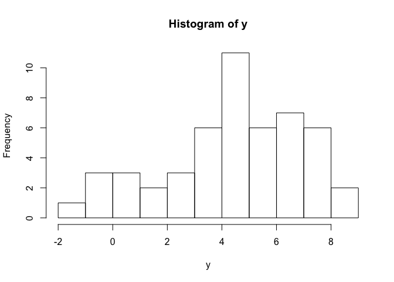
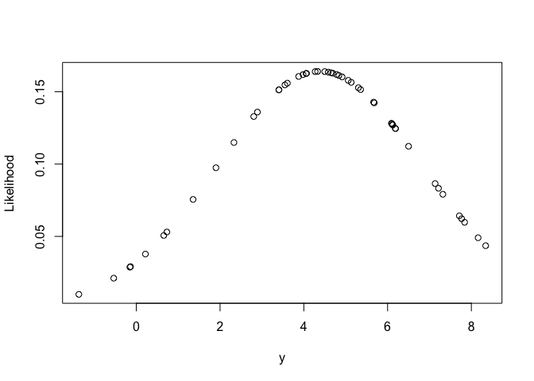
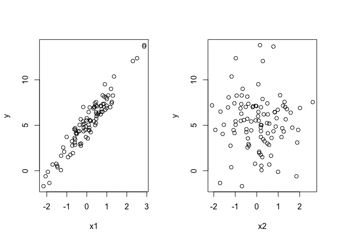
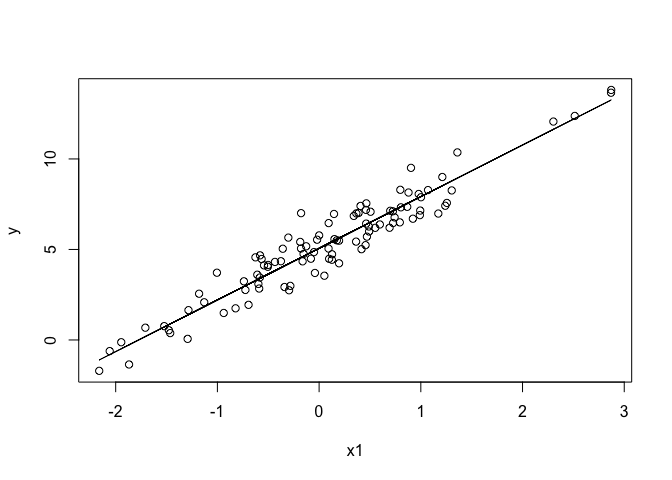

How do I interpret the AIC?
===========================

My student asked today how to interpret the AIC (Akaike's Information
Criteria) statistic for model selection. We ended up bashing out some R
code to demonstrate how to calculate the AIC for a simple GLM (general
linear model). I always think if you can understand the derivation of a
statistic, it is much easier to remember how to use it.

Now if you google derivation of the AIC, you are likely to run into a
lot of math. **But the principles are really not that complex.** So here
we will fit some simple GLMs, then derive a means to choose the 'best'
one.

Skip to the end if you just want to go over the basic principles.

Before we can understand the AIC though, we need to understand the
statistical methodology of likelihoods.

Explaining likelihoods
----------------------

Say you have some data that are normally distributed with a mean of `5`
and an sd of `3`:

    set.seed(126)
    n <- 50 #sample size
    a <- 5
    sdy <- 3
    y <- rnorm(n, mean = a, sd = sdy)
    hist(y)

Now we want to estimate some parameters for the population that `y` was
sampled from, like its mean and standard devaiation (which we know here
to be 5 and 3, but in the real world you won't know that).

We are going to use frequentist statistics to estimate those parameters.
Philosophically this means we believe that there is 'one true value' for
each parameter, and the data we observed are generated by this true
value.

    m1 <- glm(y ~ 1, family = "gaussian")
    sm1 <- summary(m1)

The estimate of the mean is stored here `coef(m1)` =4.38, the estimated
variance here `sm1$dispersion`= 5.91, or the SD `sqrt(sm1$dispersion)`
=2.43. Just to be totally clear, we also specified that we believe the
data follow a normal (AKA "Gaussian") distribution.

We just fit a GLM asking R to estimate an intercept parameter (`~1`),
which is simply the mean of `y`. We also get out an estimate of the SD
(= $\\sqrt variance$) You might think its overkill to use a GLM to
estimate the mean and SD, when we could just calculate them directly.

Well notice now that R also estimated some other quantities, like the
residual deviance and the AIC statistic.

    summary(m1)

    ##
    ## Call:
    ## glm(formula = y ~ 1, family = "gaussian")
    ##
    ## Deviance Residuals:
    ##     Min       1Q   Median       3Q      Max
    ## -5.7557  -0.9795   0.2853   1.7288   3.9583
    ##
    ## Coefficients:
    ##             Estimate Std. Error t value Pr(>|t|)
    ## (Intercept)   4.3837     0.3438   12.75   <2e-16 ***
    ## ---
    ## Signif. codes:  0 '***' 0.001 '**' 0.01 '*' 0.05 '.' 0.1 ' ' 1
    ##
    ## (Dispersion parameter for gaussian family taken to be 5.910122)
    ##
    ##     Null deviance: 289.6  on 49  degrees of freedom
    ## Residual deviance: 289.6  on 49  degrees of freedom
    ## AIC: 233.72
    ##
    ## Number of Fisher Scoring iterations: 2

You might also be aware that the deviance is a measure of model fit,
much like the sums-of-squares. Note also that the value of the AIC is
suspiciously close to the deviance. Despite its odd name, the concepts
underlying the deviance are quite simple.

As I said above, we are observing data that are generated from a
population with one true mean and one true SD. Given we know have
estimates of these quantities that define a probability distribution, we
could also estimate the likelihood of measuring a new value of `y` that
say = 7.

To do this, we simply plug the estimated values into the equation for
the normal distribution and ask for the relative likelihood of `7`. We
do this with the R function `dnorm`

    sdest <- sqrt(sm1$dispersion)
    dnorm(7, mean = coef(m1), sd = sdest)

    ## [1] 0.09196167

Formally, this is the relative likelihood of the value 7 given the
values of the mean and the SD that we estimated (=4.8 and 2.39
respectively if you are using the same random seed as me).

You might ask why the likelihood is greater than 1, surely, as it comes
from a probability distribution, it should be &lt;1. Well, the normal
distribution is continuous, which means it describes an infinte set of
possible `y` values, so the probability of any given value will be zero.
The relative likelihood on the other hand can be used to [calculate the
probability of a range of
values](https://en.wikipedia.org/wiki/Probability_density_function).

So you might realise that calculating the likelihood of all the data
would be a sensible way to measure how well our 'model' (just a mean and
SD here) fits the data.

Here's what the likelihood looks like:

    plot(y, dnorm(y, mean = coef(m1), sd = sdest), ylab = "Likelihood")

It's just a normal distribution.

To do this, think about how you would calculate the probability of
multiple (independent) events. Say the chance I ride my bike to work on
any given day is 3/5 and the chance it rains is 161/365 (like
Vancouver!), then the chance I will ride in the rain[1] is 3/5 \*
161/365 = about 1/4, so I best wear a coat if riding in Vancouver.

We can do the same for likelihoods, simply multiply the likelihood of
each individual `y` value and we have the total likelihood. This will be
a very small number, because we multiply a lot of small numbers by each
other. So one trick we use is to sum the log of the likelihoods instead
of multiplying them:

    y_lik <- dnorm(y, mean = coef(m1), sd = sdest, log = TRUE)
    sum(y_lik)

    ## [1] -114.8636

The larger (the less negative) the likelihood of our data given the
model's estimates, the 'better' the model fits the data. The deviance is
calculated from the likelihood and for the deviance smaller values
indicate a closer fit of the model to the data.

The parameter values that give us the smallest value of the
-log-likelihood are termed the maximum likelihood estimates.

Comparing alternate hypotheses with likelihoods
-----------------------------------------------

Now say we have measurements and two covariates, `x1` and `x2`, either
of which we think might affect y:

    a <- 5
    b <- 3
    n <- 100
    x1 <- rnorm(n)
    x2 <- rnorm(n)
    sdy <- 1
    y <- a + b*x1 + rnorm(n, sd = sdy)
    par(mfrow = c(1,2))
    plot(x1, y)
    plot(x2, y)

So x1 is a cause of y, but x2 does not affect y. How would we choose
which hypothesis is most likely? Well one way would be to compare models
with different combinations of covariates:

    m1 <- glm(y ~ x1)
    m2 <- glm(y ~ x2)
    m3 <- glm(y ~ x1 + x2)

Now we are fitting a line to y, so our estimate of the mean is now the
line of best fit, it varies with the value of x1. To visualise this:

    plot(x1, y)
    lines(x1, predict(m1))

The `predict(m1)` gives the line of best fit, ie the mean value of y
given each x1 value. We then use predict to get the likelihoods for each
model:

    sm1 <- summary(m1)
    sum(dnorm(y, mean = predict(m1), sd = sqrt(sm1$dispersion), log = TRUE))

    ## [1] -125.6214

    sm2 <- summary(m2)
    sum(dnorm(y, mean = predict(m2), sd = sqrt(sm2$dispersion), log = TRUE))

    ## [1] -247.8059

    sm3 <- summary(m3)
    sum(dnorm(y, mean = predict(m3), sd = sqrt(sm3$dispersion), log = TRUE))

    ## [1] -125.4843

The likelihood of `m1` is larger than `m2`, which makes sense because
`m2` has the 'fake' covariate in it. The likelihood for `m3` (which has
both x1 and x2 in it) is fractionally larger than the likelihood `m1`,
so should we judge that model as giving nearly as good a representation
of the data?

Because the likelihood is only a tiny bit larger, the addition of `x2`
has only explained a tiny amount of the variance in the data. But where
do you draw the line between including and excluding x2? You run into a
similar problem if you use R^2 for model selection.

So what if we penalize the likelihood by the number of paramaters we
have to estimate to fit the model? Then if we include more covariates
(and we estimate more slope parameters) only those that account for a
lot of the variation will overcome the penalty.

What we want a statistic that helps us select the most parsimonious
model.

The AIC as a measure of parsimony
---------------------------------

One way we could penalize the likelihood by the number of parameters is
to add an amount to it that is proportional to the number of parameters.
First, let's multiply the log-likelihood by -2, so that it is positive
and smaller values indicate a closer fit.

    LLm1 <- sum(dnorm(y, mean = predict(m1), sd = sqrt(sm1$dispersion), log = TRUE))
    -2*LLm1

    ## [1] 251.2428

Why its -2 not -1, I can't quite remember, but I think just [historical
reasons](https://en.wikipedia.org/wiki/Akaike_information_criterion#CITEREFAkaike1985).

Then add 2\*k, where k is the number of estimated parameters.

    -2*LLm1 + 2*3

    ## [1] 257.2428

For `m1` there are three parameters, one intercept, one slope and one
standard deviation. Now, let's calculate the AIC for all three models:

    -2*LLm1 + 2*3

    ## [1] 257.2428

    LLm2 <- sum(dnorm(y, mean = predict(m2), sd = sqrt(sm2$dispersion), log = TRUE))
    -2*LLm2 + 2*3

    ## [1] 501.6118

    LLm3 <- sum(dnorm(y, mean = predict(m3), sd = sqrt(sm3$dispersion), log = TRUE))
    -2*LLm3 + 2*4

    ## [1] 258.9686

We see that model 1 has the lowest AIC and therefore has the most
parsimonious fit. Model 1 now outperforms model 3 which had a slightly
higher likelihood, but because of the extra covariate has a higher
penalty too.

You don't need to do these calculations yourself everytime you want an AIC. The function `AIC(m3)` will just give it to you.

AIC basic principles
--------------------

So to summarize, the basic principles that guide the use of the AIC are:

1.  Lower indicates a more parsimonious model, relative to a model fit
    with a higher AIC.

2.  It is a *relative* measure of model parsimony, so it only has
    meaning if we compare the AIC for alternate hypotheses (= different
    models of the data).

3.  We can compare non-nested models. For instance, we could compare a
    linear to a non-linear model.

4.  The comparisons are only valid for models that are fit to the same response
    data (ie values of y).

5.  Model selection conducted with the AIC will choose the same model as
    leave-one-out cross validation (where we leave out one data point
    and fit the model, then evaluate its fit to that point) for large
    sample sizes.

6.  You shouldn't compare *too* many models with the AIC. You will run
    into the same problems with multiple model comparison as you would
    with p-values, in that you might by chance find a model with the
    lowest AIC, that isn't truly the most appropriate model.

7.  When using the AIC you might end up with multiple models that
    perform similarly to each other. So you have similar evidence
    weights for different alternate hypotheses. In the example above m3
    is actually about as good as m1.

8.  You should correct for small sample sizes if you use the AIC with
    small sample sizes, by using the AICc statistic.

9. You can access the AIC in R with the `AIC()` function.  

Message me on [Twitter](https://twitter.com/bluecology) if you have comments on this post. 

[1] Assuming it rains all day, which is reasonable for Vancouver.
