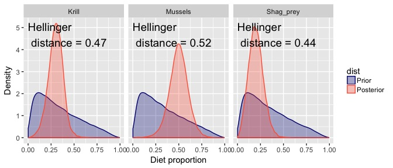

The study of animal movement, animal diets and more generally nutrient and carbon flows in ecosystems has been transformed by stable isotope ecology. However, in a new [paper](https://link.springer.com/article/10.1007/s00442-018-4138-y) we present evidence that misuse of isotope mixing models, the statistical tools that underlie the analysis of stable isotopes, may be leading many studies to false conclusions.  

The problem arises because Bayesian methods are used in the analysis of stable isotope ratios, without thought to how the priors affects the results.  

## The problem with the priors

In our analysis, we focus on the use of stable isotopes to estimate the diet compositions of animals. Though the analysis of stable isotope ratios can equally well be applied to understanding nutrient and carbon flows in ecosystems, like in the pictured mangrove forest.

One of the most popular approaches for analysing isotope data are Bayesian mixing models. Bayesian mixing models account for variation in the isotopic signature of different potential food sources. This means we get estimates of proportional contribution of food items to a diet with associated uncertainty intervals.

Bayesian methods require specification of priors, which reflect our prior knowledge about what the animal consumes. The model then integrates the prior with the data to obtain the final estimates, termed posteriors.

The problem arises, because most ecologists use the 'default' prior, apparently without considering its effect on their posterior estimates of diet composition.

In many other settings Bayesian priors can be designed so they have only a weak influence on the posterior, this is not the case in mixing models. Take the image below. The blue probability distribution shows the 'default' priors for the contribution of each of three food items to a gull species' diet.

Clearly the prior distribution is not totally uninformative. The prior has a mode near 10% and a mean of 1/3 (because their are three potential food sources).

The priors for a diet cannot in fact be totally flat across all proportions, simply because the sum across all proportions must equal 1. The plotted priors are in fact the 'marginal' priors, so they reflect the fact that there are more ways to add three numbers and get one when those numbers are near 1/3, than near 0 or 1.

So if you run an analysis with a small amount of data, or very noisy data, the result you get out will basically be the prior.

This means that any potential diet items thrown into the analysis, in case they matter, can come out with a mean contribution near 1/3 (or 1/ however many sources you had), leading researchers to the unexpected conclusion that unlikely diet items are suddenly very important.

## Quantifying learning

We propose a way to get around this issue is to quantify how much is learned over and above the priors.

The idea is simple, we can use the maths of information theory to measure how much the posterior estimates diverge from the priors.

In the above picture you see the Hellinger distance for each posterior. This measures the divergence between prior and posterior, with values near zero indicating identical distributions and values near one indicating the posterior has positive probability everywhere the prior had zero probability (ie maximal divergence).  

Another statistic is the Kullback-Leibler divergence, which we also discuss in the [paper](https://link.springer.com/article/10.1007/s00442-018-4138-y).

So, if we have not learned much (ie the data are weak), then the Hellinger distance and Kullback-Leibler divergence will be near zero.

There are several ways we can get high information divergence, and a high value warrants further investigation.

For instance, the data may support the prior, in which case we have similar mean estimates for diet, but uncertainty about diets has decreased.

Or the data may contradict the priors, in which case we have different mean estimates, or even the same mean with much greater uncertainty.

## Power analysis

A handy side-effect of our application of information theory is that it provides a means for conducting power analysis with Bayesian mixing models. If we simulate data-sets with different numbers of samples we can estimate the sample size required for the data to overcome the prior.

This type of power analysis could be useful a-prior analysis to use to help optimise sampling design. For instance, we might want to optimise the number of samples taken from animals for expense or ethical reasons.

## Summary

Many of the problems associated with interpreting Bayesian mixing models could be avoided if people followed the [best practice guidelines](http://www.nrcresearchpress.com/doi/abs/10.1139/cjz-2014-0127?src=recsys&__hstc=74603853.e72c280a7921bf0d7ab734f9822a9c39.1519948800087.1519948800088.1519948800089.1&__hssc=74603853.1.1519948800090&__hsfp=528229161&). We propose some handy evaluation methods to avoid some of the pitfalls of Bayesian mixing models.  

Our analyses can be conducted with an [R package](https://github.com/cbrown5/remixsiar), 'remixsiar', that works with simmr and mixsiar, two common packages for Bayesian mixing models.

We hope use of these methods will improve the study of nutrient and carbon flows in ecosystems.

Feel free to message me on [Twitter](https://twitter.com/bluecology) if you have any thoughts or comments.
