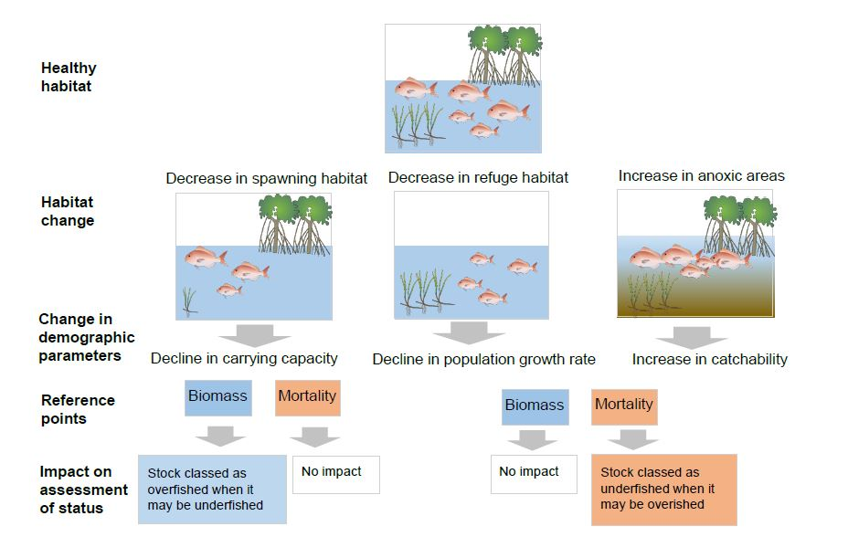

Our new research [published in Fish and Fisheries](https://onlinelibrary.wiley.com/doi/abs/10.1111/faf.12318) argues that protecting fish habitats is critical to recovering the world’s fisheries ([here's an open access version](https://www.biorxiv.org/content/early/2017/12/13/233478)).

The study reviewed the habitat requirements for fish stocks across the globe. Nearly half of those reviewed were found to use habitats that are known to be in decline.  

  
*Our guide to assessing the risk of misclassification of stock status when there are unrecorded changes in fish habitat*

Overfishing is often pinned as the only cause of declines in the productivity of fisheries, which implies stricter fisheries regulations are the sole solution to overfishing. We found that nearly half of the world’s best researched fish stocks are using habitats that are in decline, like seagrass and mangroves.

Many fish habitats are under-threat from human activities like coastal development, pollution and destructive fishing that not only catches fish, but also damages habitats on the ocean floor. Queensland for instance, has lost large areas of its seagrass meadows and mangrove forests to development ¬of coastal infrastructure and pollution.

The study looks at how protecting or restoring lost habitats can improve the status of fisheries, so that the fisheries can sustainably support higher catches. If habitats are declining and we don't know about it, we can mistakenly believe that fish stocks are better or worse off than they actually are (see figure).  

Managing fish catch is an important part of ensuring we have sustainable fisheries that support food production and jobs. But we can’t just count on good fisheries management. Protecting the fish habitats we have left and restoring lost habitats like mangroves is crucial.

It has previously been estimated that 31% of fish stocks globally are over-exploited, meaning that catches could be higher if fishing pressure was reduced. But these previous estimates ignored the effects of habitat loss on the productivity of fisheries.

We analysed habitat use for 418 of the best researched fish stocks (those in the RAM Legacy stock assessment database). These are stocks for which detailed monitoring data are available. They are commonly used to estimate how sustainable fish are at the global scale.

This was a work of several years, first conceived as part of my ARC DECRA project and now has finally reached print. Study co-author Andrew Broadley and I reviewed hundreds of papers to identify what types of habitats were used by the 418 stocks.

We also published the results of that review, the data for which is available for free in [the Fishscape database](http://www.seascapemodels.org/fishscape/).

The results suggest we need to look beyond fisheries to other activities that are degrading habitats, like pollution that comes from on land, and coastal development.

“Restoration of critical fish habitats such as mangroves, seagrass, and floodplains will increase the resilience of fish populations against overfishing. For example, in the Wet Tropics, northern Australia, reconnecting coastal lagoons with mangroves and the Great Barrier Reef has been the primary objective of many restoration projects for fish species such as barramundi to have a better chance of growing and reproducing” said study co-author Dr Fernanda Adame.

Managing fish habitats can be hard – we need to coordinate our management across the land and sea and across different industries, like infrastructure development and fisheries. But doing so is crucial to supporting the jobs created by fisheries and the opportunity to fish recreationally that is enjoyed by millions of Australians.  

We hope to continue to use this work to inform our new project on [mapping the health of coastal wetlands globally](https://globalwetlandsproject.org/).
