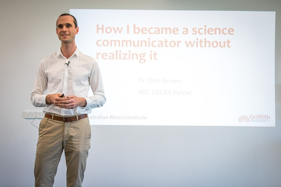

Would you consider yourself to be a science communicator, that is not just writing papers but doing other activities like doing interviews on radio?  

<em>Photo: Tom Rayner</em>

This story is about how I became a science communicator, without ever intending too.  

This blog is based on a talk I gave for the launch of the Australian Rivers Institute's [new science magazine](https://catchmenttocoast.org/2018/09/29/launch-of-our-magazine/).

I used to think scicomm was doing interviews for print, radio and TV to try and reach general public. I definitely didn’t want to do interviews growing up. I wanted to be a marine biologist and help ocean ecosystems.
Looking back though, it turns out I was always a keen science communicator.  

In high school I took a creative writing course, as a kind of break from all the science and maths I was doing. My peers in the course were writing beautiful poems about love, drinking and drugs (we were 16!). I was the nerdy kid imagining I was a journalist for Scientific American, writing non-fiction magazine articles about cool science.  

I never got very good marks in writing, but my creative writing teacher (Karen Clark) said something that has stuck in my head all these years. “keep practicising writing Chris, you will get good at it” (or something like that, it was a few years ago).  

When I went on to do my PhD at UQ, writing become about papers and very technical.  

During my PhD I was invited by Ben Halpern to attend training on science communications at the University of California, Santa Barbara.  
It was there I learned about Nancy Baron’s work “[Escape from the Ivory Tower](https://islandpress.org/books/escape-ivory-tower)”. I became convinced that it was crucial for us to escape the ivory tower if science was to inform better policies and decisions about the environment. I thought I should try to do more scicomm.  

The course was a lot about media interviews. I did a mock interview with an actual journalist from Scientific American, and failed badly. I felt that if this was what scicomm was about, it definitely wasn’t for me.
At the course they also taught us about Twitter and I became interested in how we could connect with other people through social media.  

I started tweeting in my first postdoc. But more importantly, I started seeing a lot of blogs on twitter.
Now as a young postdoc at UQ I felt my emerging identity as an independent thinker and scientist was lost in UQ's academic machine.  

I realised that starting my own blog was a way I could present the identity I wanted to present to the world with full control. And share my own thoughts. So I started blogging.  

At the same time I was still trying to escape from the ivory tower and the opportunity arose to do an interview for some North Queensland papers on my new study. When I arrived at the office next data the Uni’s media person had posted the article on the message board. Turns out the newspaper had also asked some local fisherman what they thought of my study. They had printed a quote in large font:  

> “These guys have no brains”  

Yep, interviews and scicomm weren’t for me.  

But I kept blogging.  

And my blogs were being read. I would meet people overseas at workshops and they would say ‘hey I read your blog’. That was exciting. But I was really only reaching other scientists.  

By the time I came to ARI I was becoming addicted to blogging. So much so that now I write about a PhD thesis worth of words in blogs every 18 months.  

I hope one day I bump into my creative writing teacher on the street so I can tell her “hey, I practiced and I became a Writer!”  

Things changed when I came to the Australian Rivers Institute and I started to identify as a science communicator. I think it is indicative of the wonderful supportive culture we have at ARI. The institute is great at supporting the career development of its ECRs.  

At ARI I set up the institute's blog and twitter feed (where I also do 10s of blogs per year and edit many more). I would help my colleagues write blogs about their science papers in a more accessible form. And I found I really enjoyed it.  

I also learned there never was an ivory tower at ARI. Everyone was doing such great applied work, such as that the work Stuart Bunn and Michele Burford do with the National Environmental Science Program. Under this funding they are working directly with stakeholders to set science priorities and do the research that was needed.  

That really changed my perspective on scicomm, it wasn’t just about interviews with journalists, it could be more targeted, directly speaking to the people that needed the research the most.  

Then [Liz O'Brien](https://twitter.com/drlizob?lang=en) from Griffith's Research Office encouraged me to apply for a Tall Young Poppy Award in science media and communication and I won one. The recognition really helped me to start to identify as a communicator.  

So then we went further and set up the [ARI Scicomm cadets](https://catchmenttocoast.org/2018/08/31/scicomm-cadets/) program. So we are currently training four of our ECRs in science communications skills, everything from tweeting to engaging with stakeholders. And they are running some amazing activities like Man’s international Cyanobacteria Twitter conference that is coming up next month.  

Then Prof Rod Connolly invited me to join an application for funding that has become the [Global Wetlands Project](https://globalwetlandsproject.org/). We hired a full-time science communicator. He’s here today – Tom Rayner – and is doing some amazing things that more strategic than I ever dreamed scicomm could be. We have integrated scicomm into our research from day 1, and have a strategy for everything from training ECRs to how to facilitate a two-way dialogue between researchers and stakeholders.  

Tom and I are currently working on how we will monitor the project's impact with stakeholders, so we can map the project's pathways to impact over its 4 year duration.

With all of this interest in scicomm, I am very pleased to be at ARI as a researcher and science communicator for the launch of ARI’s magazine.  

The magazine for me represents much of what ARI is about. It is showing to the world that not all scientists are stuck in the ivory tower.  

It gives our early career researchers a voice so they can start to create their own research identity.  

It is about reaching out to stakeholders and starting a conversation that will hopefully lead to better more useful science and more effective decision about our environment. People are less likely to raise comments like ‘they have no brains’ if they’ve had the chance to contribute to the science from day one.  

So now you've heard my story, I'll ask you again, are you a science communicator?
