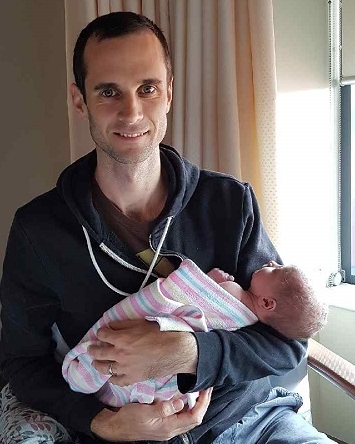

2018 has been a big year for me, at work and home. I started several major grants, including starting new PhD students and hiring my first ever postdoc. Then very quickly I also hired my 2nd and 3rd ever postdocs. All this hiring meant I had to chair interview panels for the first time.

I don't think the first few candidates realised, but I was as nervous as they were.

At home my second son was born. Cradling his floppy little head in hospital I had that feeling again that there was something wrong that society would let such a naive Dad look after this child's fragile life. I often feel like I'm learning to be a Dad by 'trial and error' and that someone will pull me up for poor parent skills, like not holding a baby properly.

All these feelings of not being capable may be [imposter syndrome](https://impostersyndrome.com.au/index.php/what-is-it/). Imposter syndrome is the feeling that you are a fraud, and that all you've achieved is false. You feel like you will eventually be caught out by someone and everything will come tumbling down. You have this feeling even though there is quantitative evidence that you are in fact the real deal (ok so I did win the grants, and yes I am a capable father who has raised another child).

<em>Me wondering what I've gotten into again</em>

Imposter syndrome is becoming increasingly well recognized in academic circles, because it often affects successful people. I think there is evidence that women are more prone to it than men, though we men can certainly be affected too.

**So an important development goal for someone's PhD is not just to grow their knowledge, but also their confidence in that knowledge**. This might include the confidence to present seminars, conduct statistics, write papers, debate, do job interviews, or even just speak with colleagues.

Learning to be humble about your knowledge can be important too, though I think this need is rarer in early career scientists.

**Many people with imposter syndrome may not even realise they can overcome it.** If they are even aware of their own low confidence they may see it as an inherent trait, like it's part of their DNA. In fact, you can write your own story about who you are.

I want to share here how I grappled with imposter syndrome and how I've learned to be more confident and overcome low self-esteem.

I'll focus on the parts of the story I think are lessons that others can act on. I hope this helps you.

## My story about low self-esteem and cultivating confidence  

I did my PhD in a very successful lab group. I remember three months into my PhD feeling extremely stressed. Many of my peers who had started 6 months before me had submitted their first PhD papers to journals like Science. I was asking myself how I deserved to be there. I was months in and I hadn't submitted a paper yet!  

A few years later I shared this experience with some of my peers. They laughed. Apparently just before I started the lab lead had printed my CV and left it on the tea-room table. The other students had been somewhat intimidated by some of my academic achievements in undergrad.  

The lesson I learned was that we often compare ourselves against other people's achievements and find ourselves to be lacking. **We fail to remember that we too have been successful, but in different ways.** It is like looking at someone's Instagram feed: They select only the amazing things to post about their holiday, and you think they have a much more interesting life than you have. If you talk to them though, you find out that the holiday was mostly mundane, or downright dreadful.

**It is important to learn that you can write your own story of what success is, and you can write this story around your own strengths.**

If you are not sure what your strengths are, find a trusted friend or colleague and ask them. Another way to find your strengths is to write down your 'weaknesses'. **Your strengths will often be the flip side of your weaknesses.** So if one of your weaknesses was taking on too much for other people, maybe your strength is teamwork.  

I don't know why I thought I was failing so early on in my PhD. I think it goes back to low self-esteem from my teenage years. I was often bullied in high school. Rarely did I think I was 'good' at anything. When I did well in class, I usually put it down to luck or hard work.  

## You can choose peers that help your confidence, not hinder it

Study and academia played a key role in growing my confidence. As I progressed to the later years of high-school I escaped from some of the social circles that were putting me down. Those later years also saw a greater emphasis on learning and study and, for me, access to some great mentors who encouraged my interest in ecology and science.

Studying at university meant I found peers who also shared my passion for ecology and science. I gained the respect of my peers for the knowledge I did have. For instance, I often helped my peers study for exams. This really helped me develop more confidence.

**Finding a positive group of peers and mentors is important for growing your confidence**. In my PhD and onto my postdoc I had finally found a community that grew my confidence, rather than putting me down like in high-school. Many of them became close friends.

As my Phd went on I started to ask the other students or postdocs in the lab for help on everything from admin to statistics to finding a house. This helped me find a community among other PhD students and postdocs who become a crucial support network. I learned from them that others who seemed so successful had also faced the same fears of failure as me, but overcame them.

**So a community of support can help you grow your confidence.** Often all it takes is to ask someone for help.  

## Mentors that let you make mistakes  

Finding and maintaining positive mentors is also important too. I've had many. I looked back at the acknowledgements from my PhD and a quote about my supervisors stands out:

> "I could not have emerged from this PhD confident about making a career in scientific research without their guidance, but also the freedom they gave me to make mistakes."

Because we all make mistakes sometimes, I think it is important for supervisors to let you make them, or, if not, find your own mentors that help you reconcile and learn from them.  

If your supervisor is putting you down, maybe you need to find another mentor. Or be brave and ask them to be more positive. Criticism is hardwired into academic culture (and so it should be), but sometimes supervisors can be more critical and negative than they realise.

Along the way in my PhD I got to present at conferences. I was well prepared and I did a good enough job to get positive feedback from other scientists. I also got some papers through peer-review. Some times the reviews (and even coauthors!) were hyper-negative. Sometimes they were positive. But the end result of the published paper was always a boost to my confidence. So putting the work in to making these achievements happen was crucial to building my confidence.  

Through my PhD I started learning the R programming language, which has become instrumental to my career. As I got better I realised it was knowledge other people wanted to have too. So into my postdoc I started teaching R to others, something I continue to this day.

I've found teaching something you know well, even to just one or two people, is a great way to build your confidence. It is like the Instagram situation in reverse, you see other people are hungry for what you have.

## Imposter syndrome can be an extreme sport  

I love extreme sports like surfing, mountain biking, rock climbing and writing.  

Writing is an extreme sport?

I forget where I read it, but someone said that writing novels is an extreme, adrenalin fueled, sport. An author spends years putting together a novel before it is published. Every time they have little idea how it will be received, they may get critical acclaim, bomb reviews, or worse still, be totally ignored.

I think writing papers can be the same too. I never really now if a paper will fly through review, or totally flunk.  Imposter syndrome puts the fear in me. And I have learned to love running straight into it.

> I have been helped to overcome imposter syndrome by the realization that confronting fears in any form is a kind of sport

This might seem odd to you, but hey I'm a Dad, I don't get as much time surfing and climbing as I used too, so writing is my way to get a rush now.

Part of this realization is that the consequences of mistakes usually aren't that high. I'm fortunate (or getting old!) to have the experience of making mistakes and surviving many times. Usually the outcome is just being slightly embarrassed, but then you correct them and nothing else happens. Unlike extreme sports athletes, we don't get physical wounds from errors in equations, hidden flaws in experimental designs or missing references.

These blogs, especially the personal ones that make me feel vulnerable, are another way I practice 'extreme' writing.  

## Experimenting with your career and learning from mistakes  

The final tool that's helped me with imposter syndrome is seeing everything as a series of experiments.

Some people say we should embrace failure as a way of learning. I prefer to see failure as part of experimentation.  

I recognized that the change in my job from being an postdoc to a supervisor meant this year would be a big year of learning. I reconciled with myself that there would undoubtedly be mistakes, and while I would try to avoid them, I would learn from those that I did make.

So next time you hesitate because of the risk of failure, try looking at the challenge as an experiment. Ask yourself, how might I run this experiment to maximize the learning, but minimise the costs of failure?  

For instance, I recently submitted a paper on some eco-stats that were pretty new to me (and ecologists). But I posted the manuscript on a pre-print server and sought pre-review feedback before submitting it. I made some helpful corrections that way.

I'll leave you with a story from a friend. My friend met someone who was selling a book series about how to raise your kids. The salesman made a convincing sales pitch to my friend about how the books would direct her to raise smart and well balanced children. But at the end my friend said she didn't want the books. The salesman asked why and my friend said:

> "These books would take the trial and error out of parenting. My children are my experiments, I don't want to lose that joy."  
