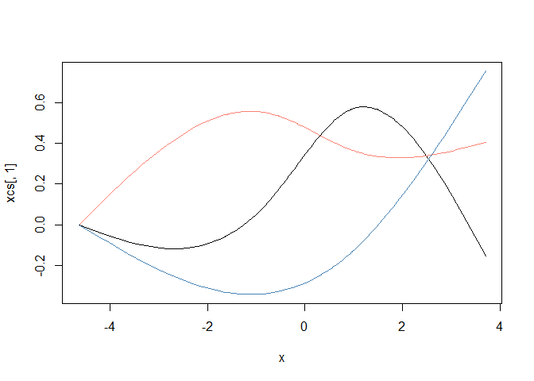

GLM tips: get non-linear with splines
=====================================

This tip is great for a quick non-linear test, before you go all the way
with a GAM or parametric non-linear model.

You'll need the `splines` library, which comes shipped with R anyway.

First, let's make up a bit of count data. The underlying 'true' model
will be poisson (think count data) with a log link (so slope estimates
are multiplicative of the poisson mean). But we'll introduce a bit of
non-linearity.

    n <- 100
    set.seed(101)
    x <- sort(rnorm(n, sd = 2))
    mu <- 2 + 0.1*x - 0.6*x^2 + 0.18*x^3#linear predictor

    y <- rpois(n, exp(mu))
    plot(x, y)
    lines(x, exp(mu))

Now, we could just fit a polynomial, but for real data we wouldn't know
the mean structure was generated as a polynomial. So we might want to
use something a bit more flexible, like a cubic spline.

So, here's how to make a cubic spline. We just need to choose the
degrees of freedom. A DF of of 1 will give us a linear fit, higher DFs
allow more bends ('knots'). We'll fit a log-linear model, a model with
df = 2 and a model with df= 3 Given we generated our data with a cubic
polynomial, we'd expect the 3 df model will do best

    library(splines)
    #log linear model
    m1 <- glm(y ~ x, family = "poisson")
    m1pred <- predict(m1, type = "response")

    #non-linear models
    m2 <- glm(y ~ ns(x,2), family = "poisson")
    m2pred <- predict(m2, type = "response")

    m3 <- glm(y ~ ns(x,3), family = "poisson")
    m3pred <- predict(m3, type = "response")

    par(mfrow = c(1,3))
    plot(x, y, main = "DF = 1")
    lines(x, exp(mu), lwd = 2, col = "grey")
    lines(x, m1pred, col = "orange", lwd = 2)

    plot(x, y, main = "DF = 2")
    lines(x, exp(mu), lwd = 2, col = "grey")
    lines(x, m2pred, col = "purple", lwd = 2)

    plot(x, y, main = "DF = 3")
    lines(x, exp(mu), lwd = 2, col = "grey")
    lines(x, m3pred, col = "darkblue", lwd = 2)

The orange line is the naive linear fit, it basically shows no trend.
The purple line (df = 2) does better, but misses the kick up at the end.
The blue line looks closest to the 'true' mean function (grey line).

The purple and blue lines are our spline fits with 1 and 2 knots
respectively. Both clearly capture the non-linearity. The grey line is
the 'true' mean structure we created above. So our splines just peaks a
bit too hard, but does get the shape right.

We can convince ourselves that the 3 df splines model is better with AIC

    AIC(m1)

    ## [1] 492.1094

    AIC(m2)

    ## [1] 434.6807

    AIC(m3)

    ## [1] 362.3653

Yep, the 3 spline model has a much lower AIC despite using more model
D.F., so is better.

Transfer your spline skills, anywhere
-------------------------------------

A nice feature of this cubic spline trick is that you can use it
anywhere that takes a model matrix as input. So it will work with `glm`,
`glmer`, `lmer` and any Bayesian GLM method you care to use. Just apply
your normal model selection criteria to find the 'best' number of knots.

First, set the knots using `x`:

    library(splines)
    xcs <- ns(x, 3) #3 knots!
    head(xcs, 3)

    ##                1         2           3
    ## [1,]  0.00000000 0.0000000  0.00000000
    ## [2,] -0.04388799 0.1157184 -0.07117461
    ## [3,] -0.04775128 0.1262731 -0.07766646

    plot(x, xcs[,1], type = 'l', ylim = c(min(xcs), max(xcs)))
    lines(x, xcs[,2], col = "salmon")
    lines(x, xcs[,3], col = "steelblue")

This splits `x` into three covariates (note the new matrix `xcs` has
three columns), which I've plotted above. The cubic spline algorithm
puts bends in the new covariates according to the density of the data.

We can use these new covariates in our model and `glm` will estimate a
coefficient for each one.

Because the `xcs` are a non-linear functions of `x`, fitting a model
against them means we can mix the curves to get a non-linear fit. We do
lose a few degrees of freedom though, because now x is three covariates,
instead of just one.

We can just use `xcs` in our model formula as a covariate.

But I prefer just to put the `ns` command directly into the model
formula, that way it is easy to change the knots, as we did above.

What about GAMs?
----------------

If you really want to get into non-linear trend fitting, you should use
a generalized additive model (GAM), such as from package `mgcv`.

In fact, GAM can fit these kind of splines for you too (and more), it
just uses a different method to select the number of knots.

But the splines trick is still handy. For instance, you can quickly
modify an existing linear model to have a non-linear spline. Or use it
in a Bayesian linear model that doesn't have a GAM equivalent ([you can
also spit out model matrices from
mgcv](https://www.jstatsoft.org/article/view/v075i07) and use them in
Bayesian models if you want other types of splines).

So I hope you enjoying splining.
