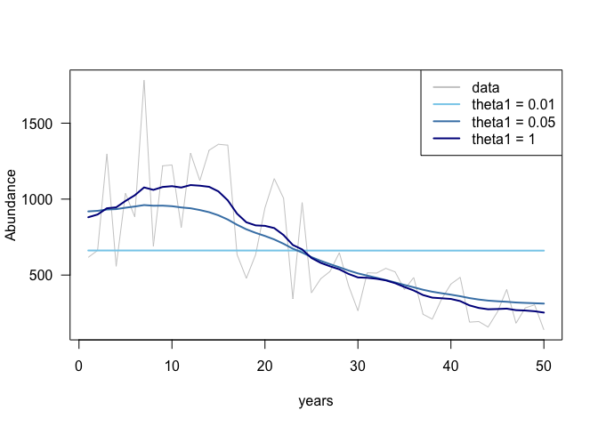

[Our new research](https://www.sciencedirect.com/science/article/pii/S0006320719306020) has revealed a 71% decline in tiger sharks across Queensland’s coastline ([open-access version](https://www.biorxiv.org/content/biorxiv/early/2019/01/13/395509.full.pdf)).

In this blog I will explore the time-series modelling techniques we used to estimate this trend. (I've written about the significance of this [decline elsewhere](https://catchmenttocoast.org/2019/09/11/decline-in-tiger-shark-population-defies-expectations/).)

We aimed to achieve two things with the modelling in this paper. First, we wanted to explore how using informed Bayesian priors affects non-linear trend fitting. Second, we wanted to know the impact of having more or less data on estimates for the magnitude of a decline.

## Smoothing non-linear trends with Bayesian models

We chose to use a Bayesian time-series modelling technique. This isn't as complex as it sounds. It is really just a Bayesian extension of GLMs.

The clever extension (not our invention!) is to use a random walk to model non-linear trends in population size. In effect, the random walk is just saying each year's population has some dependency on the previous year.

You can think of the random walk as telling us about how strongly the value of next year is constrained by the value this year.

The neat thing about Bayesian methods (as opposed to frequentist methods) is we get to use prior information for the variance of the random walk. This means we can control the strength of the random walk. More variance = potentially bigger steps in the random walk. Less variance = smaller steps.

Eventually if we tell the prior that there is effectively no variance in the random walk, the model will always estimate a flat line. If you let the prior have very large variance, then the random walk will follow the data very closely.

We usually want to be somewhere in the middle of the two extremes of a flat trend versus a trend that tracks every slight wiggle. We want a trend line that 'smooths' the data. See the picture.

The idea for this paper started with a [blog a couple years ago](http://www.seascapemodels.org/rstats/2017/06/21/bayesian-smoothing.html), where I explained the idea of smoothing a random walk with prior information.

We used the [R-INLA](http://www.r-inla.org/) framework for our model. This is a handy tool, because we could model other, non-temporal, source of variation too. Like differences in trends by sites.

## Priors informed by life-history traits

So why use Bayesian methods for tiger shark time-series? Well the Bayesian priors mean we can inform the time-series models with other information. Like life-history traits.

Tiger sharks are in decline on the East Coast of Australia, we want to know by how much, because that information is important for informing conservation decisions. This means we need to smooth out all the noise in the data to estimate a long-term trend.

[Holly Kindsvater and co](https://www.sciencedirect.com/science/article/pii/S0169534718301411) explain the idea of priors very elegantly. But basically conservation biology has a data crisis. We need to make the most of the information we have.

If we used the more traditional techniques, like GAMs, we only get to use the time-series data to estimate the level of smoothing. But why ignore other sources of data when we could use them?

<em>The method for informing priors</em>

We show that the random walk variance can be informed by life-history information (see picture). These are measurements scientists have made of tiger sharks, which do not depend on time-series. For instance, information like, at what age do tiger sharks breed and how many babies do they have?

This life-history information tells us how rapidly the tiger shark population is likely to change under natural conditions. So we use it to constrain the random walk.

We then used a special type of prior, a [penalized complexity prior](https://arxiv.org/abs/1403.4630) to ensure that we could capture less common, but rapid changes in abundance, which may be caused by humans killing things.

## Does data quantity matter?

Of course! But we wanted to know how much data you need. We had a lot of data in this instance, almost 10,000 shark captures over 33 years at 11 regions.

So we ran simulations where we used only some of the data (The INLA technique came in handy here, because it runs so [FAST](http://www.seascapemodels.org/rstats/2017/04/14/glmm-comparison.html)).

It turns out the informed priors did pretty well at getting a good estimate of the trend when there was less data.

The 'default' priors also did very well (ie what you get if you don't tell INLA what prior to use). I hope the developers of the INLA penalized complexity prior are pleased to hear this.  

However, we think it is still good to make use of life-history information. Informed priors help to justify modelling decisions, which can be important when trends are used to inform policy debates.

## What's next?  

There's lots of interest in Queensland's sharks right now. Not least because of a [court battle between environmental lawyers and the Queensland government, over government policy](https://www.abc.net.au/news/2019-09-18/shark-attack-drum-lines-great-barrier-reef/11523902) to shoot sharks they catch in beach protection programs.

We've also found declines in other [large sharks, including threatened species](https://theconversation.com/some-sharks-have-declined-by-92-in-the-past-half-century-off-queenslands-coast-108742).

Everyone keeps asking us what is causing these shark declines. So we'd like to do some modelling of different causes of mortality (commercial fishing, recreational fishing, shark control programs etc...) to see what matters most.
