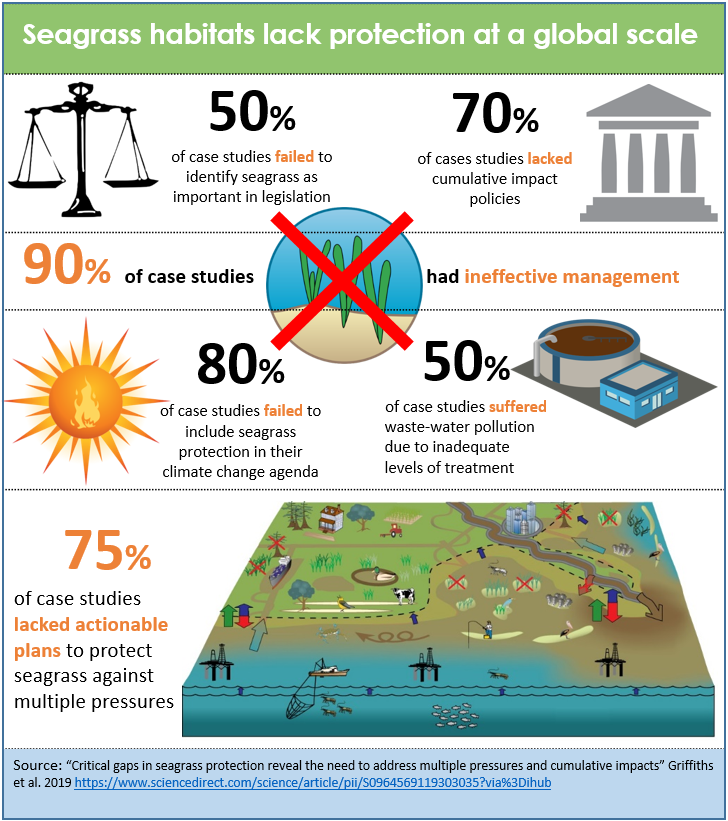

This blog was written by PhD student [Laura Griffiths](http://www.seascapemodels.org/people/Laura-Griffiths.html).

Seagrass ecosystems face multiple threats, from pollution to sea level rise. However, management is failing to adequately protect these ecosystems and prevent their decline. [We reviewed global policy relevant to seagrass protection and identified some critical gaps](https://www.sciencedirect.com/science/article/pii/S0964569119303035). We need to rethink how we protect coastal ecosystems in general, and seagrasses in particular, from multiple cumulative threats.

Seagrass ecosystems are one of the most widespread coastal ecosystems on the planet. They are crucial to the world’s carbons stores, are an essential habitat for biodiversity conservation and provide income and food security for thousands of local communities world-wide.

However, overburdened by human activities at the land sea interface, these ecosystems have undergone significant decline in the last few decades. Losses of up to 7% per year have been shown globally. Identifying the root cause of this continued loss by looking at management under the microscope reveals the missing pieces necessary to protect these essential ecosystems.

We took a look at twenty sites around the world. These included sites with high cumulative impacts and covered all levels of governance structure to see how seagrass ecosystems were being managed.  The aim was to underpin the root causes leading to their mismanagement and associated decline. We looked at all relevant management related documents such as legislation, policies, plans, etc.. to understand how, and if, threats to seagrass were being targeted with a management action.

What we found was that seagrass ecosystems were poorly protected across the globe. Failure was apparent in that they were not recognised or valued legally (through legislation) in many cases. The worst managed habitats were in countries with a low human development index. In cases where they were valued, management was generally insufficient to protect seagrass ecosystems from the suite of anthropogenic threats. A sector-led management approach incapable of crossing physical (i.e. land and sea) and jurisdictional boundaries were the main reasons preventing adequate protection.

Having said that there were three case studies that stood out against this backdrop of under protection. These were the shining lights that the world can look to for guidance moving forward. They were the Trilateral Wadden Sea Plan, Reef 2050 Long Term Sustainability Plan, and the Pilot Draft Plan for the Western Part of the Gulf of Gdansk.

Successful protection of seagrass requires holistic management of threats from land and the sea. Holistic management can be achieved through integrated management plans. This means that urban planning departments need to speak their marine and freshwater counterparts and consider how human activities impact on coastal ecosystems.

Some aspects to be considered include:

-	the location of stormwater drainage, sewage outfalls and dredge spoil  

-	control over recreational activities that scour the seafloor like motorised watercraft, fishing for worms and trampling  

-	modification of coastal structures like pontoons and jetties to allow sufficient light penetration  

-	review of water quality guidelines to minimize the effect of turbidity, particularly in semi enclosed embayments  

-	restore seagrass habitat at alternative sites when smothered by land reclamation projects  

-	greater support for monitoring of seagrass habitat to ascertain historical loss and determine current spatial extent

-	evaluate how ecosystem services like productive fisheries can be supported in the future once losses are realised  

-	the inclusion of cumulative impact policies into the planning and decision-making process  

More importantly the study identified that recognition of value through legislation and policies is the first step to better protect seagrass ecosystems. Without this fundamental initiative it is likely that the status of seagrass ecosystems will continue to degrade.  
