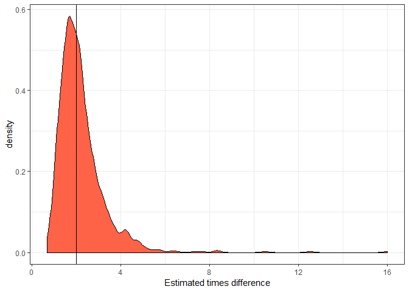
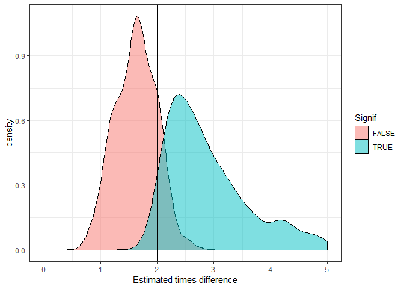

Using R and power analysis to inform experimental design
========================================================

A collaborator once asked me: "can you do that thing where you take a
little bit of data and model it up to make lots more data?"

Does it sound suspicious to fake a lot of data from a little bit of data? It
depends on the context. Making up data is totally appropriate if you
want to do a power analysis.

And 'making-up' data (let's call it simulation from now on) for power
analysis is a handy tactic for designing effective surveys and
experiments. This post will look at why and how.

A brief introduction to power analysis
--------------------------------------

In the narrow-sense, power analysis it about type II error, or the
chance your data and analysis won't be able to detect an effect that is
really there.

Type II errors are the quiet sibling to type I errors, which tend to get
more focus. The whole "&lt;0.05 is significant"" mentality is about type
I errors.

Having a low type I is important if you want to say a new drug, which
may have side-effects, works.

But in many fields, type II errors are more consequential. In
environmental science in particular, we don't want significant (in the
non-statistical sense of the word) environmental change to go
unnoticed. Poor power would mean we are unlikely to detect
environmental change in our acidification experiments, or from say an
oil spill decimating a seabird colony.

Pragmatically, if you are doing a PhD you have a limited amount of time
to get publishable results. So you'd want enough power to detect an
effect, should it be there.

Power analysis is also much more useful type II errors, when used in the
broader sense of the term.

[Broad-sense](https://ms.mcmaster.ca/~bolker/emdbook/) power analysis is
about how well data and a statistical model work together to measure an
effect. So it could be about whether we measure the *right* effect (not
just whether we measure it at all).

In the broad and narrow sense, power analysis is a really helpful tool
when you are designing experiments, or a field survey.

For more on traditional power analysis in environmental stats I
recommend the textbook [Quinn and Keough](https://qkstats.com/) (or
google it to find a pdf) or in the [broad-sense Bolker's excellent
book](https://ms.mcmaster.ca/~bolker/emdbook/)

Power analysis for experimental and survey design
-------------------------------------------------

Let's say you want to know whether there are more fish inside a marine
reserve (that have no fishing) than outside the reserve. You are going
to do a number of standardized transects inside and outside the reserve
and count the numbers of fish.

Your fish species of interest are a very abundant sweetlips and a rather
rare humphead wrasse. What's the chance that you would be able to detect
a two times difference in abundance for each fish species between reserves and
fished areas?

We can address this question with power analysis by simulating 'fake'
data for the surveys where there is a doubling of abundance, then
fitting a statistical model to the fake data, then deciding whether or
not the difference is 'significant' (e.g. p&lt;0.05). Then we repeat
that a 1000 times and count up the % of times we said there was a
difference. That % is the power.

So we need to decide on a few things ahead of time, the sample size of
surveys, the expected (mean) abundance values and the variance in
abundance. This is where you could draw on earlier literature to make
estimated guesses. The sample size is up for grabs and trying different
sample sizes could be part of your power analysis.

Let's assume there are normally 10 sweetlips per transect and 1 humphead
wrasse per transect.

As the data are counts we'll assume they are Poisson distributed. This
amounts to assuming mean = variance, so the variance of sweetlips across
transects is 10 and wrasse is 1.

Simulating data with R
---------------------

To answer this question with R we are going to use quite a few handy
packages:

    library(purrr)
    library(ggplot2)
    library(broom)
    library(dplyr)
    library(tidyr)

`purrr` is handing for creating 1000s of randomised datasets, `ggplot2`
is for plots, `broom` is for cleaning the 1000s of models we'll fit,
`dplyr` and `tidyr` are for data wrangling.

Now let's create a function that simulates data and fits a model. This
may look overwhelming, but don't worry about the R details if you're not
that into R. All we are doing is creating a function that simultions
some data from two groups (reserve or not) for `n` transects, and then
fits a
[GLM](http://www.seascapemodels.org/rstats/2018/10/16/understanding-the-glm-link.html)
and finally it spits out a p-value for whether there was a significant
difference in the simulated data.

    sim <- function(n, x1, x2){
      x <- rep(c(x1, x2), each = n/2)
      y <- rpois(n, lambda = x)
      m1 <- glm(y ~ x, family = "poisson") %>% tidy()
      m1
    }

Now we can use our simulation function to simulate counting wrasse on 20
transects (10 inside and 10 outside the reserve), and then fitting the
GLM to that data:

    set.seed(2001) #just do this to get the same result as me
    sim(100, 1, 2)

    ## # A tibble: 2 x 5
    ##   term        estimate std.error statistic  p.value
    ##   <chr>          <dbl>     <dbl>     <dbl>    <dbl>
    ## 1 (Intercept)   -0.522     0.287     -1.82 0.0690  
    ## 2 x              0.618     0.167      3.69 0.000222

So we get a table with mean estimated difference (on log scale),
standard errors and p-values.

Narrow-sense power analysis
---------------------------

Now we use `purrr` to do this 1000 times:

    mout <- map(1:1000, ~sim(20, 1, 2))

Which results in 1000 lists, yuck. Let's do some data wrangling on the
output:

     mout2 <- mout %>%
      bind_rows(.id = "rep") %>%
      filter(term != "(Intercept)") %>%
      mutate(Signif = p.value < 0.05,
             rep = as.numeric(rep))
    head(data.frame(mout2))

    ##   rep term      estimate std.error     statistic     p.value Signif
    ## 1   1    x  6.931472e-01 0.4082471  1.697862e+00 0.089533876  FALSE
    ## 2   2    x  8.266786e-01 0.4531632  1.824240e+00 0.068115744  FALSE
    ## 3   3    x  5.877867e-01 0.3220304  1.825252e+00 0.067963001  FALSE
    ## 4   4    x  1.145132e+00 0.4339488  2.638865e+00 0.008318414   TRUE
    ## 5   5    x  1.823216e-01 0.3496022  5.215114e-01 0.602010565  FALSE
    ## 6   6    x -2.823275e-13 0.3429971 -8.231194e-13 1.000000000  FALSE

Now we get a dataframe of the 1000 simulations, indicating whether p for
the difference between reserve vs unreserved was &lt;0.05 (column
'Signif').

To get the power, we just sum `Signif` and divide by the 1000 trials:

    sum(mout2$Signif)/1000

    ## [1] 0.408

So an ~40% chance we'd detect a 2x difference in wrasse abundance with
20 transects. This is the 2-sided probability, arguably for this question
 we could also use a one-sided test.

Try it again for the sweetlips (expected abundance doubling from 10 to
20). You'll see you get much more power with this more abundance species
(almost 100%).

You could try this with different sample sizes to get an idea of how
much effort you need to invest in doing transects in order to see a
difference (if the difference is really there of course).

Broad-sense power analysis
--------------------------

How close does our approach get us to the 2x difference? We can also
answer that by looking at the estimates from the GLM:

    ggplot(mout2, aes(x = exp(estimate))) +
      geom_density(fill = "tomato") +
      theme_bw() +
      geom_vline(xintercept = 2) +
      xlab("Estimated times difference")

This distribution shows the expected outcomes we'd estimate over 1000
repeats of the surveys. So the solid vertical line is the 'real'
difference. Note the long tail to the left of drastic overestimates. It
is common with small sample sizes that we might overestimate the true
effect size. More on this later.

I took the exponent of the `estimate` (estimated mean difference),
because the Poisson GLM has a log link, so the estimate is on the log
scale. Taking its exponent means it is now interpreted as a times
difference (as per the x-axis label).

Bias in significant estimates
----------------------------

It is reasonably well known that over-use of p-values can contribute to
publication bias, where scientists tend to publish papers about
significant and possibly overestimated effect sizes, but never publish
the non-significant results. This bias can be particularly bad with small
sample sizes, because there's a reasonable chance we'll see a big
difference and therefore, make a big deal about it.

We can look at this phenomena in our simulations. First, let's take the
mean of our estimated effect sizes for those trials that were significant
and those that were not:

    signif_mean <- mean(exp(filter(mout2, Signif)$estimate))
    nonsignif_mean <- mean(exp(filter(mout2, !Signif)$estimate))
    all_mean <- mean(exp(mout2$estimate))
    c(all_mean, signif_mean, nonsignif_mean)

    ## [1] 2.210280 3.062810 1.622725

So average effect size for the significant trials is &gt;3x (remember
the real difference is 2x). If we take the average across all trials it
is closer to the truth (2.3x).

Clearly if we only publish the significant results, over many studies
this will add up to a much bigger difference than is really there. This
can be a problem in some fields. I don't think publication bias
particularly affects studies of marine reserves, because typically there
are multiple research questions, so the researchers will publish anyway.

Let's look at this as a plot. We'll do the same distribution as above,
but with different colours for significant versus non-significant.

    ggplot(mout2, aes(x = exp(estimate), fill = Signif)) +
      geom_density(alpha = 0.5) +
      theme_bw() +
      geom_vline(xintercept = 2) +
      xlab("Estimated times difference") +
      xlim(0,5)

You can clearly see the significant trials almost always overestimate
the true difference (vertical line).

What's the solution? Make sure you report on non-significant results. And
try to aim for larger sample sizes.
