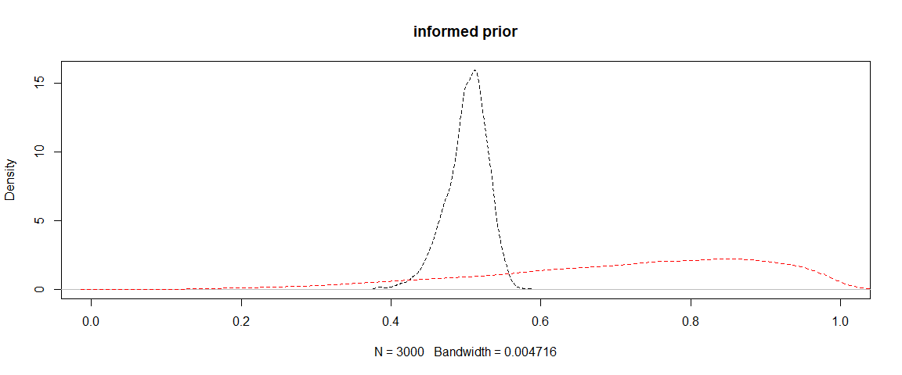

How much has the data informed your isotope mixing model?
================================================

The contributions of different food sources to animal diets is often a
mystery. Isotopes provide a means to estimate those contributions,
because different food sources often have different isotopic signatures.
We would typically use a Bayesian mixing model to estimate the
proportional contributions of different food sources to samples taken
from the animal.

Isotope mixing models are fitted within a Bayesian framework. This means
that the end results (AKA 'posterior distributions') are influenced by
the data, the model and the prior distributions. Priors are specified
for each parameter in the model, including the source contributions.

In the article ["Quantifying learning in biotracer studies" (Brown,et
al. Oecologia
2018)](https://link.springer.com/article/10.1007/s00442-018-4138-y) we
describe how comparing priors and posteriors with information criteria
is important to determine the influence of the data on the model.

This blog describes how to use my
[BayeSens](https://github.com/cbrown5/BayeSens) R package to calculate
information criteria for mixing models.

Why mixing model priors matter
------------------------------

The default prior for most mixing model has a mean of 1/n, where n is
the number of sources. So if we had five potential food sources this
means our starting assumption is that on average the consumer eats and
assimilates 20% of each prey item.

Uncareful use of mixing models has resulted in findings from some
peer-reviewed being contested. For instance, if the user just puts
sources in the model 'just to see' if they matter, the starting
assumption is that, on average, each contributes an equal fraction to
the diet. This starting assumption is in many cases ridicilous.

When the data are not particularly informative, the model will return
the result that every item contributed an equal fraction to the animals
diet. The authors may then write this up as a new 'result' when in fact
it was just the default assumption of the software package being
reflected in their outputs.

In general I am quite suspicious of all the isotope studies reporting
generalist consumers that eat equal fractions of prey. These patterns
may well just reflect the default priors.

Adding to the confusion is that some call the default priors
'uninformative'.

Priors for mixing models are all informative, eventhe so called
'uninformative' priors. The prior for source contributions bounded
between 0-1, and source contributions must sum to 1, so it can never be
truly flat in that range.

Solutions
---------

You should always plot your priors and posteriors to check what is going
on. You can very quickly identify this issue of uninformative data. Then
in your write up, you could put less emphasis on results that look like
the priors.

You can also calculate statistics that measure how different prior and
posterior are. In our paper, we described several statistics taken from
information theory. You can then easily report these statistics to
summarize where prior and posterior are different (or not).

For instance, in a [recent study of coastal fish
specices](https://www.sciencedirect.com/science/article/pii/S0272771419308492?casa_token=Qm8VrU9QEukAAAAA:dMdCtjarurMhWUyoUYdQte1Xy07D00YkdDUQgSUNSRBdSietcm3PPJaIw4yVWkgFTR4bfNl6-iw)
we fitted many models across many species and regions, so we reported
the differences as a table in the supplemental material.

How to use the R package
------------------------

This blog demonstrates how information criteria can be calculated for
mixing models fit with
[MixSIAR](https://cran.r-project.org/web/packages/MixSIAR/index.html).

We will apply the simple marginal information criteria from that paper
to the Killer Whale example, see `vignette("killerwhale_ex")` in
MixSIAR.

The killer whale example is a nice simple one with no covariates or
random effects. If you have covariates or random effects, you'll need to
be careful to compare priors to posteriors at the same locations on the
fixed/random effects.

It will be helpful to have some understanding of MixSIAR's data
structures, because we need to find the posterior samples in the model
output.

Killer whale example
--------------------

First load the packages we need:

    library(BayeSens)
    library(MixSIAR)

Now load the data (this is verbatim from the Killer whale example).

    mix.filename <- system.file("extdata", "killerwhale_consumer.csv", package = "MixSIAR")

    mix <- load_mix_data(filename=mix.filename,
                         iso_names=c("d13C","d15N"),
                         factors=NULL,
                         fac_random=NULL,
                         fac_nested=NULL,
                         cont_effects=NULL)

    source.filename <- system.file("extdata", "killerwhale_sources.csv", package = "MixSIAR")

    source <- load_source_data(filename=source.filename,
                               source_factors=NULL,
                               conc_dep=FALSE,
                               data_type="means",
                               mix)

    discr.filename <- system.file("extdata", "killerwhale_discrimination.csv", package = "MixSIAR")

    discr <- load_discr_data(filename=discr.filename, mix)

Draw samples from the prior
---------------------------

Let's draw samples from the prior. You can also plot this with MixSIAR's
`plot_prior` function, but we need a matrix of the samples for
calculating info criteria later.

    alpha <- rep(1, source$n.sources) #default prior values
    p_prior <- MCMCpack::rdirichlet(10000, alpha) #draw prior samples

Let's plot just the prior for the first source (since they are all the
same in this case)

    #Plot histogram and density (same data, different ways to view it )
    par(mfrow = c(1,2))
    hist(p_prior[,1], 20, main = source$source_names[1])
    plot(density(p_prior[,1]), main = source$source_names[1])
    abline(v = 1/source$n.sources)

As you can see the default prior clearly isn't 'uninformative' because
it is centred around 1/number of sources (in fact it has mean 1 over the
number of sources). It might be better called the 'uninformed' (by the
user) prior. This means the prior will have a lower mean the more
sources you include in the model.

Run the model
-------------

This is verbatim from the Killer Whales example.

    model_filename <- "MixSIAR_model_kw_uninf.txt"   # Name of the JAGS model file
    resid_err <- TRUE
    process_err <- TRUE
    write_JAGS_model(model_filename, resid_err, process_err, mix, source)
    jags.uninf <- run_model(run="test",mix,source,discr,model_filename,alpha.prior = alpha, resid_err, process_err)

    ## module glm loaded

    ## Compiling model graph
    ##    Resolving undeclared variables
    ##    Allocating nodes
    ## Graph information:
    ##    Observed stochastic nodes: 12
    ##    Unobserved stochastic nodes: 23
    ##    Total graph size: 766
    ##
    ## Initializing model

I've used the test run mode here just to speed things up for the
example.

You should absolutely use long chains (e.g. `run = "long"`) when
calculating info criteria. They are quite sensitive to the number of
MCMC samples if there are few samples. We need enough samples to get a
good idea of the posteriors full shape.

Extract samples
---------------

Here's where it helps to have some idea of how MixSIAR structures
outputs. We need to find the posterior samples. You can dig around using
`str(jags.uninf)`. I did that and found the samples under
`jags.uninf$BUGSoutput` as below:

    p_post <- jags.uninf$BUGSoutput$sims.list$p.global

Now we have a matrix of prior samples and a matrix of posterior samples
we can just compare them with the `hellinger` or `kldiv`
(Kullback-Leibler divergence) functions from `BayeSens`. I'll compare
just the first source (Chinook salmon).

    hellinger(p_prior[,1], p_post[,1])

    ## Hellinger distance - continuous
    ## [1] 0.61
    ##
    ##  Hellinger distance - discrete
    ## [1] 0.65

    kldiv(p_prior[,1], p_post[,1])

    ## Kullback-Leibler divergence
    ## [1] 5.7

We'd like to know what the info criteria are for all sources, so we
could manually select columns to compare, or just use some sort of
iterating function to do them all at once. Here I use `lapply` and put
them into a dataframe:

    hell_out <- lapply(1:source$n.sources, function(i) hellinger(p_prior[,i], p_post[,i])$hdist_disc)
    kl_out <- lapply(1:source$n.sources, function(i) kldiv(p_prior[,i], p_post[,i])$kd)
    info_df <- data.frame(source_names = source$source_names,
                          hellinger = unlist(hell_out),
                          KLD = unlist(kl_out))
    info_df

    ##   source_names hellinger       KLD
    ## 1      Chinook 0.6536184 5.6601980
    ## 2         Chum 0.3659136 1.6746118
    ## 3         Coho 0.3053054 0.9676074
    ## 4      Sockeye 0.5260229 3.6985169
    ## 5    Steelhead 0.5430961 4.2273867

Hellinger values near 0 are very similar to the priors, Hellinger values
near 1 are very different to the priors. The KLD ranges from &gt;0 to
infinity, so greater values indicate greater differences from the prior.
So these results indicate to us that the model and data are not very
informative about Coho, but much more informative about Chinook. To
interpret why this is you should plot the priors and posteriors.

You can use `output_JAGS` to do this. We will do it ourselves, just to
practice data wrangling. For Chinook and Coho:

    par(mfrow = c(1,2))
    plot(density(p_post[,1]), main = source$source_names[1])
    lines(density(p_prior[,1]), col = "red")
    abline(v = 1/source$n.sources, lty = 2)

    plot(density(p_post[,3]), main = source$source_names[3])
    lines(density(p_prior[,3]), col = "red")
    abline(v = 1/source$n.sources, lty = 2)

It is pretty clear that contributions for Chinook have shifted higher,
whereas the data doesn't give us much reason to believe Coho are any
more important than the prior suggested. 

Note that you can also get high information criteria stats if the
posterior mean stays the same as the prior's mean, but the distribution
changes shape (e.g. gets thinner). For instance, if the data were
strongly informative that Coho were not an important food source, then
we could have the same posterior mean of 0.2, but the uncertainty
intervals would be much narrower around 0.2 than in the prior.

Informative priors
------------------

The killer whale example also gives a model fit with informed priors.
Here's the code verbatim from MixSIAR:

    kw.alpha <- c(10,1,0,0,3)
    kw.alpha <- kw.alpha*length(kw.alpha)/sum(kw.alpha)
    kw.alpha[which(kw.alpha==0)] <- 0.01
    model_filename <- "MixSIAR_model_kw_inf.txt"  
    resid_err <- TRUE
    process_err <- TRUE
    write_JAGS_model(model_filename, resid_err, process_err, mix, source)
    jags.inf <- run_model(run="test",mix,source,discr,model_filename,alpha.prior=kw.alpha, resid_err, process_err)

    ## Compiling model graph
    ##    Resolving undeclared variables
    ##    Allocating nodes
    ## Graph information:
    ##    Observed stochastic nodes: 12
    ##    Unobserved stochastic nodes: 23
    ##    Total graph size: 766
    ##
    ## Initializing model

The only extra step we need to do now is draw samples from the prior and
posteriors:

    p_prior_inf <- MCMCpack::rdirichlet(10000, kw.alpha) #draw prior samples
    p_post_inf <- jags.inf$BUGSoutput$sims.list$p.global

    hell_out_inf <- lapply(1:source$n.sources, function(i) hellinger(p_prior_inf[,i], p_post_inf[,i])$hdist_disc)

    ## Warning in sqrt(1 - integrate(fx1, minx, maxx)$value): NaNs produced

    ## Warning in sqrt(1 - integrate(fx1, minx, maxx)$value): NaNs produced

    kl_out_inf <- lapply(1:source$n.sources, function(i) kldiv(p_prior_inf[,i], p_post_inf[,i])$kd)
    info_df <- cbind(info_df,
                     data.frame(
                          hellinger_inf = unlist(hell_out_inf),
                          KLD_inf = unlist(kl_out_inf)))
    info_df

    ##   source_names hellinger       KLD hellinger_inf   KLD_inf
    ## 1      Chinook 0.6536184 5.6601980     0.7829688 8.7014174
    ## 2         Chum 0.3659136 1.6746118     0.3353133 1.0081589
    ## 3         Coho 0.3053054 0.9676074     0.1208581 0.1794651
    ## 4      Sockeye 0.5260229 3.6985169     0.1262016 0.1923406
    ## 5    Steelhead 0.5430961 4.2273867     0.6469540 5.7095752

The warning about NA's comes from the prior for some groups being near
zero, so the continuous version of the Hellinger stat isn't able to be
calculated. We are using the discrete version though, so its no problem
to us.

So with the informed priors the Hellinger has increased for Chinook and
Steelhead and decreased for the others.

Remember that the information criteria just measure the distance from
the prior. So if our data just confirm the informed priors, or there
isn't enough data to overcome the informed priors, then the information
criteria will be near zero. In this case we have only two tracers and
samples from 12 killer whales. The prior we used on Sockeye was very
strong to zero consumption, so our result stays the same.

The below plot shows the priors in red and posteriors in black for the
model with informed priors.

    plot(density(p_post_inf[,1]), lty = 2, main = "informed prior", xlim = c(0,1))
    lines(density(p_prior_inf[,1]), lty = 2, col = "red")

I haven't plotted the informed Coho model because both the prior and
posterior are a spikes near zero.

You can clearly see the model has shifted the consumption of Coho
downwards relative to the informed prior.
