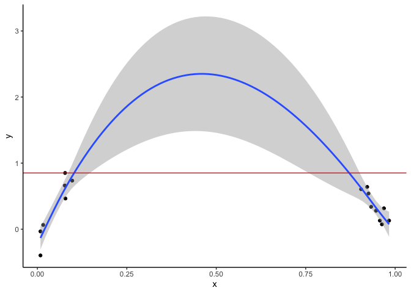
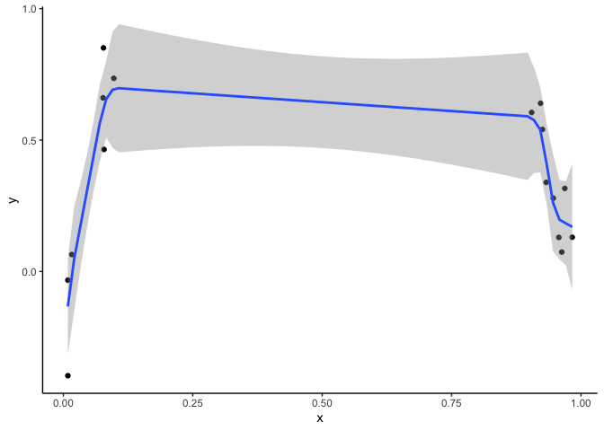

When interpolation doesn’t work with GAMs
=========================================

GAMs shouldn’t be used for extrapolation, and they can give strange
results for interpolation too. Here I’ll explain why and we’ll look at a
solution that involves changing the order a smoother’s penalty. Gaps in
an x-covariate, such as gaps in a time-series, can be a problem to deal
with if you are trying to interpolate to those gaps. Consider this
example data and GAM fit with a big gap in the middle.

The below graph shows data as points and a the fit of a GAM:

There is a strong rising trend for low x and a strong declining trend
for high x. The GAM fills in the gap and suggests a polynomial curve.

The problem is our predicted y values for intermediate x are much higher
than than the range of the observed y values (indicated by the red line.
y is predicted to be &gt;2 at x = 0.5, but observations have y always
less than about 0.7. So while we aren’t extrapolating on the x-axis, we
are extrapolating on the y-axis.

There is no straightforward answer to solving this problem. The answer
depends on what you know about the system from prior work. **Ideally
you’d collect more data for the intermediate x values**, but if that is
not possible here are some options:

1.  Keep the result above if you have reason to believe there truly is a
    hump shaped relationship between x and y. If you that x causes y and
    have a theory for that relationship then the extrapolation of y
    values might be reasonable. This theory would be based on prior work
    on the two variables.

2.  Keep the fit above but refrain from making predictions in the gap.

3.  Fit different smooths for the values at the two ends of the spectrum
    (e.g. by grouping values on the x-axis and using that group as a
    `by` variable in the smooth).

4.  Try a different basis spline for the smooth. See `?smooth.terms` for
    options

5.  Modify the order of the penalty, which can give a fit like this:

Option 3 fits the model: `gam(y~ s(x, m=1), method = "REML")`. The `m=1`
parameter adjusts **the order of the penalty** for the smooth.

A brief non-technical description of the `m` parameter follows. When
mgcv fits a spline for a covariate it is balancing the objectives of
fitting the data as closely as possible versus fitting the data so
closely that the smooth will misrepresent new data. The way mgcv
balances these two objectives is to apply a ‘penalty’ that increases the
wigglier the smooth gets.

How we define ‘wiggly’ for use in the penalty is determined by the `m`
parameter. If `m=1`, the penalty is applied to the slope of the
smoother. If the smooth was a car, this would be like minimizing the
number of speeds the car can go. If the car had 3 degrees of freedom it
can only go at three speeds, with abrupt jolts when changing between
speeds

The default is `m=2`. `m=2` is generally preferable because it gives a
smoother fit with fewer abrupt changes. The `m=2` option applies the
penalty to the slope of the slope, AKA the second derivative of the
smooth. If we talk about cars again, you could think of this as
minimizing the acceleration and deceleration of car. The car can go many
speeds, but we are minimizing the rate it shifts between speeds. Of
course this would be a smoother ride than the `m=1` car.

To summarize there is not right answer for this issue of interpolation.
There are many options and your choice depends on the system you are
studying and how much knowledge you have about its mechanisms.
