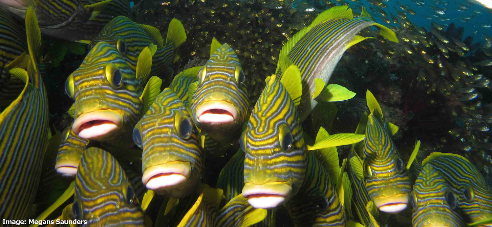
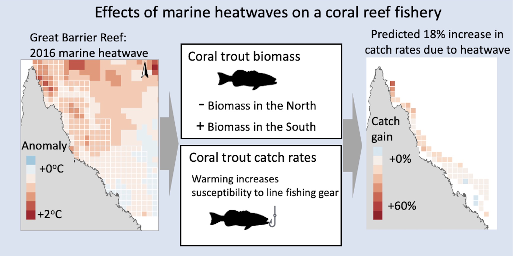

There has been a lot of focus on the challenge of managing overfishing with the controversial new documentary Seaspiracy on Netflix. But the overfishing issue isn't as simple an issue as the picture that documentary paints.

The sustainability of coral reef fisheries around the world is threatened by too much fishing, but also by extensive change in reef habitats.

Notably, heatwaves are becoming more intense and frequent under climate change and are now a main driver of coral loss. But how will heatwaves and coral loss impact the sustainability of reef fisheries? This is a question we have been working on over the past few years.

Please contact me (chris.brown@griffith.edu.au) if you can't access the full-text versions of the work below (some but not all are open access).

Overfishing is the main human-driven cause of stock declines, but we shouldn't focus solely on that issue. [A significant proportion of fish stocks](https://onlinelibrary.wiley.com/doi/abs/10.1111/faf.12318) at a global scale are dependent on habitats that have been degraded over recent decades, like corals.

But, it is hard to pin fishery declines on habitat loss, because the mechanisms for habitat loss to impact fisheries are complex. We found that habitat loss interacts with [fishery management in surprising ways](https://onlinelibrary.wiley.com/doi/abs/10.1111/faf.12318).

Habitat loss can contribute to overfishing because it reduces the productivity of fisheries. But, if those declines in productivity are detected by monitoring and wrongly attributed to overfishing, the management response could actually make management more conservative, as we described in our [review of how habitat loss impacts fisheries](https://onlinelibrary.wiley.com/doi/abs/10.1111/faf.12318).

Habitat loss likely threatens many of the world's coral reef fisheries. An unprecedented heatwave in 2016 affected reefs globally, and on Australia's Great Barrier Reef caused extensive mortality of corals. We studied this event to see how it may impact reef fisheries.

[We reviewed Queensland's fisheries](https://www.nature.com/articles/s41598-020-74652-2) for the effects of coral loss on key fishery species. There was marked regional variation within Queensland in the dependence of fisheries on reef species. This variation corresponded to the types of fisheries dominating particular regions.

Aquarium collection fisheries (including fish, corals and other invertebrates) and the reef line fishery are the most likely to be affected by coral habitat loss. Importantly, quantitative stock analysis identified several reef snapper (Lutjanidae) species that are at risk of overfishing due to the interaction of fishing pressures and coral habitat declines.

Habitat loss is not the only pathway for heatwaves to impact reef fisheries. Heatwaves also have direct effects on fish.

There was extensive coral mortality, [but most fish species did not respond to this habitat loss in the short-term](https://www.nature.com/articles/s41586-018-0359-9). Rather, there was a direct effect of the warming on the fish community, such that there were species declines in the northern warm waters and increases in species richness on some southern reefs. These changes are consistent with range shifts in the fish community.

If heatwaves have direct physiological effects on fish communities, they may also how easily fish can be caught in fisheries. [We addressed this question for coral trout, the most important commercial finfish taxa on the Great Barrier Reef](https://onlinelibrary.wiley.com/doi/abs/10.1111/gcb.15472).

We used a unique dataset of reef fish surveys, collected by citizen scientists working with the Reef Life Survey not-for-profit. We matched that data to fish catch data. This enabled us to look at how fish populations and fish catch changed over the heatwave.

We found modest evidence for a southward shift in coral trout after the heatwave. More important though was that we found coral trout were easier to catch when it is warmer. We predicted the heatwave raised catches by as much as 18%, given the for the amount of fishing effort in the heatwave year.

We hypothesised that coral trout got easier to catch during the heatwave because they were hungrier. Coral trout eat more when it's warmer, to keep up with their metabolic demands. The line fishery uses baited lines and lures, so coral trout may have been more attracted to bait when temperatures were raised.

If fish get easier to catch then the risk of overfishing them could also be higher. The current management regime for the Great Barrier Reef fishery is based on a total allowable catch. If this system is adhered to, it should prevent overfishing of coral trout, even if they are easier to catch in the future. In many other coral reef fisheries around the world though there are no limits on catch. In such places overfishing will be a greater risk under recurrent heatwaves.

Overall this body of work has identified multiple ways that heatwaves impact reef fisheries. Importantly habitat loss and the direct effects of warming will both impact fish species, but the sustainability of the fishery also depends on how it is managed. This finding provides hope that proactive fishery management can maintain sustainable fisheries in the face of climate change.

*The work discussed in this article was supported by an Australian Research Council Discovery Early Career Award to Chris Brown* 
