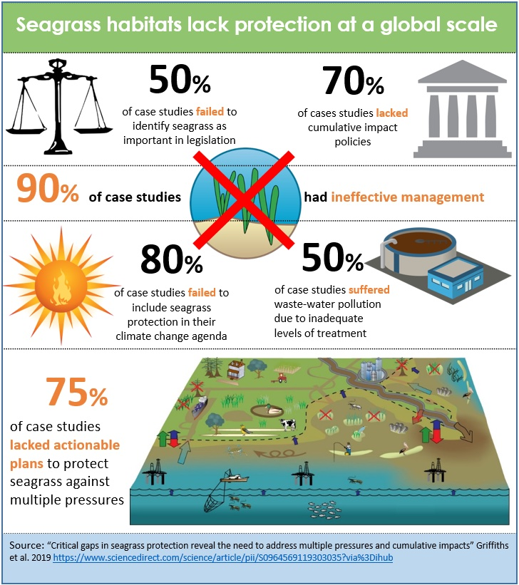

We are working towards models to predict the impacts of multiple stressors on coastal habitats, like seagrass and mangroves, funded by an Australian Research Council Discovery Project.

The project team is lead by Dr Chris Brown and includes Professor's Rod Connolly (Griffith) and Isabelle Cote (Simon Fraser University), postdoc Dr Mischa Turschwell, and PhD students Olivia King and Laura Griffiths.

Key results to date are:

* [An up-to-date global scale compilation of seagrass trends](https://onlinelibrary.wiley.com/doi/full/10.1111/gcb.15684?casa_token=wehlqHZKl10AAAAA%3AxD3lTb3blVnY8W41vT3Mn0fVEsdPxJMncV0ocuKViSbpJAhGN-gHPqLKdUulEkJVXcYP3u381zRk55eb). We show that almost 20% of monitored seagrass has been lost globally, but that there is considerable regional variation in rates of loss. In forthcoming work we have generated a globally comprehensive map of risk of seagrass loss, based on cumulative impacts from multiple stressors.

* [A review](https://www.sciencedirect.com/science/article/pii/S0964569119303035) looking at how cumulative impacts to seagrass ecosystems are managed across 20  global case-studies. We found that in most places policy and management actions were mismatched to the impacts seagrass faced. Notable were management gaps in addressing extreme climate events, which are key global drivers of seagrass loss.

* [A global scale analysis of drivers of mangrove loss](https://www.sciencedirect.com/science/article/pii/S0006320720306959?casa_token=t9xnb_-mIeIAAAAA:lF9TH0aElAxH7Ca7p_16uZQykONpZ7GQo2WZGKfsi32VcQKM9w3cJclx0wQWvTjUBiOumSWW7oQ), showing variable effects of cumulative impacts to mangroves across nations, but also that rates of loss are lower in protected areas.

* [A review of the interactive effects of pesticides and low light on aquatic primary producers](https://www.int-res.com/abstracts/meps/v668/p215-230/). PhD student Olivia King led this review of the physiology of these stressors, which she drew on to hypothesize how these stressors will interact. She is now testing those hypotheses in a series of lab experiments.
