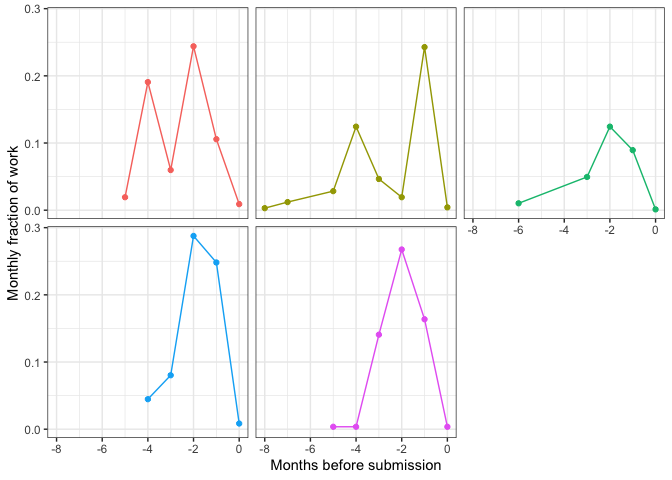

How much time does it take to write a grant?
===========================================

Writing grants takes time and effort, but how much time? In this post
I’ll show data from my time tracking app that quantifies exactly how
much time it took me to write applications to a national grant agency
(the Australian Research Council).

TLDR: I start preparing 4-5 months ahead of the final deadline, spend
about 10% of my work hours over that period. But effort varies and peaks
at 30% of my monthly work hours 1-2 months before the deadline.

I hope this post helps other people plan better for grant writing (and
[here are the strategies I
use](/research/2021/10/02/grant-writing-strategies.html)). I think the
significant ongoing time investment also contributes to inequities in
scientific careers, I’ll come to that [in another
post](/research/2021/10/02/are-grant-applications-fair.html).

Why time matters
----------------

Estimating time required on grant writing is an important part of career
planning. For instance you may need to think about how you’ll fit it around
the rest of your life (grant writing in my experience often requires after hours
work) or field work.

Or you may be facing the end of a research contract, and thinking about
trying to win the next bucket of funding. So its worth thinking whether
the time investment is worth the effort, given the risk of not winning
the grant, or whether the time could be better invested in other career
opportunities.

When I started grant writing, my best guess for how much time it would
take was: “a large proportion of working hours over several months”.

Well, for for quite a few years years I’ve been logging my time on
different tasks. My log now includes writing five applications for
funding from the Australian Research Council.

For context, ARC grants have an overall success rate of about 20%, and a
slightly lower rate for fellowships.

Total time
----------

I estimate that each grant typically requires 4-6 months preparation
time at an average of about 10% of total work hours (0.1 FTE) over that
period.

But that figure belies considerable variation in effort across time

Below you’ll see cumulative hours on five grants (one for which the
outcome is still pending). Each application was written in a different
year, but I’ve plotted them concurrently for comparison. My typical
grant writing time of 70 hours counts only my time writing, editing or
engaged in meetings about the grant. It doesn’t include tea breaks,
reading time or thinking time or other people’s time. So actual time
investment would be much greater than 70 hours.  

  

The most recent grant took significantly less time than the others. This
grant was a collaborative effort. It also came easily in that I had
material and experience to draw on from previous years.

You’ll see I started thinking and working on each grant about 4 months
ahead of time.

That is in part due to a very good internal preparation process my
research institute (Australian Rivers Institute at Griffith University)
runs. Over several workshops we pitch our initial ideas and then get
directed feedback on drafts of the applications.

Effort kicks up at about 2.5 months out, when I usually aim to have a
first draft written so it can be reviewed by colleagues.

Then effort peaks just before the lead up to the 1 month mark. Most
major grants require internal review by the University’s research
office, and the deadline for that is 1 month before the final.

Then in the final month effort drops off again. Usually by that point
I’m just tying up lose ends and making minor corrections from the review
feedback.

I have replotted that data as fraction of my monthly work hours (not
accounting for holidays).  

  

You clearly see the peak between 3 and 2 months out.

To sum up, it takes time and planning to write a major grant. In follow
up posts I’ll discuss [the strategies I use](/research/2021/10/02/grant-writing-strategies.html).

I also want to acknowledge that I have had the privileges and
opportunities that help me spend time on grant writing. But not everyone
has that opportunity or privilege. In a final post I’ll discuss [how
complex grant applications can be inequitable](/research/2021/10/02/are-grant-applications-fair.html).
