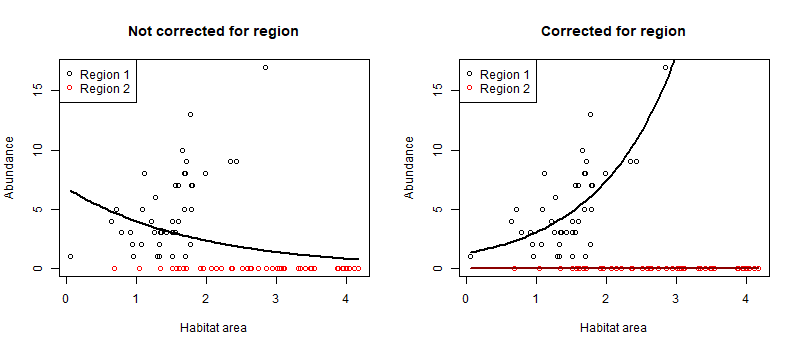

There is often debate over the best place to start when teaching students inferential statistics. The teaching of statistics should start with basic understanding of what data are, probability and data visualisation. Beyond that students usually start to learn about inferential methods. 

The debate then becomes should we start with classic methods like ANOVA, general (and generalized) linear models, or machine learning methods. 

This debate applies to latter year undergraduate courses (2nd or third year) and also the day to week long workshops that are routinely run using R and or other software. 

I argue that the teaching of inferential statistics should start with general (and generalized) linear models (GLMs).

GLMs are the foundational framework for model-based thinking, which dominates modern statistical analysis. The general linear model generalizes many of the historical methods for testing and encompasses what were traditionally called ‘t-tests, anova and linear regression and ancova. 

Then, extensions of 'general' into 'generalized' linear models supersede tests for non-normally distributed data such as contingency table tests, logistic regression and even ordination and manova (multivariate stats). Teaching GLMs gives students the overarching principles they need to go away on their own and learn any modern statistical test. 

In the past we gave students a long list of tools to deal with exceptions, with few common linkages between the different tools. This makes it harder for students to draw a common thread between tools. I think this lack of coherency is a key reason students finish a course but then can't remember what test they need for a particular situation. We remember things better if they fit within a coherent framework. 

Much better if students finish the course knowing what is possible, and that they can find the specific tweaks they need for a particular dataset (e.g. modelling a poisson vs gaussian distribution). Students will be much more likely then to be able to find a good model for any data analysis problem they are presented with.

One of the arguments for teaching ANOVA first was that it gives students an understanding of how variance is decomposed into difference components of the model (e.g. treatment vs residual error). A fair point, but variance decomposition can also be done with GLM, since ANOVA is just a special case of GLM. 

An advantage of exploring variance components in a GLM framework is that it also emphasises effect size and facilitates graphical exploration of the analysis. Classic ANOVA methods promote interpretation via tables of numbers (e.g. p-values). The overinterpretatoin of p-values  has resulted in many spurious or meaningless findings. 

GLMs encompass both statistical testing (p-values) and estimates of effect size (important to interpret relevance to real world). Effect sizes are then straightforward to visualize through making plots of parameter estimates with confidence intervals, or direclty by making predictions of response for different treatment or covariate values. 

This leads me to the point that GLMs can be used as a predictive tool. In contrast, a classic ANOVA does not estimate differences in the mean (only variance explained by differences in means), so you cannot predict values of a response variable from an ANOVA. Predictive tools have increasing relevance in modern workforces. 

In my own area of marine science for instance, fishery scientist may use a GLM to quantify how fish catch varies with different mesh sizes of nets (smaller mesh size will generally will catch smaller fish). The fitted GLM can then be used to make predictions that standardise comparison of catches from nets with different mesh sizes. ([Read about another example that is a GLM version of ANCOVA](https://www.seascapemodels.org/rstats/2020/09/04/correcting-with-glms.html)). 

**Figure:** Example of using a GLM to correct for differences in habitat use across two regions. In the left panel we model fish abundance just on habitat. However, region 2 has more habitat but no fish, so the fit is negative. On the right we additionally control for region, and see that abundance increases with habitat in region 1. 

The predictive ability of GLMs is a step towards more sophisticated methods for prediction. Basic GLMs are the first step towards methods that include hierarchical models (random effects), and non-normal distributions (e.g. poisson for count data). Distribution types and hierarchical models are themselves a step towards maching learning and AI methods. Random effects for instance are a type of shrinkage technique. The principle of shrinkage is used across many different model classes (e.g. GAMs, ridge regression, regression trees, neural networks) to improve predictive power. 

The discussion about what to teach can sometimes be side-tracked about what software to use, often the argument is between R and Python. Now I'm a huge fan of R and don't know much python, but I think the debate over software is a distraction from the main game. 

More important is that students learn about quantitative analysis and principles such as the estimation of effect sizes. Some programming is helpful, to give them flexibility of options. Whether they learn that in R or Python is secondary. Obviously the software that is used in their (intended) workplace will be most helpful. However, often it is unknown what software they will encounter most. So just give them the fundamental theory and skills to learn and they will be enabled to adapt and learn on the job. 

