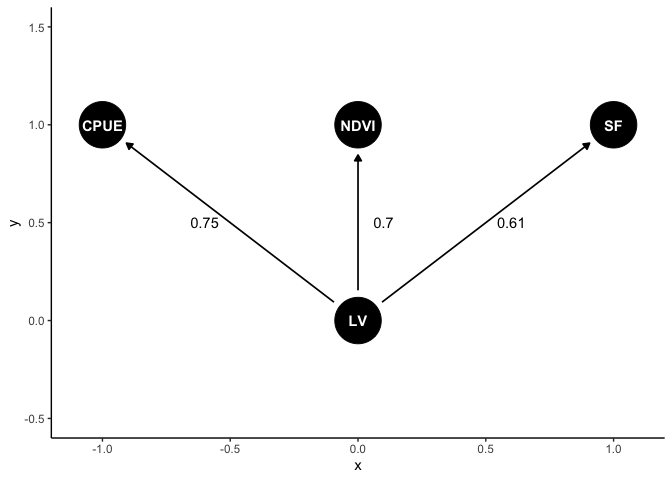

Structural equation modelling (SEM) is a tool for exploring
relationships among multiple variables. `lavaan` and `piecewiseSEM` are
two of the most widely used and accessible packages for latent variable
modelling in R. Both use frequentist methods.

It is also possible to develop SEMs in a Bayesian framework. There are advantages
to using the Bayesian framework. So here I provide a brief tutorial on creating
a simple Bayesian SEM with the stan program.

The [blavaan](https://ecmerkle.github.io/blavaan/) package creates and fits SEMs in a Bayesian framework, but using similar syntax to lavaan. But it can help your understanding to code your own models and give you greater flexibility (though blavaan can do a lot!). 

The tutorial is based on our [recent
study](https://www.sciencedirect.com/science/article/pii/S0048969723002851)
that sought to understand relationships among indicators of catchment
and fishery condition. If you find the SEM methods described here
useful, please cite the paper.

Code for that study, including a more complicated SEM, is available [on
the study’s github
repo](https://github.com/cbrown5/ecological-condition-latent-model).

I won’t cover much SEM theory or background on Bayesian modelling. For
more info on those topics:

-   A introduction to SEM theory, check out [Jon Lefcheck’s online
    book](https://jslefche.github.io/sem_book/)

-   [rstan documentation and
    tutorials](https://mc-stan.org/users/documentation/tutorials)

-   Learn Bayesian stats with the The Statistical Rethinking
    [book](https://xcelab.net/rm/statistical-rethinking/) and [Youtube
    series](https://www.youtube.com/watch?v=cclUd_HoRlo)

## Advantages of Bayesian SEM

The key advantage is the flexibility Bayesian methods give you. We used
Bayesian methods because we wanted to combine a state-space model and a
SEM. The state-space model was a timeseries model of fish population
change through time.

The population model was linked to a latent (unobserved) variable that
represented cathcment condition. Other observed indicators of catchment
condition were pasture biomass and vegetation greenness.

Other applications of Bayesian SEM could be to model non-gaussian data,
incorporating spatial and temporal models into a SEM, or modelling
missing data.

Now we’ll step through a broad overview of how to get started with
Bayesian SEM. We’ll use the data from my paper as an example.

[Download the data](https://github.com/cbrown5/ecological-condition-latent-model/blob/main/Data%20for%20Barramundi%20model.csv)

## Define your DAG (directed acyclical graph)

SEMs need to be directed acyclical graphs. The DAG defines the proposed
relationships among variables. It is the starting point for writing the
math that describes the model.

We’ll define a simple DAG that aligns to a factor analysis. We’ll model
relationships between streamflow, fish (barramundi) catch per unit
effort (CPUE) and vegetation greenness (NDVI) for a catchment in
Northern Australia:

    library(dagitty)
    library(ggdag)
    dag1 <- dagify(CPUE ~ LV, 
                   NDVI ~ LV,
                   SF ~ LV)
    ggdag(dag1)

Our observed indicators are SF (streamflow), NDVI (veg greeness) and
CPUE (catch per unit effort). LV is a latent variable that represents
correlations among the observed variables.

This system is strongly driven by rainfall and river flow, so we expect
positive correlations among flow, fish and vegetation.

## Define the stan model

Now we have a DAG, we need to write equations to represent the proposed
relationships. We also need to specify the priors.

Here I’m assuming normal distributions for each variable (logging for
CPUE). Priors are weakly informative to encourage convergence.

I won’t include the full stan model definition below, just the model
component. [Click here to download the full model file you’ll need to
run this](https://github.com/cbrown5/ecological-condition-latent-model/blob/main/simple-model.stan).

Here’s the core of the model:

    cfa_mod <- "model{ 

      //
      //Ecological condition 
      //
      nu ~ std_normal(); 
      //Note variance fixed to 1 by using standard normal here
      
      //Priors for indiator params 
      a_NDVI ~ normal(0,10);
      a_CPUE~ normal(0,10);
      a_SF ~ normal(0,10);
      
      beta_NDVI ~ normal(0,1);
      beta_CPUE ~ normal(0,1);
      beta_SF ~ exponential(1.8);
      //Note use of exponential() for streamflow to ensure positive
      // only values. Helps convergence. 
      
      //Observation errors
      sigma_CPUE ~  exponential(0.1);
      sigma_NDVI ~  exponential(0.1);
      sigma_SF ~  exponential(0.1);
      
      // Observations
      lnCPUE ~ normal(lnCPUE_hat, sigma_CPUE);
      NDVI ~ normal(NDVI_hat, sigma_NDVI);
      SF ~ normal(SF_hat, sigma_SF);
    }"

Read in the full model file and compile it for stan:

    library(rstan)

    mod <- stan_model(file = "simple-model.stan", verbose = FALSE)

At this point there is usually a fair bit of debugging and fixing of
typos until the model parses correctly.

## Consider identifiability

Identifiability is a common issue in SEM. Roughly it means that some of
the free parameters you are trying to estimate are interchangeable.
Therefore, even with an infinite amount of data you would be unable to
identify their values precisely (e.g. one could be high the other low or
vice-versa).

A basic example would be the model:

`y = a*x + b*x + c`

parameters `a` and `b` are interchangeable.

Identifiability is a bit different in Bayesian models, because we have
priors. For instance, in the model above, if we set a very strong priors
on `a` and/or `b` (based on theory for instance) we may still be able to
estimate their values precisely.

In a complex SEM issues of identifiability can be much harder to
distinguish than the example above, as we will see.

Identifiability issues in a Bayesian will manifest as poor convergence
of MCMC chains. You will see high Rhats. Digger deeper you may find some
parameters have bimodal posterior distributions (e.g. if you do a
histogram of all samples for a parameter). You will also find strong
correlations in parameter estimates. For instance in the model above
parameters `a` and `b` would be strongly correlated (near 1).

You may be able to get convergence if you run your model for really long
chains, however, it will be more efficient to try and fix the model. It
will also mean your parameters are easier to interpret.

If you have identifiability issues, parameters that have the property
above are a good place to start to try to fix issues in your SEM
formulation.

In the stsan code above I’ve made two key decisions to facilitate
convergence.

First, I’ve fixed the latent standard deviation to 1 to ensure
identifiability. You could also have the latent’s SD free, but then fix
one of the regression slopes to 1.

Second, I’ve set the prior for the streamflow beta (regression slope on
the latent variable) to be an exponential. This ensures it has only
positive values.

For example, imagine that streamflow, NDVI and CPUE are all positively
correlated with each other. Then their beta’s all need to be the same
sign. However, they could equally well be all positive, or all negative.
The meaning is the same, since the latent variable has not units.

If we run the model where all betas are sampled from normal priors, then
we would hit issues with parameter switching. We see strong bimodality
in the posteriors for the betas, because they can equally well be all
positive or all negative. This slows converngence significantly.

So instead I’ve used an `exponential(1.8)` prior for the streamflow
beta. This peg the sign to whatever streamflow is doing. So if
streamflow is positive and the other covariates are positively
associated with it, they will all have positive betas.

I chose `1.8` so that my prior has similar 90th percentile as a normal
distribution. e.g. compare `qnorm(0.9, 0,1)` to `qexp(0.9, 1.8)` both
have 90th percentiles at about 1.28.

## Do some data cleaning

Now let’s get the data and just clean it up a bit.

    dat <- read.csv("Data for Barramundi model.csv")

First calculate the log of the CPUE:

    dat$lnCPUE <- log(dat$Barramundicatch/dat$Effort)

Some variables are missing data. In our paper I modelled missing data,
but here we will just use years with complete data for simplicity:

    dat2 <- subset(dat, Year %in% 1995:2015)

Now we will standardize and centre each variable, makes it easier to set
priors and interpret the regression coefficients (AKA loadings). We’ll
also define a list to use in the stan model

    datstan <- with(dat2, {
      x = list(N = nrow(dat2),
           SF = (Streamflow - mean(Streamflow))/sd(Streamflow), 
           NDVI = (NDVI - mean(NDVI))/sd(NDVI), 
           lnCPUE = (lnCPUE - mean(lnCPUE))/sd(lnCPUE)
      )})

## Fit the model

Now we are ready to fit the stan model:

    # options(mc.cores = 1) #parallel::detectCores())

    fitm1 <- sampling(mod, data = datstan,
                   iter=8000, chains=3, thin = 10)

## Investigate convergence

For this task I recommend launching the shiny tool for exploring stan
fits. Can be done like this:

    shinystan::launch_shinystan(fitm1)

If convergence is poor (e.g. higher Rhat values or strong
autocorrelation in the chains) a good place to start in a SEM is to
check for parameter non-identifiability, as described above. This means
some parameters are interchangeable (or nearly so).

A handy way to explore for the above issues is to click the “Explore”
tab in the shiny, then do bivariate plots of parameters against each
other.

The histograms for this model fit look like they’ve converged on a
unimodal distribution:

    samps <- extract(fitm1)

    par(mfrow = c(1,3))
    hist(samps$beta_NDVI)
    hist(samps$beta_CPUE)
    hist(samps$beta_SF)

## Explore model results

For this model the regression slopes (AKA factor loadings) are of
primary interest. They tell us how the different indicators are related
to each other.

Make a dataframe of the samples of interest:

    fit_dat <- with(samps, data.frame(beta_SF, beta_NDVI, beta_CPUE))

Now use tidyr to reshape for easy plotting:

    library(tidyr)
    library(dplyr)
    fittidy <- fit_dat %>% 
      mutate(sample = 1:nrow(fit_dat)) %>%
      pivot_longer(-sample, names_to = "Parameter", values_to = "value")

Now use ggplot to plot posterior distributions

    library(ggplot2)
    theme_set(theme_classic())
    ggplot(fittidy) + 
      aes(x = value, y = Parameter, fill = Parameter) + 
      geom_vline(xintercept = 0) + 
      geom_violin()

All have positive values, indicating all indicators are positively
associated with each other.

## Check model assumptions

We need to check assumptions like any regular model. This means checking
distributions are appropriate to model the data, same as you would for
any GLM.

In a SEM we also have to think about d-separation. In short, this means
checking for residual correlations between a our variables that aren’t
explicitly part of the model.

[There’s formal tests of d-separation for Bayesian
models](https://esajournals.onlinelibrary.wiley.com/doi/full/10.1890/11-1899.1),
but [many authors have just used visual checks of residual
correlations](https://esajournals.onlinelibrary.wiley.com/doi/abs/10.1890/15-0833.1).

There are many resources on d-separation, [here’s one
paper](https://esajournals.onlinelibrary.wiley.com/doi/full/10.1890/08-1034.1).
Books by Judea Pearl and Bill Shipley are also good ways to learn.

Our data here also has the additional complexity of being time-series.
Our model above assumes d-separation of a variable from itself through
time, so this is also something we could check (by testing for
autocorrelation in the residuals).

I won’t show all these tests in this brief tute, but here’s a start on
getting residuals. Just subtract the predictions from the observations,
e.g. for NDVI:

    med <- apply(samps$NDVI_pred, 2, median)
    resids <- datstan$NDVI - med

One way to check the normal distribution is appropriate for the NDVI
data is to do a quantile-quantile plot of the residuals:

    qqnorm(resids)
    qqline(resids)

We want to see the points fall close to straight on the line, which in
general they do.

We can also check for non-linearities by plotting observations vs
predictions:

    plot(med, datstan$NDVI)

Of course this is Bayesian analysis, so we could also create credible
intervals for the residuals.

If you do the above for CPUE you’ll see there is clearly strong
autocorrelation. This is one reason I used a [state-space model in the
paper](https://www.sciencedirect.com/science/article/pii/S0048969723002851).

## Graph model results

Let’s make a plot of the result. First we’ll get median effect sizes
(just the median of the chains for each parameter)

    meds <- round(apply(fit_dat, 2, median),2)

Now we can make the plot with labels on the arrows. Most of this code is
just setting up the position of things:

    dag1 <- dagify(CPUE ~ LV, 
                   NDVI ~ LV,
                   SF ~ LV)
    coords <- list(x = c(CPUE = -1, NDVI = 0, SF = 1, LV = 0),
                   y = c(CPUE = 1, NDVI = 1, SF = 1, LV = 0))
    coordinates(dag1) <- coords
    ggdag(dag1) +
      annotate("text", x = c(-0.6, 0.1, 0.6), y = c(0.5, 0.5, 0.5),
               label = meds) +
      lims(y = c(-0.5, 1.5))

 As its a
Bayesian analysis we could also add CIs or probability that an effect is
>0. They could be calculated like this.

e.g. upper 95th quantile:

    round(apply(fit_dat, 2, quantile, 0.975),2)

    ##   beta_SF beta_NDVI beta_CPUE 
    ##      1.27      1.21      1.13

Or probability effect is greater than zero:

    nsamps <- nrow(fit_dat)
    round(apply(fit_dat, 2, function(x){sum(x>0)/nsamps}),2)

    ##   beta_SF beta_NDVI beta_CPUE 
    ##      1.00      1.00      0.98

## Model predictions

Our model also predicts the mean for each variable. Let’s just look at
CPUE. In this matrix rows are samples are columns are years. So we can
summarize each column to get the prediction with intervals for that
year.

Here is the median with 90th credible intervals and data shown as
points:

    ndvi_pred <- data.frame(year = dat2$Year, 
                            ndvi_obs = datstan$NDVI, 
                            med = apply(samps$NDVI_pred, 2, median),
                            lwr = apply(samps$NDVI_pred, 2, quantile, 0.05),
                            upr = apply(samps$NDVI_pred, 2, quantile, 0.95))

    ggplot(ndvi_pred) + 
      aes(x = year, y = med) +
      geom_line() + 
      geom_ribbon(aes(ymin = lwr, ymax =upr), color = NA, 
                     fill = "black", alpha = 0.5) +
      geom_point(aes(y = ndvi_obs)) +
      labs(x = "Year", y = "NDVI (normalized)")

## Conclusion

Bayesian modelling is a powerful framework for building SEMs. It gives
you greater flexibility in developing models than the standard SEM R
packages.

You can use all types of non-gaussian distributions to model data, as
well as build in other model types like non-linear or state-space
models.

The cost is an extra overhead to learn the theory of SEM and the methods
for Bayesian modelling. But if you have a background in one or the
other, and some programming ability, then it won’t be too hard.

I learned Bayesian modelling well before I started on SEMs. When I came
to SEM (through the lavaan package) I was overwhelmed and confused by
jargon and interpretation of greek letters that have a special meaning
to SEM specialists. I found it much easier to gain a high level
understanding of SEM issues (like d-seperation) then work in the
Bayesian framework to build models.
