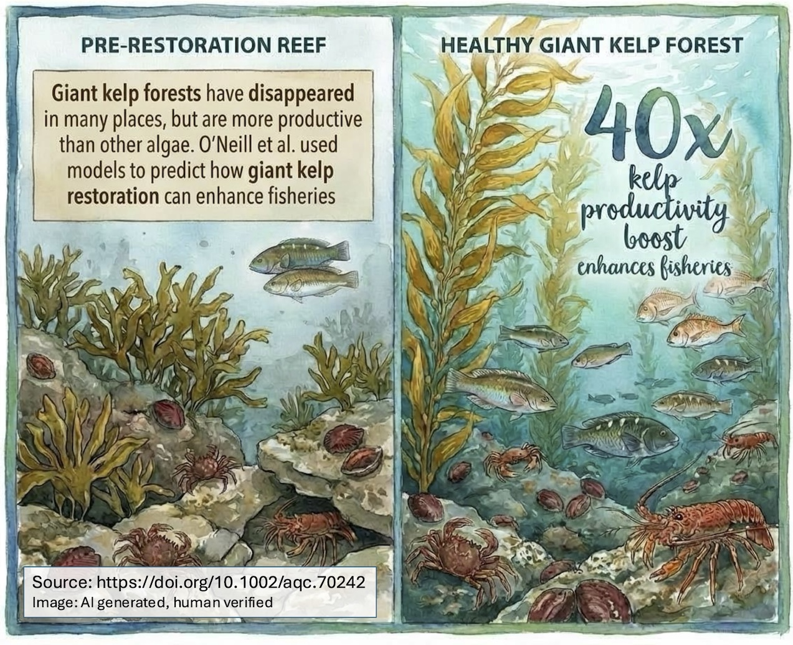

Kelp restoration is gaining [global momentum](https://kelpforestalliance.com/) with recognition that we are losing kelp forests and the values they provide as habitat for biodiversity and supporting fisheries. 

But questions remain. We wanted to know if restoring giant kelp forests boost productivity for commercially important species like abalone and rock lobster. We [explore this question in our new study](https://doi.org/10.1002/aqc.70242). (Free access version [here](https://www.biorxiv.org/content/biorxiv/early/2024/12/20/2024.12.16.628810.full.pdf) or [email me](mailto:c.j.brown@utas.edu.au) for a copy)

We took measurements of kelp growth from Tasmania's East Coast and used them in models of ecosystems to study how gain kelp restoration could impact fisheries. 

We found the productivity gains could be substantial.

**Images** Key findings

## Why giant kelp matters

Giant kelp *Macrocystis pyrifera* has largely disappeared from Tasmania's east coast, replaced by the less productive *Ecklonia radiata*. The productivity difference between these two species is striking - giant kelp is approximately 40 times more productive than Ecklonia. 

That extra productivity has to go somewhere. While we still need more research to fully understand the fate of giant kelp biomass, the evidence suggests it flows through the food web to support a wide range of species, including those important for fisheries.

## Modelling food web effects

We used ecosystem models to trace how increased macroalgae productivity from giant kelp restoration moves through the food web. The model shows productivity flowing from the restored kelp to herbivores like abalone, then up through different predator-prey interactions to boost productivity across many species in the ecosystem.

The most confident results come from the productivity measurements themselves - based on extensive, long-term datasets comparing giant kelp and Ecklonia across different areas and seasons. 

Then we use those data in the model to predict the effects of meeting Australia's restoration targets for giant kelp (restore 30% of degraded habitats). 

The model predicted improvements of fishery catch of 1-7%, depending on the species. This is a substantial improvement given the scale of the model is the entirety of Tasmania and the area of kelp restoration is relatively small compared to that total area. 

     

**Image** Giant kelp breaking up in later summer - its death and decomposition provides food to microbes that feeds energy into the local foodweb. 

## What the models don't capture

Our model looked across all of Tasmania's waters. Future improvements could study local changes in fishery productivity near to kelp forests. These are likely to be more substantial and could benefit fishers the most in those areas. 

The models focused on overall ecosystem productivity gains, but giant kelp provides additional benefits not captured in these predictions. Restoring dense surface canopies creates more habitat and refuge for juvenile fish, which could lead to even higher increases in fish productivity than the models predict.

## From global goals to local action

Our study demonstrates how global restoration targets can be translated into specific, outcome-based goals relevant to local communities. In Tasmania, the positive impacts of giant kelp restoration on kelp forest health and fisheries productivity align well with local values and needs.

Models are particularly valuable at this stage of kelp restoration because we're still in the early phases of upscaling. In the absence of previous large-scale examples to learn from, models help set realistic expectations and make the case for restoration investments. Models like this help show how restoration has relevance to communities. Community groups are more likely to support restoration when expected outcomes are clear and relevant to their specific needs.

Giant kelp is worth restoring not just because it's something we've lost, but because of the ecosystem-wide benefits it provides.