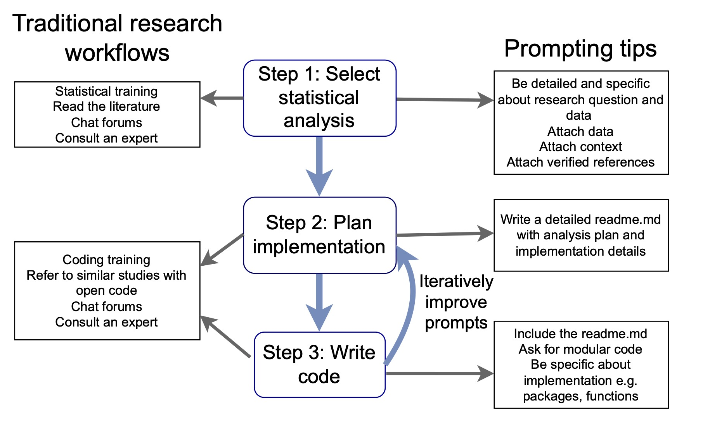

Like it or not, everyone is using large language models to help do their statistics. 

There's a lot of claims made about whether LLMs can or can't do useful ecological statistics. In our new paper  ["Prompting large language models for quality ecological statistics"](https://besjournals.onlinelibrary.wiley.com/doi/10.1111/2041-210x.70267?af=R) (in Methods in Ecology and Evolution) we wanted to test those claims quantitatively. 

We provide guidelines for how to use LLMs to produce scientifically valid statistical analyses. The short version: LLMs can help you do better statistics, but only if you ask well. And "asking well" is a learnable skill.

The paper is co-authored with agentic AI expert Scott Spillias and grew out of our experiences teaching LLMs for statistical analysis.

## Why we wrote it

I've been teaching researchers how to use LLMs for coding and statistics for a few years now. Two things kept coming up. First, most people underestimate how much the prompt matters — they treat LLMs like a search engine and get search-engine quality advice. Second, some people trust LLM-generated code and statistics uncritically, which is risky.

Late 2024 studies found LLMs recommended the correct statistical test less than 40% of the time with generic prompts. But accuracy improves substantially with more specific prompts, which is a key skill we focus on in the article.

## What we found

We ran repeatable evaluations in R, replicating each prompt 10 times across multiple LLMs. A few results stood out.

**Specificity matters enormously for test selection.** We compared four prompts for choosing a statistical test for an ecological dataset, ranging from "How do I test the relationship between two continuous variables?" to a detailed prompt specifying variable types, sample size, and study design. The generic prompt never suggested count models (the appropriate family for fish abundance data). The detailed prompt guaranteed them, regardless of which LLM we used.

**Detailed prompts make agent-generated code more consistent.** We asked the Github Copilot agent to write an entire analysis workflow from two different prompts — one brief, one detailed. We then ran multivariate ordination on the resulting code to measure how similar the 10 replicates were to each other. The detailed prompt produced much tighter clusters — the agent kept using the same functions, variable names, and structure. Inconsistent code is harder to review, which matters if you're trying to catch statistical errors.

**Being specific overcomes weaker models.** When we tasked LLMs with writing R code to calculate a distance matrix, the detailed prompt got the right answer 90–100% of the time across all models. The brief prompt mostly failed — except for GPT-5 Codex, which guessed correctly 9/10 times. Good prompts effectively compensated for using a smaller, cheaper model.

## The workflow we recommend

We suggest breaking LLM-assisted analysis into three stages, and writing separate prompts for each. This helps you control the workflow and avoid LLM mistakes. 

1. **Choose the statistical approach** — describe your variables, sample size, and study design in detail. Attach the data or a summary. Point the LLM to reference material you trust.

2. **Plan the implementation** — before writing any code, get the LLM to help you structure the project directory and scripts. We use a `readme.md` that includes research context, analysis steps, package preferences, and directory layout. This file then gets attached to every subsequent prompt, giving the LLM a consistent memory across sessions.

3. **Write the code** — with a detailed readme and explicit instructions, agents can complete analyses with minimal supervision. Without that structure, even strong models produce code that's hard to review and inconsistent across runs.

## General prompting tips

These apply regardless of which stage of analysis you're at:

- **Declare a role upfront** — start with "You are an expert in ecological statistics and R." This orients the LLM and nudges it toward discipline-appropriate methods.
- **Avoid multi-turn conversation where possible** — each turn adds context that can't be removed. If the conversation goes wrong, start fresh with a better prompt rather than trying to correct course.
- **Use prompt bootstrapping** — ask the LLM what information it would need to answer your question better, then start a new session with that improved prompt.
- **Attach your own references** — rather than letting the LLM search the web, point it to tutorials and vignettes you've already vetted. You control the quality of the context.
- **Break problems into steps** — don't ask for everything at once. Separate choosing a method, planning the code structure, and writing the code into distinct prompts.

## The important role for the scientist

Statistical expertise is still required. You need to know enough to evaluate whether the LLM's suggestions are appropriate, check that code is scientifically valid (not just syntactically correct), and understand what the results mean. Novices who lack that background are more likely to write poor prompts and less likely to catch bad advice. 

We think LLM literacy should be part of statistical training programs, alongside the fundamentals. In our own training we start novices off on R fundamentals and stats first, with no AI other than bug fixes or asking for explanation of unknown code. Once they grasp core concepts we then move onto more advanced forms of AI integration. This needs to introduced done stepwise. 

We're also only beginning to understand LLM biases for ecological data. Spatial dependencies, nested designs, and zero-inflated count data are common in ecology but probably underrepresented in LLM training data. There's a lot of evaluation work still to do.

The paper and all the code for the evaluations is at [Zenodo](https://doi.org/10.5281/zenodo.18463012). If you want the full workflow in practice, there's also a [one-day course](https://www.seascapemodels.org/R-llm-workshop/) and an [online book](https://www.seascapemodels.org/AI-assistants-for-scientific-coding/).
