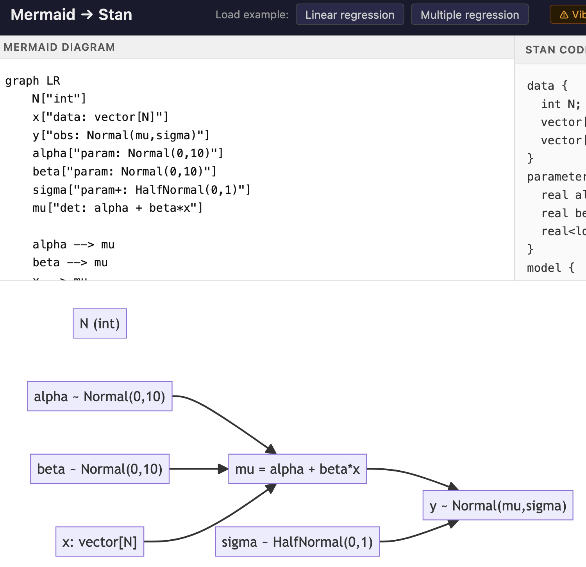

Since chatGPT, stats academics have been saying that we need to teach coding, but I no longer think we do

I’m just about to publish a paper on using large language models to write code for ecological modelling. In the paper we argue for retaining the teaching of coding in undergraduate programs. Teaching coding is teaching undergraduates to reason quantitatively.

But I wonder what opportunities we are missing with this strong view that coding is central to statistical training?

Coding is certainly not the only way to teach reasoning. People were reasoning effectively well before computer coding was invented.

As an example of alternative possibilities, I vibe coded a webpage that takes mermaid syntax (a flow chart syntax) and turns it into a Bayesian model (specifically written in the Stan language). [Try a prototype of ‘mermaid to stan’ here](https://www.seascapemodels.org/mermaid-to-stan/).

Directed Acyclical Graphs (ie flow charts) are a great way to reason when you are building Bayesian models. Arguably much easier to see problems than with code in fact.

So make your DAG, you get code that you can copy and paste into R. In principle if you understand the DAG you don’t need to read the R code. (though I should say this is a protoype, so you should read the R code in this case).

Many students struggle to learn coding and may never need to use it beyond their degree. Of course some will use it extensively.

We may be better off streaming then so that:

1.   Every gets trained in logical reasoning and stats theory (essential in sciences and I think general life)

2.   Students that want to can learn the code

## What about code QA/QC?

Detractors will argue you ‘need to understand the code to be able to check it’.

That’s true of genAI written code (though maybe not for much longer).

But if we can create tools like my prototype that have all the necessary quality checks built it. That’s not a new innovation, its just that generative AI makes this super easy.

I can now built an app for my students in about 15 minutes. With that capability I could potentially bypass the code altogether.

What’s important with AI generated applications is extensive tests. So building tests into the development process is key

Likewise for students using these tools, they need tests to self-check what they are doing. This could include graphs or simulated data so students can check the model works as intended.

## Interactive tools for students

Coding can be such a huge barrier to teaching new students stats and quantitative methods. They get stuck on details and frustrated by tiny bugs they haven’t learned to spot.

I’d rather teach them statistics and reasoning first, coding second, if they think they’ll go into a quant heavy career.

GenAI opens new possibilities for creating apps where we can reason about an analysis in alternative ways to coding, but still translate that reasoning into code that works.