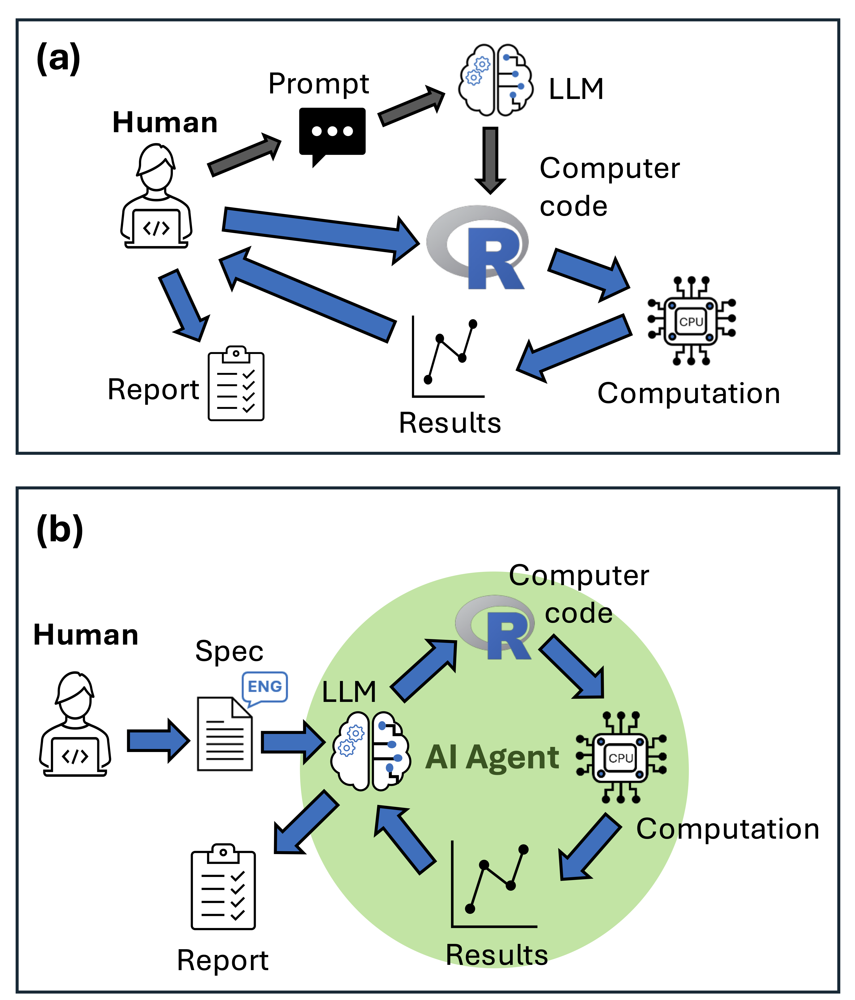

Agentic AI tools like Claude Code can write and run code, fix its own errors, and produce a formatted report with figures. I wanted to know whether that translates into reliable ecological modelling, so we ran a test: three fisheries tasks, four AI models, ten independent runs each, scored against a rubric. The results are published in [Fish and Fisheries](https://doi.org/10.1111/faf.70079).

We found agents can be genuinely useful, but only if you know how to use them well and only if you know enough about the analysis to catch what they miss.

## How we did our tests 

We used [Roo Code](https://roo.cline.bot/), an agentic AI that runs inside VS Code. Unlike a chatbot, it can write code, execute it, read error messages, and iterate autonomously. There are many popular software's for agentic AI, Claude Code is the most popular right now. We chose Roo Code because it is open source and fully customisable.

We gave it detailed specification sheets and asked it to complete three tasks. One was a common ecological modelling task: fitting a generalized linear model (GLM) of fish abundance and coral habitat. The other two were tasks specialised to fisheries modelling: fitting a von Bertalanffy growth curve and running a yield per recruit analysis. We chose these because they are common in ecological sciences, but specalised enough that LLMs probably haven't seen many examples in their training data. 

We ran each task 10 times. LLM responses have some randomness, and this multiplies when doing long-running tasks. So consistency is as important to measure as their best performance. We scored every output against a rubric covering accuracy, code quality, and report quality.

We used four versions of LLMs. Two proprietary models: Claude Sonnet 4.0, Sonnet 4.5 (which came out during review so we added later). One open weight model: Kimi K2 and its 'exacto' variant. 

During review, Kimi K2 'exacto' became available on the [OpenRouter](https://openrouter.ai/) platform, so we added that. The exacto routes requests to providers with the best performance. Some providers run it cheaply. Long story-short, exacto performed much better than just requesting any provider's version of K2, this highlights the importance of running open weight models on quality hardware. 

## How to use agentic AI for ecological modelling

We learned several key lessons about how to get the best out of agentic AI for ecological modelling. 

**Write a detailed specification sheet.** Our sheets ran to multiple pages covering analysis aims, data structure, recommended R functions and packages, expected outputs, and file naming conventions. This takes time, but writing a specification forces you to think carefully about what you actually want. [Here's an example](https://github.com/cbrown5/agentic-ai-fisheries/blob/main/Scripts/glm-test-case/glm-readme.md).

**Specify the algorithms explicitly.** Agents default to the most common method in their training data, which may not be appropriate for your question. If you want bootstrapped confidence intervals via the `boot` package, say so. 

Even then, they may not comply: both Claude models in our study repeatedly applied natural mortality to the first age class in the yield per recruit model despite explicit instructions not to. That's a subtle error that affected catch estimates—the numbers that would inform fishery management. These quirks of agent behaviour highlight why expert supervision is essential. 

**Run replicates and compare outputs.** Accuracy scores varied substantially between runs. sometimes the agent nailed every parameter; sometimes it got some parts correct but made systematic errors in other parts of the analysis. Running multiple agents and comparing outputs is one way to identify the best solutions.

**Check the things the agent doesn't know to check.** None of our agents checked for collinearity between predictors in the GLM, even though it's standard practice. We deliberately left it out of the specification to see if they'd do that. The GLMs ran fine, the results looked coherent, but there was in fact strong colinearity between the predictors. The lesson here is that the agents are good at coding, but their conceptual implementation may be misleading, incomplete or logically flawed. 

## The biggest problem with agentic AI is that it can produce professionally formatted output that contains logical errors 

The error type that concerns me most is professionally formatted output containing logical errors. 

In our results we saw growth curves that plotted beautifully but used the wrong confidence interval method, or a yield analysis that applies mortality in the wrong sequence. A coding syntax error is immediately obvious. A methodological shortcut embedded in otherwise clean output may be invisible unless you already know what the answer should look like.

There is a genuine risk that inexperienced researchers will use these tools to produce analyses they cannot evaluate. Experienced researchers may also get overconfident and not check results thoroughly enough. These flaws can then leak through to the applications, as we've seen where human errors in [ecological modelling impacts decisions on invasive species](https://pnas.org/doi/10.1073/pnas.2426166122). 

For scientists with strong quantitative foundations, agents offer a real efficiency gain. The specification sheets and rubrics from our study are in the supplemental materials if you want to adapt them. All our code is available on github if you want to run your own tests ([Check this folder, each modelling 'test-case' has the specification sheet and other files](https://github.com/cbrown5/agentic-ai-fisheries/tree/main/Scripts))

The paper is open access: [Brown et al. 2026, Fish and Fisheries](https://doi.org/10.1111/faf.70079).
