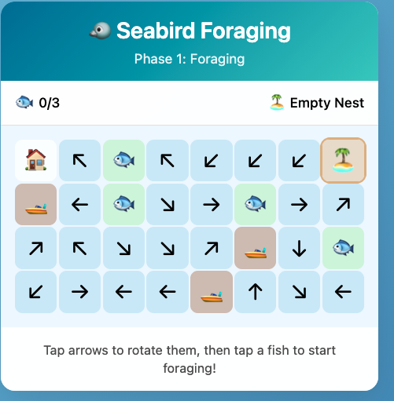

One of the benefits of generative AI is quick prototyping of web apps. I've used this advantage to bring simple games into my lectures. This helps make slide heavy lectures more engaging and gives the students an alternative pathway for learning. 

The games are nothing sophisticated. The graphics are simple and there are at most 1-2 levels. The advantage is that they are cheap and easy to make. So you can bash one together and try it out in a lecture without a big time investment and with minimal technical know-how. 

The simplest games are about an equivalent investment of time as making the powerpoint slides I would have used before. 

I'll show a few examples (a more comprehensive list is below). Then I want to discuss how to build these games. Its pretty simple, there's just a few steps to follow. 

I teach in marine science and statistics, so they are all pretty marine biology and stats focused. But hope you get some ideas to make your own for whatever discipline you teach in. 

[**Word match game**](https://www.seascapemodels.org/connections-game/) inspired by the New York Times connections puzzle. I made my own version that lets me customize what words you have to match. This one is great for a quick recap quiz 10 or 20 minutes into a lecture. The students find it more fun (and challenging) than regular multi-choice quizzes. 

[**Seabird block game**](https://www.seascapemodels.org/seabird-block-game/). This ones takes a bit more explaining. But the basic idea is that the player is a seabird and they have to navigate a wind field to catch fish and feed their chick. Meanwhile they are competing for fish with a fishing boat. 

[**Impact evaluation and monitoring design**](https://www.seascapemodels.org/impact-eval-app/). This one is more technical. It is about choosing sites on a map to do ecological monitoring. The lesson is in choosing a representative set of sites that gives you a statistically accurate answer. 

Then I've also started on a more ambitious project, which I call **[FANGS](https://www.seascapemodels.org/FANGS/)**. This one attempts to recreate a complex statistical software in the web browser. This means students can try out this stats method for a quick intro without having to go through software installation, which can I find can waste an hour or more of class time. 

FANGS is still a work in progress and has taken 30+ prompts (the others were more like 1-2 prompts). But the prototype works well so I'm going to keep refining it as I have time. 

## Learning goal

There's a few key elements to setting up these games. 

First you need a learning goal. The game should be integrated into your teaching. So think about what lesson you want your students to learn from playing it. 

For the connections game its just about recapping on key technical words. For the seabird game we follow up with a discussion about seabird conservation, drawing on the conflicts that emerge in the game. I designed the game with those conflicts so as to create these discussion opportunities. 

For the statistical games there are precise mathematical concepts I am trying to teach the students. 

Adding pop-ups with questions is one way to do this. Or you can just discuss in class. 

The impact evaluation and monitoring design game deals with more complex statistical concepts. That one isn't self contained in the webpage, I walk through it in class before setting the students loose on the game. 

## Game building and hosting

Here's the process I follow. I first write detailed instructions for what I want. Being detailed and specific is key, the prompt can run into 100s or 1000s of words. If the game doesn't work out its often best to refine your prompt then start again. 

I'm using Claude Code and/or Github Copilot in VSCode. 

[Here's the prompt I used for the word match game](https://github.com/cbrown5/connections-game/blob/main/game-idea.md) and [here's the one for the seabird game](https://github.com/cbrown5/seabird-block-game/blob/main/game-idea.md). Some testing and follow-up prompting was required to get rid of bugs and make them work like I wanted. 

The other key is to have the AI agent create the game as a standalone webpage. Then you don't need a server to run the game, the user just goes to the webpage and it runs in their browser. For this reason you need to keep the games pretty small and the graphics simple, otherwise it may run very slowly. 

Play the game locally to check it works and the logic is robust (usually you can just open the file in a web browser). If there are bugs, or worse logical errors you can guarantee the students will find them. Also you don't want the students to learn the wrong lessons. 

Once I'm happy with the game I sync the code repository to Github. Github is a cloud service for storing code. There's plenty of tutorials online if you don't know how to use it (or AI can help you). Its pretty straightforward. 

Once its on github you need to setup [Github Pages](https://docs.github.com/en/pages) for your repository. This means people can navigate to a URL and the code will run in their browser (rather than them just seeing the raw code). For instance, the code for the seabird game lives here: https://github.com/cbrown5/seabird-block-game/

But I've activated 'pages' on that repository, so if you go here your browser will load the code so you can play: cbrown5.github.io/seabird-block-game

## Future improvements

I'd love to have more time to invest in this system, so I can create compelling games quickly and focus on learning elements rather than getting the technical aspects right. A few things we need to make are: 

**Standard prompts/specification sheets for game code**

Including elements like what javascript packages to use (there are specialized gaming ones like Phaser3), how to render graphs, and a template for quick quiz pop-ups. 

**System for creating graphics** Currently the games use emoji's or the AI draws the graphics as an SVG (ie it writes code to create coordinates that draw lines), which is an ineffective way to generate images with AI [see these pelicans on bicycles](https://simonwillison.net/2026/Apr/8/muse-spark/). These methods are quick, but also not as compelling as I would like. 

A more effective system would use an image generation model (like Nano Banana) to make sprite sheets. This should be possible using [Max Woolf's system for creating images in a grid](https://minimaxir.com/2025/12/nano-banana-pro/). But my attempts have required a lot of manual handling, as the images are never quite perfectly on a grid. I'm sure someone will sort this out for us soon and put it into a nice 'skill'. 

**Multiplayer games and class feedback** 

A downside to a fully browser based experience is that there is no data exchange with a server. So that precludes the possibility of multiplayer games, or getting a summary of student answers/outcomes. Firebase may be one way to cheaply create a multiplayer game or get summary stats on student engagement (like how many won/lost). 

**Accessible learning**

My prompts aren't optimised for accessibility, e.g. font sizes and colours. This would be an easy win. 

**Games in assessment**

My big picture dream is to have some of the smaller assessment items replaced with games. So rather than the weekly quiz, the students have to solve a puzzle or win a game. I have this idea of an RPG game where the player wanders around our marine science laboratories. In each lab they collect some data. The final 'boss battle' for the assessment is putting that data together into a coherent analysis to answer a topical research question. Why can't assessment be fun too?

Anyway, I recommend starting small with low ambitions and building up from there. Let me know how you go in your classes if you try this. 

## List of games to date 

[Word match game](https://www.seascapemodels.org/connections-game/). Code and instructions are here if you want to make your own version: https://github.com/cbrown5/connections-game

Or upload your own [word match data file](https://www.seascapemodels.org/connections-game/word-match-upload.html)

[Seabird block game](https://www.seascapemodels.org/seabird-block-game/). Catch fish to hatch your egg and successfully raise your chick. 

[Larval fish avoiding jellyfish and trying not to starve](https://www.seascapemodels.org/seabird-block-game/ocean-game)

And there's even more games, these ones I did 'live' for a presentation where the [audience developed a game for science communication and played it all within an hour](https://www.seascapemodels.org/posts/2025-09-17-ai-generated-scicomm-games/index.html). 

### Statistical games 

[Impact evaluation and monitoring design](https://www.seascapemodels.org/impact-eval-app/)

Game code for my stats class: https://github.com/cbrown5/KSM721-games

Including [likelihoods](https://www.seascapemodels.org/KSM721-games/likelihood-distribution-game/) and [regression](https://www.seascapemodels.org/KSM721-games/regression-likelihood-game/index.html). 

[App to turn a diagram into statistical code](https://www.seascapemodels.org/mermaid-to-stan/).

[My most ambitious AI generated project FANGS, a Bayesian computation engine that runs in a web browser](https://www.seascapemodels.org/FANGS/). Warning its a work in progress! 

Finally, I've made a few just for fun too. [These checklist games](https://www.seascapemodels.org/checklist-game/) are meant to help my kids get ready in the morning. 