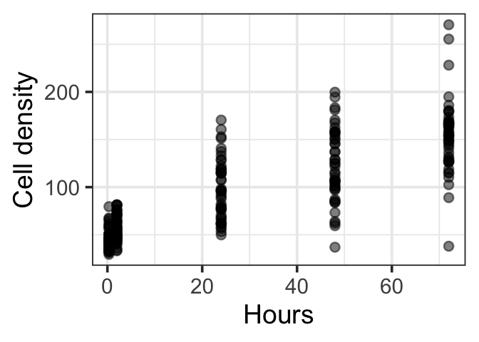
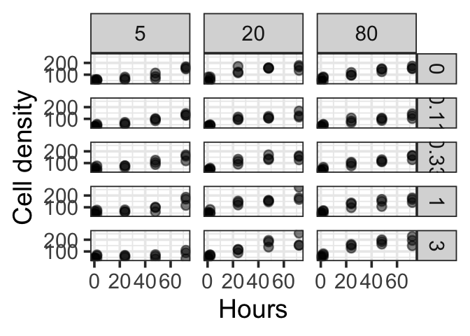
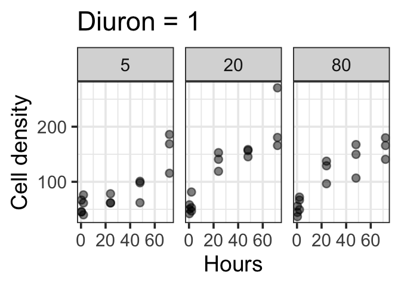
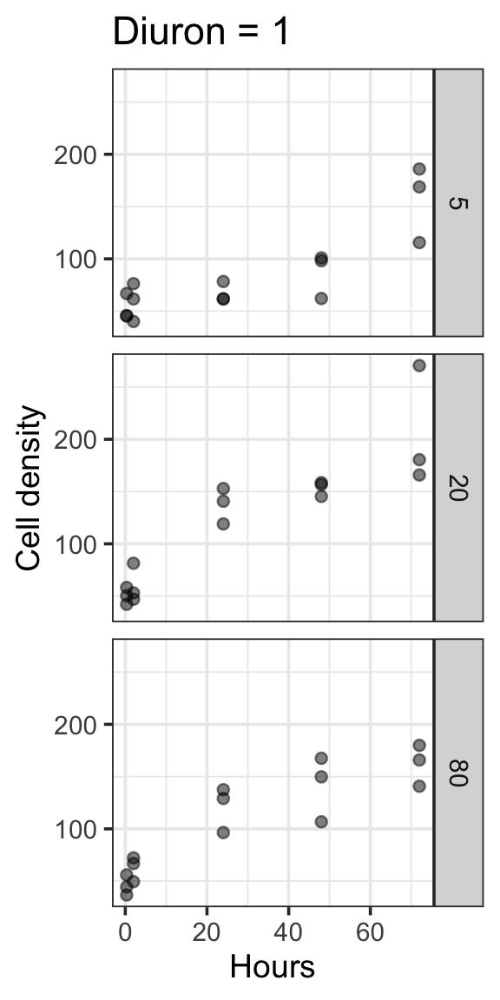

The default for styling plots should be for easy viewing on mobile
devices.

Most digital interactions are via mobile these days. Even if you plan on
viewing your plots on a desktop, a mobile friendly layout will make them
more readable.

I recommend defaulting to a mobile friendly view from day 1 of data
exploration. This means using larger font, line and label sizes than
standard plotting package defaults. I’ll show how below.

You can then alter the styling as your finalize the plots of
publication, where desktop viewing might be more common (I saw ‘might
be’ because I frequently papers on my phone these days).

Styling plots for visual clarity is key from the start, because clarity
of presentation influences how you interpret the research. So it has a
tangible impact on the way your research will develop and how you engage
with your collaborators.

I often communicate with collaborators and students via instant messages
(e.g. Teams), which allows for quick feedback cycles. The default ggplot
settings can be hard to view however.

There are many good books on making graphs, e.g. check out the
Functional Art by Alberto Cairo.

Below I just want to show a few tips for improving ggplot2 settings to
get better visuals for mobile.

We’ll use one of my [example
datasets](https://github.com/cbrown5/example-ecological-data) from an
[algal growth experiment](https://doi.org/10.1098/rspb.2022.0348).

You can load it directly from the url.

The biggest tip is to change the base size in your base theme. If you do
this with `theme_set` it then applies to all plots in this R session.

``` r
library(tidyverse)
```

``` r
# Read raw data
dat <- read.csv("https://raw.githubusercontent.com/cbrown5/example-ecological-data/main/data/algal-stressors/diuron_data.csv")

theme_set(theme_bw(base_size = 28))

ggplot(dat) + 
    aes(x = hours, y = celld) + 
    geom_point(alpha = 0.5) +
    labs(x = "Hours", y = "Cell density")
```

    Warning: Removed 75 rows containing missing values or values outside the scale range
    (`geom_point()`).



Second tip is to keep facts to 3 or so panels.

Before:

``` r
ggplot(dat) + 
    aes(x = hours, y = celld) + 
    geom_point(alpha = 0.5) + 
    facet_grid(Diuron_num~Light_num) +
    labs(x = "Hours", y = "Cell density")
```



Better:

``` r
dat |>
    filter(Diuron_num == 1) |>
    ggplot() +
    aes(x = hours, y = celld) + 
    geom_point(alpha = 0.5) + 
    facet_wrap(.~Light_num) + 
    labs(x = "Hours", y = "Cell density", title = "Diuron = 1")
```




Best: for mobile ,use a vertical arrangement

``` r
dat |>
    filter(Diuron_num == 1) |>
    ggplot() +
    aes(x = hours, y = celld) + 
    geom_point(alpha = 0.5) + 
    facet_grid(Light_num~.) + 
    labs(x = "Hours", y = "Cell density", title = "Diuron = 1")
```



In general, don’t put too much information on a single plot. If you are
using colours avoid lengthy legends (\<7 items is ideal, \<3 is
excellent).

If its getting too complex, think about what you are trying to
communicate, then split your plot into several plots, one for each
point.

Finally, you might as well set-up to save publication quality pngs from
the get go:

``` r
g1 <- dat |>
    filter(Diuron_num == 1) |>
    ggplot() +
    aes(x = hours, y = celld) + 
    geom_point(alpha = 0.5) + 
    facet_grid(Light_num~.) + 
    labs(x = "Hours", y = "Cell density", title = "Diuron = 1")
ggsave(g1, filename = "figure1.png", width = 6, height = 12, dpi = 600)
```

Play around with width and height to get the viewing ratio and size good
for clear visualisation. A high dpi is needed for publication quality
images.
