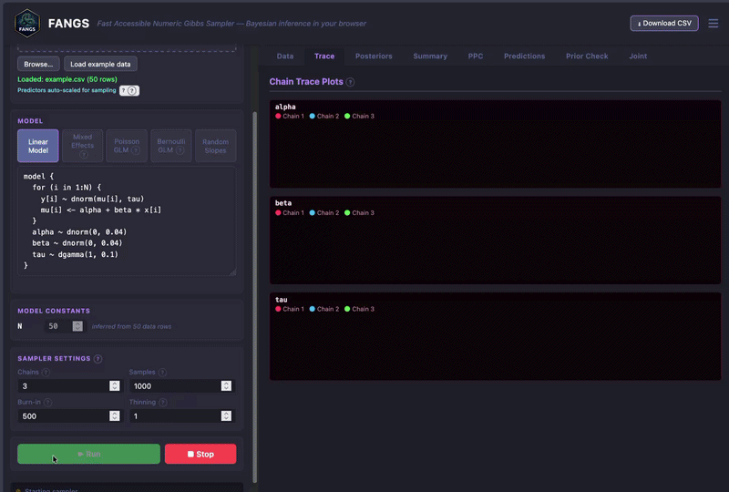
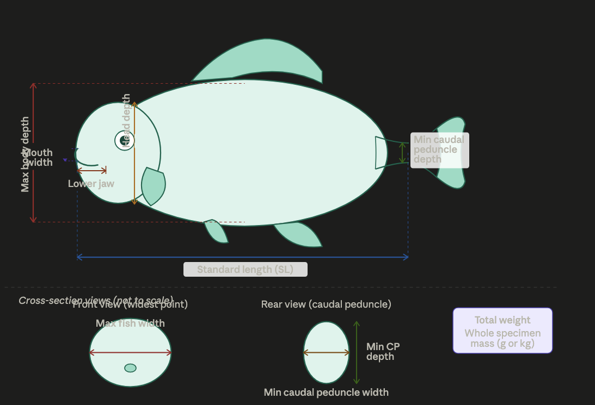
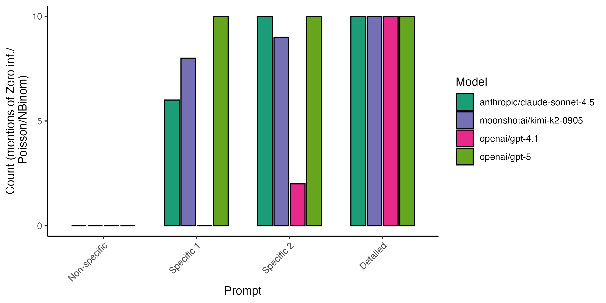
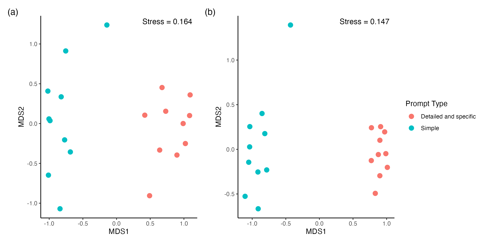
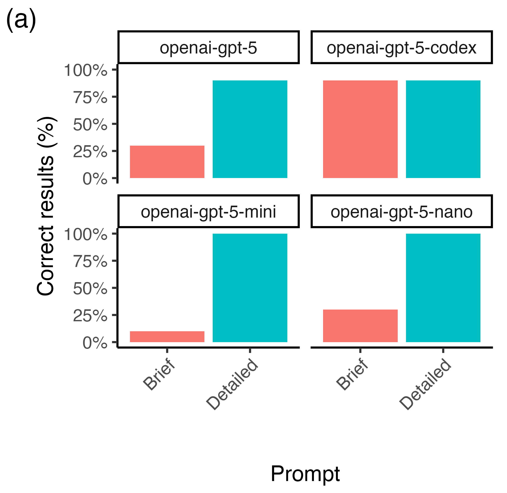
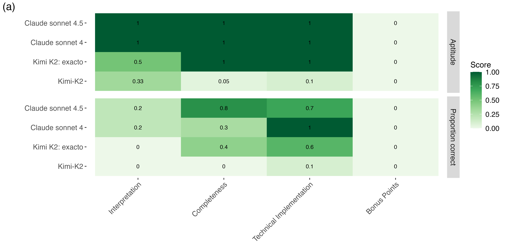

## Generative AI for Coding and Research: An FAQ

Slides and links from a recent talk. 

[Back to my blog](https://www.seascapemodels.org/bluecology_blog.html)

## Generative AI - Incredible and...

{.r-stretch}

[FANGS](www.seascapemodels.org/FANGS)

## Underwhelming

{.r-stretch}

## Aims

- Understand generative AI
- Learn key terms
- Use these tools effectively in research

## What is GenAI?

- Artificial intelligence that generates new content (text, images, code)
- We'll focus on Large Language Models
- Excel at logic and code generation
- Can interpret images, use browsers, debug code, access tools and the internet
- Predicted to be fully capable software developers in 1-3 years

## How do LLMs work?

- Complex neural networks with multiple layer types
- Trained on large corpus of text data
- Generate content by predicting the next token (word)
- [Watch explanation: 1:25-2:50](https://www.youtube.com/watch?v=wjZofJX0v4M)

## What is an AI Assistant?

Software that manages your interactions with an LLM.

Examples: Copilot, ChatGPT, Github Copilot, Claude Code

## Using AI Assistants with R

- Claude Code or Github Copilot in VSCode
- Positron assistant
- AI R packages like gandar
- See [Luis Verde's page](https://luisdva.github.io/llmsr-book/)

## Ways to Use LLMs for R

- Chat with an assistant for help
- Use keystroke assistants for code autocomplete
- Deploy agents to write code
- Integrate LLMs into your own R functions

## What is an LLM Agent?

{.r-stretch}

[Brown et al. 2026, *Fish and Fisheries*](https://onlinelibrary.wiley.com/doi/10.1111/faf.70079?af=R)

## How LLMs Help with Data Analysis

:::: columns
::: column
**Three-step workflow:**

1. Plan statistical analysis
2. Plan implementation
3. Write code

:::
::::

[Brown and Spillias 2026, *Methods in Ecology and Evolution*](https://besjournals.onlinelibrary.wiley.com/doi/10.1111/2041-210x.70267)

## Step 1: Statistical Approach Selection

**Example prompt:**

"I want to statistically test the dependence of fish abundance on coral cover. I have observations of coral cover (continuous %) and fish abundance (count). Data from 49 locations with standardized surveys. Sites are spatially clustered into regions. Provide several statistical approaches with assumption verification and visualizations. Reason step-by-step."

## Better Prompts = Better Results

{.r-stretch}

[Brown and Spillias 2026, *Methods in Ecology and Evolution*](https://besjournals.onlinelibrary.wiley.com/doi/10.1111/2041-210x.70267)

## Step 2: Plan Implementation

Structure your context as a README.md:

- Project title
- Research context and aims
- Analysis methodology
- Technology context (R packages)
- Analysis steps
- Directory structure
- Data locations and metadata

## Planning Improves Code Consistency

{.r-stretch}

[Brown and Spillias 2026, *Methods in Ecology and Evolution*](https://besjournals.onlinelibrary.wiley.com/doi/10.1111/2041-210x.70267)

## Step 3: Write the Code

{.r-stretch}

[Brown and Spillias 2026, *Methods in Ecology and Evolution*](https://besjournals.onlinelibrary.wiley.com/doi/10.1111/2041-210x.70267)

## General Advice

- Be detailed and specific in prompts
- Plan the steps upfront
- Keep files organized
- Provide context (but avoid irrelevant information)
- Build in tests and verification
- Give information upfront, avoid conversation

::: {.fragment}
*Mansplain the LLM!*
:::

## LLM Agent ability at Data Analysis

{.r-stretch}

[Brown et al. 2026, *Fish and Fisheries*](https://onlinelibrary.wiley.com/doi/10.1111/faf.70079?af=R)


## What is "Vibe Coding"?

> "Fully give in to the vibes, embrace exponentials, and forget that the code even exists."

— Andrej Karpathy

(This is **not** how we should use LLM agents for research)

## When is it ok to use LLM agents?

- **Low importanc taskse**: Tasks that don't affect others (e.g., [educational games](https://www.seascapemodels.org/posts/2026-04-22-quick-and-easy-AI-generated-games-for-teaching/))
- **High importance tasks**: Only when you can verify the accuracy of results. 
- Build verification into your workflow (e.g., visualizations, tests, expert review)

## Easy vs. Hard Verification

**Hard to verify:**
- "How would I do this analysis?"
- Requires expert knowledge to evaluate the quality of the response

**Easy to verify:**
- "Generate 10 figures for this data"
- Visual inspection + domain knowledge

## Do LLMs Actually Save Time?

{.r-stretch}

[Metr study: Early 2025 AI + OS Dev](https://metr.org/blog/2025-07-10-early-2025-ai-experienced-os-dev-study/)

## Do LLMs Actually Save Time?

- There's a big grey area between AI slop and useful output
- Need to be careful how you use the tools

## Environmental Costs

Relatively small impacts for individual users, but growing energy demand for the sector. 


[Recent summary on AI electricity use](https://hannahritchie.substack.com/p/ai-electricity-2025)

Consider efficiency when choosing tools and models.

## Privacy and Security

**The lethal trifecta: avoid all three together**

```{r}
#| echo: false
#| fig-width: 8
#| fig-height: 6

library(ggvenn)

# Create data for venn diagram
venn_data <- list(
  "Private Data" = 1,
  "Untrusted Content" = 2,
  "External Communication" = 3
)

ggvenn(venn_data,
       fill_color = c("#FF6B6B", "#4ECDC4", "#FFE66D"),
       stroke_size = 2,
       set_name_size = ,
       text_size = 0) +
  theme_void() +
  labs(title = "Avoid the Lethal trifecta") +
  theme(plot.title = element_text(size = 14, hjust = 0.5, face = "bold"))
```

Never send proprietary or sensitive data to untrusted services with external communication capabilities.

[Willison - Lethal trifecta](https://simonwillison.net/2025/Jun/16/the-lethal-trifecta/)

## Summary advice for AI in data analysis

- Use genAI judiciously so
  - You don't waste your time improving slop
  - You don't waste energy
  - You don't compromise security
  - Experiment to see work works
- Aim for quality over quantity

[Back to my personal blog](https://www.seascapemodels.org/bluecology_blog.html)

## Check out our collaborative blog on substack

[Vita ex machina (life from the machine)](https://vitaexmachina.substack.com/)

{.r-stretch}

