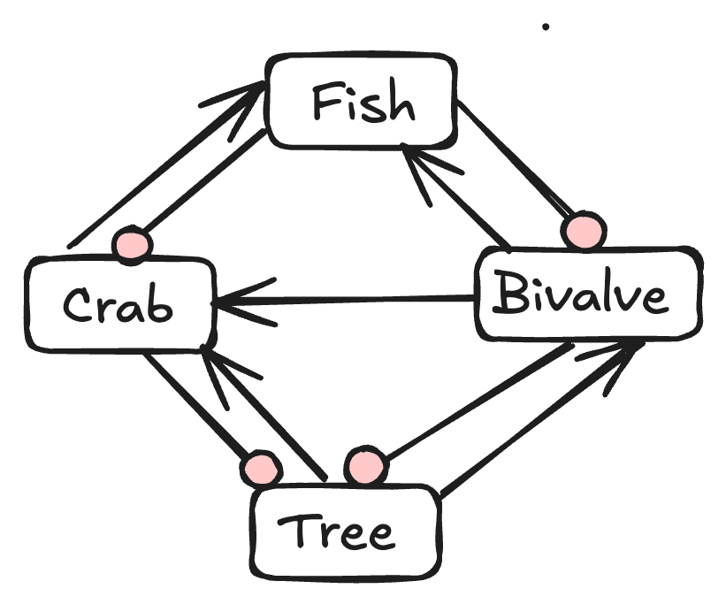

I've put together a short guide: *How Do I Build a Model? A starting guide for new modellers*. It's free, online, and written for the graduate student who has a research question and is wondering where to even begin their modelling.

You can read it online at [How Do I Build a Model?](https://www.seascapemodels.org/building-ecological-models/), or [download a pdf](https://github.com/cbrown5/building-ecological-models/blob/main/docs/How-Do-I-Build-a-Model-.pdf). 

I've never had a singular focus on a type of ecological modelling. I'm not the Bayesian guy, or the foodweb model guy, or the machine learning guy, though I've dabbled in all three. That haphazard career has given me a broad view across a lot of different modelling traditions, and I keep noticing the same meta-principles showing up regardless of the discipline. This guide is my attempt to write those down.

It's not a textbook on any particular method. Once you know what type of model you're building, go read a book by a discipline expert (I've listed some favourites in the final chapter). This guide is for getting started and principles that apply to any type of modelling. 

## What's in it

1. **Start with the question.** How you actually grow into a research question, through reading, writing, and talking it through with people whose work you admire (and some whose work you don't).
2. **From a question to a type of model.** Once you know your question, how to read papers differently, paying attention to the *how* and the *why*.
3. **Terminology: variables, parameters, and the rest.** A clean-up of vocabulary that gets used loosely and causes confusion.
4. **Know why you're building a model.** Causal inference, prediction, or something else. Knowing your purpose is what narrows down the type of model you need.
5. **Sketching your model.** Why you should start at a whiteboard with boxes and arrows before you touch an equation, and how to read those arrows as equations later.
6. **The different types of uncertainty.** Why "how uncertain am I?" is really several different questions, and why that distinction matters for what you do next.
7. **Writing your model's equations.** Turning the diagram into notation, with a nod to Edwards & Auger-Méthé's guidance for ecologists, which I'd recommend reading in full regardless.
8. **Understand your constraints.** Computational, data, and time constraints, and how they shape what model you can realistically build.
9. **The modelling workflow.** Feedback loops of writing code, debugging, running, plotting, interpreting. 
10. **Tools and software.** The endless R-versus-Python debate, and why your own familiarity with a tool is a constraint.
11. **Tips for finding novel insights.** Some of my favourite tricks, including hunting for analogues in other fields and pushing them to their extreme.

There's also a short further-reading list at the end, covering the books I'd point you to once you've picked your modelling approach.

## How it came together

I dictated the original version on a long drive, Claude Code cleaned up the transcript into a first written draft and set up the Quarto book site, and I edited it from there. 