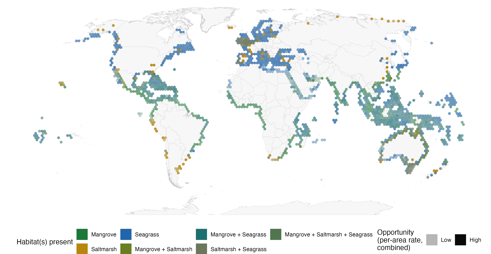

I realized this week that I won't be hiring a GIS focused research assistant the same way as I used to. 

Claude Code is just too good at GIS in R now. I guess this happened around the release of Opus 4.7. I just hadn't really pushed the coding agent until now. 

This week I downloaded a global dataset of a coastal habitat of several gigabytes, expecting to spend my free time this week poking around getting a feel for how to do my intended analysis. 

30 minutes later the analysis was done. 

Claude solved what used to be significant and time consuming GIS issues with no help from me. All I gave it was the end goal and reference to a previous workflow for a similar project. 

It smoothly addressed complex challenges like geometry self intersections and spatial intersections of raster to vector data. It even ran small-scale tests to identify processing bottlenecks and find the fastest solution for intersecting two large layers. 

## Headstarts

Now to be fair I should also acknowledge a couple of headstarts Claude had on this project. 

The first was my previous workflow for a similar problem (building a predictive model from spatial data). That gave it a rough set of steps to follow. But, my previous workflow was built entirely on vector (polygon) data, whereas the new analysis required working with rasters. So it successfully solved raster to vector issues with no help from me. 

I suspect a second big change in the R GIS ecosystem in last 5-10 years has enabled this coding agent success. Credit is due to the developers of core R spatial packages, especially `sf`, `tmap`  and `terra`. 

These have significantly streamlined spatial processing and mapping in R, making it easier to deal with complex area and distance calculations on the earth's curved surface and the ubiquitous self-intersection errors that used to cause major traffic jams in GIS work. 

Back around 2020 we were compiling global data on coastal wetlands and aligning that for an [analysis of coastal wetland health](https://www.sciencedirect.com/science/article/pii/S1470160X21008062). It took a GIS research assistant and part of the time of a supervising post-doc months just to do the spatial processing. 

## Do I still need a (human) GIS assistant for spatial analyses? 

One of my research students has taught me that perhaps the answer is yes, but the requirements of the role are different. 

You see, my student enthusiastically launched his spatial analysis project with a heap of vibe coding in R. I quickly realized he understood very little of what his coding agent had done, and there was no way we could be sure the results were accurate. 

Even in my 30 minute success story told above there were AI mistakes I had to check and fix. A big one was a silly duplicate correction for fraction -> percentage that Claude made. So it had overestimated everything by a factor of 100. 

My student turned his story around as well. His enthusiasm for the result and for learning, meant he started again. This time, working (slightly) more slowly. He did the reading, learnt the GIS theory and then used the AI agent to redevelop his analysis step-by-step. That way his understanding could keep pace with the code. 

Now in a few short months he's a competent GIS user and map maker. Credit to his attention to detail too, he won't trust any exciting result without first running thorough checks. 

So what I would want now in an RA is someone who is enthusiastic to learn and who excels at rapid self-paced learning. 

In the past meetings with the assistant would often be about how to solve the next processing challenge. Meetings with my GIS, R and AI enabled student are very different. They come with 5+ graphs and maps every week and we discuss patterns. He'll show me a beautifully prepared graph and ask me 'what do you notice here...' waiting to see if I spot the anomalies he's noticed. Then we discuss. 

Attention to detail is more important than ever. We can't rely on failures in the code or workflow as a red flag for errors anymore. The agents are too good at 'making it work'. We need analysts who don't cross the finish line of declaring success when they get the first good result, but who are happy to go back and thoroughly explore every alternative interpretation. 

So yes, I'll still hire a GIS research assistant. But the position description has changed. Less "must know `sf` and `terra`", more "must be sceptical of a beautiful map." The coding is the easy part now. The judgement was always the hard part - it's just that the coding used to take so much time that good judgement was required less often. 

