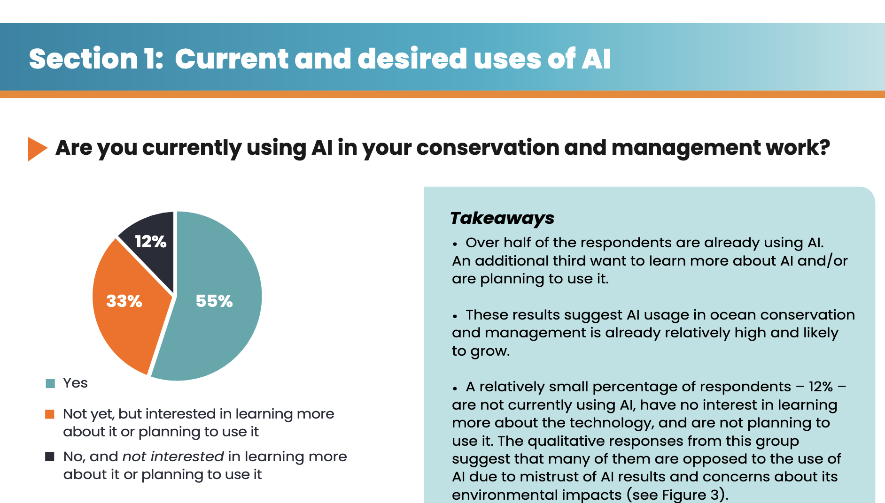

Shout out to OCTO group who just produced this Snapshop report: ["The Use Of Artificial Intelligence In Ocean Conservation and Management"](https://octogroup.org/programs/ai-snapshot-report-2026/). 

They surveyed 190 ocean conservation professionals across their extensive mailing lists. 

I recommend reading the report, its not very long and has some useful insights. There's a lot of data presented, which means you can find the bits that interest you. 

A few highlights for me.

## Unmet demand for AI

Only 55% of people are using AI currently (up to Feb 2026) for their conservation and management work. Another 33% plan to use it. I would have thought current use would be higher. 

The report raises issues around equitable access to the technology and education, so perhaps they are two of the barriers to greater uptake. Another barrier was institutional restrictions on using AI. 

Education is a topic I'm passionate about. Hence all the blog posts. 

One respondent said "AI workshops and trainings for scientists from developing countries could be a game-changer if we want to transform to a sustainable world." 

The report concludes there is an urgent need for more training on tools and literacy in AI to address understanding of capabilities and risks. I couldn't agree more. 

I've been running around these past two years teaching workshops on generative AI for data analysis, so get in touch! 

## How are we defining 'AI'

The Snapshot doesn't define 'Artificial Intelligence'. That's a common shortcoming in AI discussions. I think its helpful to differentiate among different uses. Two of the most common in marine science are generative AI for text/code/image creation and applying AI to image classification for ecological monitoring. 

Generative AI applications tend to rely on commercial tools that are general use, whereas the image classification applications rely on bespoke tools trained specifically on ecological images. So the two dominant applications of AI are very different in terms of scope of use (genAI: just about anything digital, image classification: just for monitoring), resource requirements (cheap to access via paid/free account vs requires specialist software and expensive compute), training needs (many easy to use tools vs training in specialist image software) etc... 

The quoted responses suggest most people answering this report are thinking of generative AI. Though a few are also talking about image classification. 

The main AI uses seem to be the things done by generative AI like admin/text generation, whereas the biggest wants were for AI for image classification and monitoring. That fits with the ease of access of each technology. 

## Data privacy

Several respondents  cite data privacy as a major concern: 

"I’m concerned about data security and how my own work feeds into these models without
my knowledge and consent."

Also a growing area of interest for me. Good to see I'm not the only one worried about this. 

There's much more to the report than my brief highlights here. I recommend you check out the report for more insights: 

OCTO. (2026). Snapshot 2026: The Use of Artificial Intelligence in Ocean Conservation and Management. DOI: 10.5281/zenodo.21510562. https://octogroup.org/programs/ai-snapshot-report-2026/

