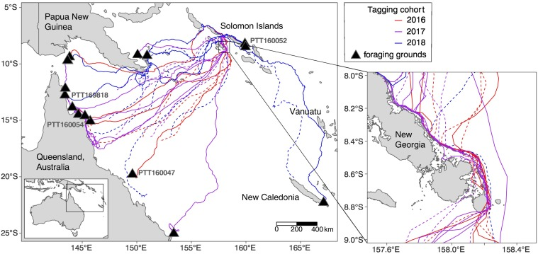

We are working the The Nature Conservancy on marine conservation across the Pacific. One example is our work in the Solomon Islands. 

The Solomon Islands is home to globally significant sea turtle populations, yet faces mounting conservation challenges. Our research has provided insights into how fisheries and protected areas impact these endangered species—and how science can drive real-world change.

[A national-scale study estimated that ~12,000 turtles were caught in 2018](https://onlinelibrary.wiley.com/doi/full/10.1002/aqc.4050), with up to 97% harvested in small-scale coastal fisheries (SSFs). Surprisingly, these fisheries, often overlooked by international funders, [pose a greater threat to turtles than industrial scale longline bycatch](https://conbio.onlinelibrary.wiley.com/doi/10.1111/conl.13056). Community-based monitoring revealed that green turtles dominate catches, and harvest rates have declined 4.9-fold over 30 years—clear signs of overfishing. These findings shaped the Solomon Islands’ National Plan of Action for Marine Turtles (2023–2027), emphasizing sustainable SSF management. 

In parallel, [satellite tracking of 30 nesting hawksbill turtles in the Arnavon Community Marine Park (ACMP)](https://www.sciencedirect.com/science/article/pii/S0006320721002925) showed that 98.5% remained within park boundaries during nesting, validating its design. Early results led to ACMP’s declaration as the nation’s first national park in 2017. Tracking also exposed poaching hotspots, prompting the establishment of a new ranger station. 

Together, these projects highlight how community-driven science can rapidly inform policy and protect endangered wildlife.