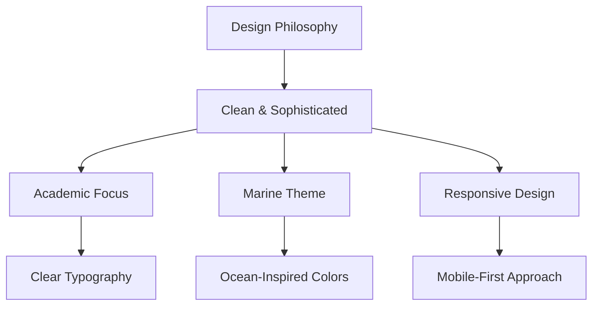
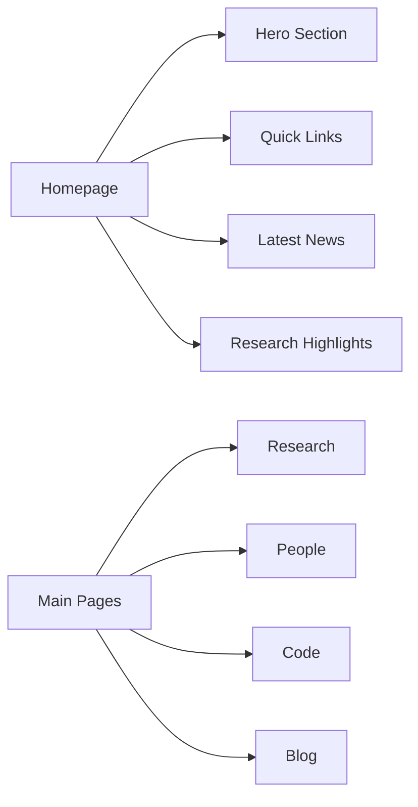
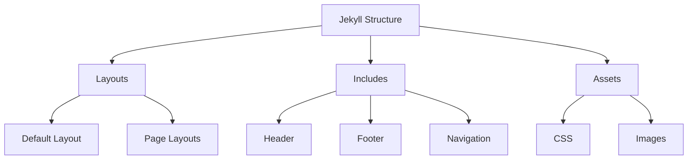

# Website Modernization Plan

## Progress Update (April 10, 2025)

### Completed Items
1. Created new CSS framework (css/style.css)
   - Implemented color scheme
   - Set up responsive grid system
   - Created component styles (cards, navigation, etc.)
   - Added typography settings

2. Updated core templates
   - Created new default layout (_layouts/default.html)
   - Updated header to use new CSS
   - Created new footer with contact info and links
   - Improved navigation structure

3. Redesigned main pages
   - Homepage with featured content and grid layout
   - Research page with project cards
   - People page with profile grid
   - Code page with course listings
   - Blog page with clean post previews

4. Updated Jekyll configuration
   - Set proper site settings
   - Configured collections
   - Added default layouts
   - Set up proper permalinks

### Next Steps
1. **Fix Layout Issues**
   - Create missing 'default-ppl' layout for people pages
   - The cards for blogs and research show the title twice in different font sizes, edit so they only show it once. 
   - the people in `/_people` collection are .md files with a category, arrange them in a grid by category. Put the 'alumnus' category last. 
   - Change the people cards so they show the first few words of each profile and the image and then just link to each person's page (See note below on how to do this)
   - Ensure consistent styling across all layouts
   - Test layout with sample content

2. **Fix Image Issues**
   - Properly link to images/people directory for profile photos, see files in `_people/` for appropriate image paths
   - Add placeholder images for missing profiles

3. **Content Refinement**
   - Review and update content on all pages
   - Ensure all links are working, the links to research, people, blog page are currently broken
   - Add featured images to research projects
   - Optimize existing images

4. **Style Adjustments**
   - Fine-tune responsive breakpoints
   - Adjust card layouts if needed
   - Ensure consistent spacing
   - Add hover effects for interactive elements

5. **Testing**
   - Test on different devices
   - Check all navigation links
   - Verify blog post formatting
   - Test contact links in footer

### Note on people cards
Here's an example of how to use templates in Jekyll to insert the link to the appropriate people page. 

```html

  
    <li><a class="button-ppl bkg-1" href="{{ people.url }}">{{ people.title }} </a></li>
  

```

<ul class="list-ppl">
    
    
  <li><a class="button-ppl bkg-1" href="{{ people.url }}">{{ people.title }} </a></li>
    
  
</ul>

## 1. Design Philosophy


### Color Scheme
- Primary: Deep blue (#1a4c6b) - representing ocean depths
- Secondary: Teal (#2a9d8f) - representing coastal waters
- Accent: Coral (#ff6b6b) - for highlighting
- Background: Light gray (#f8f9fa) - for readability
- Text: Dark gray (#2d3436) - for optimal contrast

### Typography
- Headings: 'Bitter' (already imported) - elegant and academic
- Body: 'Barlow' (already imported) - clean and readable
- Special elements: 'Archivo' (already imported) - for navigation and highlights

## 2. Structure Updates


### Homepage Redesign
- Clean hero section with static ocean-themed background
- Featured research projects in simple grid layout
- Latest blog posts/news in list format
- Essential links to key resources

### Navigation
- Simple, clean navigation bar
- Mobile-friendly hamburger menu
- Clear visual hierarchy

## 3. Page-Specific Updates

### Research Page
- Clean project cards with images
- Simple list of current projects
- Key findings in easy-to-read format
- Direct links to publications

### People Page
- Simple grid layout for team members
- Basic profile cards with:
  - Photo
  - Name
  - Role
  - Brief bio
  - Contact information

### Code Page
- Clean list of R courses
- Simple categorization
- Direct download/access links
- Clear course descriptions

### Blog Page
- Simple chronological layout
- Clean post previews
- Basic category labels
- Clear date formatting

## 4. Technical Implementation

### Jekyll Structure


### Responsive Framework
- Simple CSS grid system
- Flexbox for component layouts
- Mobile-first media queries
- Minimal JavaScript usage

### Asset Organization
- Optimized image loading
- Clean CSS structure
- Simple file organization

## 5. Implementation Phases

1. **Phase 1: Foundation**
   - Set up new CSS framework
   - Implement base typography and colors
   - Create responsive grid system

2. **Phase 2: Core Pages**
   - Homepage redesign
   - Research page layout
   - People page grid
   - Blog page structure

3. **Phase 3: Content Migration**
   - Transfer existing content
   - Optimize images
   - Update markdown files

4. **Phase 4: Testing**
   - Cross-browser testing
   - Mobile responsiveness verification
   - Content review